# Discrete Mathematics Exercise Solution Suggestions 

This is a collection of solution suggestions for the exercises of the course Discrete Mathematics from 2021. 
We do not guarantee their correctness.

## Exercise Sheet 1

#### 1) Use a suitable graph theoretical model to solve the following problems:
**a) Show that in every city at least two of its inhabitants have the same number of neighbours!**
    Let $G = (V,E)$ such that 
        * $v \in V$ if $v$ is an inhabitant of the city and 
        * $(v,w) \in E$ iff $v$ and $w$ are neighbours.
    Now, we show the (a) by proving that in any simple, undirected graph there exist two vertices which have the same degree:

-- Proof by contradiction--
    
Assume a simple, undirected graph $G = (V,E)$, such that $\forall v,w \in V: v \neq w \rightarrow deg(v) \neq deg(w)$.
Then, by assumption, the nodes $\{v_1,\dots , v_n\} = V$, have degrees $\{0, \dots, n-1\}$ (seeing as $G$ is simple, no node has an edge to itself).

Thus, there is a node $v_i \in V$ with $deg(v_i) = n-1$ meaning it is connected to all other nodes, but there also exists a node $v_j \in V$ with $deg(v_j) = 0$ meaning it is connected to no other nodes, including $v_i$. *Contradiction!*

**b) 11 friends want to send postcards according to the following rules:**
* (i) Each person sends and receives exactly 3 cards.
* (ii) Each one only receives cards from those to whom he or she sent a card and vice versa.
Tell us how this can be done or prove that this is impossible.

Let $G=(V,E)$ a graph such that the nodes $V = \{v_1, \dots, v_{11}\}$ represent the 11 friends and there is an edge $v,w \in E$ if $v$ sends a card to $w$ and vice versa.

--Proof that this is impossible--

By the Handshaking Lemma, $\sum_{v \in V} deg(v) = 2*|E|$ holds for any finite, undirected graph.
By (i), for each vertice $v \in V$, $deg(v) = 3$ and by assumption $|V| = 11$.
If we apply this to the handshaking lemma: $\sum_{v \in V} deg(v) = 33 = 2* k$, where $k = |E|$. But this holds for no integer amount of edges. *Contradiction!*

**c) Determine all graphs in which all vertices have degree 1.** 

In order for all vertices in a graph to have degree 1, each edge in the graph has to be connected to exactly two vertices, which themselves may not be connected to any other vertices.
Therefore we can construct the set of all graphs with only vertices of degree 1, based on their number of edges.
For $G = (V,E)$, with $|E| = k, k \in \mathbb{N}$:
$$
E = \{e_1, \dots , e_k\},\\
V = \{v_{i1}, v_{i2} | e_i \in E\}
$$

#### 2) Compute the number of walks of length $l$ from $i$ to $j$ in the following graph:


The number of walks of length $l$ from $i$ to $j$ is defined by the sum of all values in $A(G)^l$, where 
$$A(G) = \begin{pmatrix}
0 & 1 & 0\\
1 & 0 & 1\\
0 & 1 & 0
\end{pmatrix}$$
The element $(i,j)$ in $A(G)^l$ represents the walks of length $l$ from vertex $i$ to vertex $j$. 

**How could you use the adjacency matrix to compute the number of triangles (cycles of length 3) in a (loopless) graph?**
The number of triangles is defined by the trace (the sum of elements on the main diagonal) of $A(G)^3$ divided by 6 for undirected, and 3 for directed graphs.

**Perform the computation for two graphs of your choice on four vertices.**

#### 3) Show that each of the following four statements is equivalent to the statement "T is a tree":
* (1) Every two nodes of $T$ are connected by exactly one path.
* (2) T is connected and $\alpha_0(T) = \alpha_1(T) + 1$.
* (3) T is a minimal, connected graph, i.e., deleting an edge destroys connectivity.
* (4) T is a maximal, acyclic graph, i.e., adding an edge generates a cycle.

Let (0) := "T is a tree", i.e. *A graph is a tree iff it is connected, acyclic, and undirected.*

* (2) -> (0)
    * Connected: holds by assumption.
    * By the pidgeonhole principle, we can find a node $l \in T$ , which is connected only to one edge, i.e. a leaf node, since there are $n-1$ edges and $n$ nodes, not all nodes can be connected to two edges.
    * We proceed by induction on the number of nodes:
        * n = 2: then, there exist two nodes connected by one edge, thus $T$ is acyclic.
        * IH: For $T$ with $n$ nodes and $n-1$ edges, $T$ is acyclic.
        * Induction step: Let $T$ be a graph that satisfies (2), with $n+1$ nodes and $n$ edges. Then there exists a node $l \in T$ which is connected only to one edge, we know that the subtree $T'$ of $T$ with $l$ and the edge connected to $l$ removed is acyclic by IH, as we removed exactly one node and one edge, thus $T'$ has $n$ nodes and $n-1$ edges. Additionally $T'$ with $l$ attached to one of its nodes, cannot introduce a cycle, as $l$ is a leaf. 
    * Thus, $T$ is acyclic. 
* (0)  -> (1)
    * each $x,y \in V$ are connected by at least one path: by connected
        * each $x,y \in V$ are connected by at most one path: by acyclic
* (1) -> (3) 
    * Connected: holds by assumption.
    * Minimal: Let $(x,y)$ be an arbitrary edge in $T$, if we remove this edge, then, by (1), there no longer exists a path connecting $x$ and $y$ in $T$, thus connectivity of $T$ is destroyed. Since, this holds for an arbitrary edge, $T$ is minimal.

* (3) -> (4)
    * Acyclic: Assume $T$ contains a cycle. Then for some vertices $v_1,v_2 \in V$, w.l.o.g. assume $(v_1,v_2) \in E$ and there exists a path $v_2 \leftrightarrow y \leftrightsquigarrow v_1$. If we now delete $(v_1,v_2)$ from $E$, connectivity is maintained.
    * Maximal acyclic: For an arbitrary two nodes $v_1,v_2 \in V$ that are not connected by a direct edge, they must be connected by some path $P := v_1 \leftrightarrow y \leftrightsquigarrow v_2$ by $T$ connected. If we add a new edge $(v_1,v_2)$ to $E$, we create a cycle. 
        * Thus adding a new edge to $T$ always creats a cycle.
* (4) -> (2)
    * Let $T$ be a maximal acyclic graph. 
    * *connected:* assume $T$ is not connected and maximal acyclic, then by $T$ not being connected there are two nodes $v_1,v_2 \in T$ between which there is no path. Adding an edge $(v_1,v_2)$ has to create a cycle by $T$ maximal acyclic, but $(v_1,v_2)$ is the only path between $v_1,v_2$ by construction. Contradiction.
        * Thus, $T$ is connected.
    * $\alpha_0(T) = \alpha_1(T) + 1$:
        * Assume $T$ is the smallest maximal acyclic graph such that $|V| > |E| + 1$
            * trivially $|V| \neq 1$ and by the pidgeonhole principle $\exists l \in T$ such that $l$ is a leaf.
            * Let $T' = T \backslash \{l\}$ which removes exactly one edge and one node from $T$ by $l$ leaf. Thus, $|V| > |E| + 1$ holds for T'.
            * Now, assume $T'$ not maximal acyclic, then $\exists (x_1,x_2)$ with $x_1,x_2 \in T'$. and adding $(x_1,x_2)$ to $T'$ creates a cycle in $T'$. But by construction of $T'$, adding $(x_1,x_2)$ to $T$ would create a cycle in $T$ as well. Contradiction since $T$ is maximal acyclic. 
            * Thus $T$ cannot be the smallest acyclic graph since $T' \subset T$ and $T'$ maximal acyclic.
        * Assume $T$ is the smallest maximal acyclic graph such that $|V| < |E| + 1$
            * trivially $|V| \neq 1$, we distinguish as follows:
                * case 1: $\exists l \in T$ such that $l$ is a leaf.
                    * Let $T' = T \backslash \{l\}$, then $T'$ is maximal acyclic as shown previously and $V' < E' + 1$ as $V'=V-1$ and $E' = E-1$.
                    * Thus, $T' \subset T$ and $T'$ maximal acyclic. Contradiction.
                * case 2: No leaf node exists in $T$.
                    * We construct a path $p$ by: 
                        * selecting any node $v_1$ and choosing some neighbour of $v_1$ to add to $p$
                        * choosing a neighbour of the current node which we did not visit in the last step and adding it to $p$
                        * repeating this process iteratively. Since there are no leaves in $T$, this process can be repeated infinitely.
                        * By the pidgeonhole principle, some node $x$ repeats in $p$, i.e. $v_1 \rightsquigarrow x \rightsquigarrow x \rightsquigarrow \dots$, from this we construct a cycle $c := x \rightsquigarrow x$. Contradiction.
    * Thus T is the smallest maximal acyclic graph, such that $|V| = |E|+1$. 

Since we showed, (2) -> (0) -> (1) -> (3) -> (4) -> (2), we have shown equivalence of all statements by transitivity of implication.
#### 4) Prove that the edge set of an undirected, simple graph can be partitioned into cycles iff every vertex set has even degree. 
*Hint:* To prove the existence of a cycle, consider a maximal path and use the even degree condition.

* =>
    Let $G = (V,E)$ be a graph such that $E$ can be partitioned into cycles $C = \{C_1, \dots, C_k\}$. 
     Then for an arbitrary vertex $v$, the degree is defined as follows:
     Let $d(v)_G = 0$, then for every cycle $C_i \in C$, 
            - if $v \in C_i$,  $d(v)_{G \cup C_i} = d(v)_{G \cup C_{i-1}} + 2$
            - else $d(v)_{G \cup C_i} = d(v)_{G \cup C_{i-1}}$.
    Since we start with even degree and in each step the degree either remains unchanged or is increased by 2, the degree of all nodes is even.

* <=
    Let $G = (V,E)$ be a graph, such that every vertex $v \in V$ has even degree.

    --Proof by induction--
    * Base Case: n=1 
        * Since $|V| = 1$ and the graph is simple by assumption, $E = \{\}$, thus the partition is simply the empty set.

    * Induction Hypothesis: A graph with $|V| < n$ can have its edge set partitioned into cycles.
    * Induction step: 
        * Assume an arbitrary graph $G = (V,E)$ with $|V| = n$. 
            * case 1: $G$ is not connected
                * Then $G = G_1 \dot \cup G_2$ and by induction hypothesis both $G_1$ and $G_2$ can be partitioned into cycles. as their number of vertices are both strictly smaller than $n$.
            * case 2: $G$ is connected
                1. Then for an arbitrary vertex $v_1 \in V$, we know $d(v_1) \geq 2$ since $G$ is connected and all vertices in $G$ have even degree. 
                2. Therefore, there exists a vertex $v_2 \in V$ which is connected to $v_1$ and $v_1 \neq v2$. 
                3. Additionally, $deg(v_2) \geq 2$ by assumption and $G$ being connected. 
                4. We can apply expansion step 2. an arbitrary number of times until we reach a vertex $v_i$ for which $v_i = v_j$ holds for some $j \in \{1, \dots, i-2\}$ (i.e. a node we already expanded).
                5. We furthermore argue that the amound of expansion steps needed to find such a node/cycle is at most $n-1$ as there are only $n$ vertices in $G$ and thus after $n-1$ steps a node already on the path has to be encountered.

                After, such a cycle $C = v_1 \rightarrow v_2 \rightarrow \dots \rightarrow v_1$ is found, we can define a subgraph $G' = G \backslash C = (V',E')$. We then repeat steps 1. to 5. until there only remain nodes with no edges connected to them, which are then removed to construct $G'$.
                Now, $V' < n$ holds for $G'$ and thus $G'$ is partitionable into a set of cycles $C$ by IH. We can thus partition $G$ by $C_1 \dot \cup C$.


#### 5) Let $G = (V,E)$ be an undirected graph with $n$ vertices which does not have any cycle of length 3. Prove:
**1. If $xy \in E$ then $d(x) + d(y) \leq n$.**
        Let $G = (V,E)$ be an undirected graph such that $|V| = n$ which contains no cycles of length 3. 
        
        --Proof by contradiction--

        Assume two nodes $x,y \in V$ such that $d(x) + d(y) > n$, then the nodes $x$ and $y$ are connected to at least $n-1$ other nodes (since they are also connected by an edge themselves).
        Now, $|V \backslash \{x,y\}| = n-2$ by assumption. 
        Thus, there exists at least one node $z \in V$ such that $xz \in E$ and $yz \in E$ which means $G$ contains a cycle of length 3. Contradiction!
**2. The previous inequality $d(x) + d(y) \leq n$ implies that $\sum_{v \in V} d(v)^2 \leq n|E|$.**
        Since forall edges $xy \in E$, $d(x) + d(y) \leq n$, we know $n*|E| \geq \sum_{vw \in E} d(v) + d(w)$. 
        Now:
        $\sum_{vw \in E} d(v) + d(w) = \sum_{v \in V} \sum_{1}^{d(v)} d(v)$
        since for each vertice, its degree is contained in the left sum as many times as it occurs in an edge (i.e. as many times as its degree). Additionally, 
        $\sum_{v \in V} \sum_{1}^{d(v)} d(v) = \sum_{v \in V} d(v)^2$ 
        seeing as the left side simply sums up $d(v)$ times $d(v)$. Now we can apply transitivity of equality and get
        $n* |E| \geq \sum_{v \in V} d(v)^2$
**3. The graph has at most $n^2/4$ edges. *Hint:* Use the Handshaking-Lemma, the Cauchy-Schwarz inequality $(\sum_{i=1}^r a_i b_i)^2 \leq (\sum_{i=1}^r a_i^2) (\sum_{i=1}^r b_i^2)$, and what you have proved so far.**
    Assume $\sum_{v \in V} d(v)^2 \leq |E| * n$, we apply the Cauchy-Schwarz inequality with $a = d(v)$ and $b=1$ to get 
        $(\sum_{v \in V} d(v) * 1)^2 \leq (\sum_{v \in V} d(v)^2) * (\sum_1^n 1),$
        i.e. 
        $(\sum_{v \in V} d(v))^2 \leq \sum_{v \in V} d(v)^2 * n$
        Now, this can be inserted into the Handshaking Lemma, $4*|E|^2 = (\sum_{v \in V} d(v))^2 \leq n * \sum_{v \in V} d(v)^2$
        And in turn, from exercise 5.2): 
        $4*|E|^2 = (\sum_{v \in V} d(v))^2 \leq n * \sum_{v \in V} d(v)^2 \leq n^2 * |E|$
        we divide by $n$ and remove the sandwiched inequalities:
        $\frac{4*|E|^2}{n} \leq n * |E|$
        now only simple arithmetic transformations: $\frac{4*|E|^2}{n} \leq n * |E| \Leftrightarrow \frac{4m}{n} \leq n \Leftrightarrow 4m \leq n^2 \Leftrightarrow m \leq \frac{n^2}{4}$
        
#### 6) Let $G = (V,E)$ and $G' = (V',E')$ be two undirected graphs. A graph isomorphism is a bijective mapping $\phi : V \rightarrow V'$ such that two vertices $x,y \in V$ are adjacent iff $\phi(x)$ and $\phi(y)$ are adjacent. The two graphs $G$ and $G'$ are called isomorphic, if there exists an isomorphism $\phi: V \rightarrow V'$. Prove the following statements: 
* If $G$ and $G'$ are isomorphic graphs and $\phi : V \rightarrow V'$ is an isomorphism, then $d_G(x) = d_G'(\phi(x))$ forall $x \in V$.

    --Proof by contradiction--
    
    Let $x \in V$ be a vertice such that $d_G(x) \neq d_G(\phi(x))$.
    * Case 1: There exists some node $y \in V$ such that $\phi(y)$ is adjacent to $\phi(x)$ but $y$ is not adjacent to (x), this contradicts the definition of $\phi$.
    * Case 2: There exists some node $y \in V$ such that $x$ is adjacent to y, but $\phi(x)$ is not adjacent to $\phi(y)$. This also contradicts the definition of $\phi$.
    Since we arrive at a contradiction in both cases, $d_G(x) = d_G(\phi(x))$ has to hold forall $x \in V$.
    
* If $\phi : V \rightarrow V'$ is a bijective mapping satisfying $d_G(x) = d_G(\phi(x))$ forall $x \in V$, then $G$ and $G'$ are not necessarily isomorphic.
    We provide $G$, $G'$ and $\phi$ such that $d_G(x) = d_G(\phi(x))$, but $G$ and $G'$ are not isomorphic.
    
    G:
    ```mermaid
    flowchart LR

        1((v1)):::myClass --- 2((v2)):::myClass --- 3((v3)):::myClass;
        3 --- 1
        4((v4)):::myClass --- 5((v5)):::myClass --- 6((v6)):::myClass;
        6 --- 4
        classDef myClass fill:#999; 
    ```
    G':
    ```mermaid
    flowchart LR

        1((v1')):::myClass --- 2((v2')):::myClass --- 3((v3')):::myClass;
        3 --- 4
        4((v4')):::myClass --- 5((v5')):::myClass --- 6((v6')):::myClass;
        6 --- 1
        classDef myClass fill:#999; 
    ```
    and $\phi(v_i) = v'_i$ for each $v_i \in V$.
    
    This means, forall $v_i \in V$, $d_G(x) = d_G(\phi(x))$ as all vertices in both graphs have degree 2.
    
    But $G$ and $G'$ are not isomorphic, since $v_5$ and $v_4$ are adjacent but $v_4'$ and $v_5'$ are not.

#### 7) Are the following two graphs isomorphic?
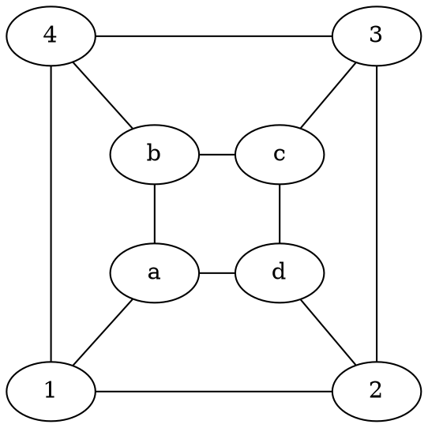

```graphviz
graph G2 { 
	rankdir=TD;
		A, B, C, D;
        A -- {<&#946;>, <&#947;>, <&#948;>};
        B -- {<&#945;>,<&#947;>, <&#948;>};
        C -- {<&#945;>, <&#946;>, <&#948;>};
        D -- {<&#945;>, <&#946;>, <&#947;>};
        <&#945;>, <&#946;>, <&#947;>, <&#948;>;
	}
```
Yes, we provide the following isomorphism:
    $f(1) = A$, $f(3) = B$, $f(b) = C$, $f(d) = D$, $f(c) = \alpha$, $f(a) = \beta$, $f(2) = \gamma$, $f(4) = \delta$, which is edge preserving and bijective.
#### 8) Let $G = (V,E)$ be a simple graph. Moreover let $G_R$ be its reduction. Prove that $G_R$ is acyclic.
--Proof by contradiction--
Let $G_R$ be a graph reduction which contains a cycle $C$, then $C$ is a walk $V_1^R \rightarrow V_2^R \leadsto V_1^R$. Thus, there exist strongly connected components $V_1, V_2$ in $G$ such that there is a walk from some $v_1 \in V_1$ to some $v_2 \in V_2$ and from $v_2$ to $v_1$. By construction of $G_R$ this means that $v_1$ and $v_2$ have to be in the same component in $G_R$. Contradiction!

#### 9) Find the strongly connected components and the reduction $G_R$ of the graph $G$ below. Furthermore, determine all vertex bases of $G$.

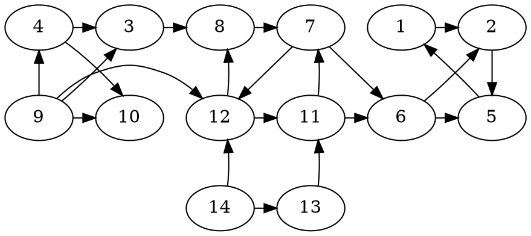
* Strongly connected components: $K1 = \{1,2,5\}$, $K2 = \{7,8,11,12\}$. 
* $G_R$:
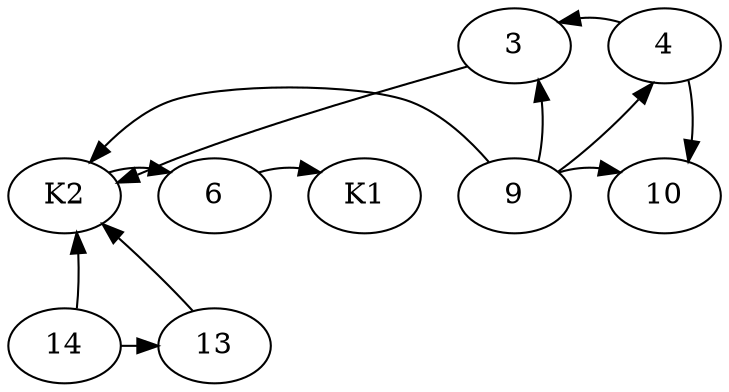

* Vertex base: $K_B$ = \{9,14\}.

#### 10) Use the matrix tree theorem to compute the number of spanning forests of the graph below!

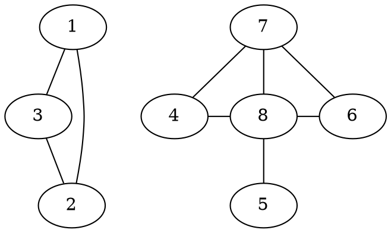
*Kirchoff's Matrix-Tree Theorem:* If $G=(V,E)$ is an undirected graph and $L$ is its graph Laplacian, then the number $N_T$ of spanning trees contained in $G$ is given by: 1.) Choose a vertex $v_j$ and eliminate the $j$-th row and column from $L$ to get a new matrix $\hat L_j$,
* Compute $N_T = det(\hat L_j)$ (The number $N_T$ counts spanning trees that are distinct as subgraphs of $G$. The resulting sum of trees that contribute to $N_T$ may be isomorphic.)

    To get all spanning forests of $G = G_1 \dot \cup G_2$, we simply calculate $N_T(G1) * N_T (G_2)$:
    The adjacency matrix of $G_1$:
    $$A(G_1) = \begin{pmatrix}
    0 & 1 & 1\\
    1 & 0 & 1\\
    1 & 1 & 0
    \end{pmatrix}$$
    
    The corresponding degree matrix: 
    
    $$D(G_1) = \begin{pmatrix}
    2 & 0 & 0\\
    0 & 2 & 0\\
    0 & 0 & 2
    \end{pmatrix}$$
    
    The laplacian:

    $$L(G_1) = \begin{pmatrix}
    2 & -1 & -1\\
    -1 & 2 & -1\\
    -1 & -1 & 2
    \end{pmatrix}$$
    
    after deleting the first row and column:
    
    $$\hat L(G_1) = \begin{pmatrix}
    2 & -1\\
    -1 & 2
    \end{pmatrix}$$
    
    calculating the determinant:
    
    $$ 
    det(\hat L_1(G_1)) = 4 - 1 = 3
    $$

    The adjacency matrix of $G_2$:
    $$A(G_2) = \begin{pmatrix}
    0 & 0 & 0 & 1 & 1\\
    0 & 0 & 0 & 0 & 1\\
    0 & 0 & 0 & 1 & 1\\
    1 & 0 & 1 & 0 & 1\\
    1 & 1 & 1 & 1 & 0
    \end{pmatrix}$$
    
    The laplacian matrix: 
    
    $$L(G_2) = \begin{pmatrix}
    2 & 0 & 0 & -1 & -1 \\
    0 & 1 & 0 & 0 & -1  \\
    0 & 0 & 2 & -1 & -1 \\
    -1 & 0 & -1 & 3 & -1 \\
    -1 & -1 & -1 & -1 & 4
    \end{pmatrix}$$
    
    after deleting the fourth row and column:

    $$\hat L_4(G_2) = \begin{pmatrix}
    2 & 0 & 0 & -1 \\
    0 & 1 & 0 & 0  \\
    0 & 0 & 2 & -1 \\
    -1 & 0 & -1 & 3 
    \end{pmatrix}$$
    
    calculating the determinant:
    
    $$ 
    det(\hat L_4(G_2)) = -1 \times \begin{pmatrix}
    2 & 0 & -1 \\
    0 & 2 & -1 \\
    -1 & -1 & 3
    \end{pmatrix} 
    = -1 \times (12 + 0 + 0 - 2 - 0 - 2) = -8
    $$
    we take $8$ as the sign only depends on which row and column you eliminate.
    Thus the number of $G = 3 \times 8$. 

## Exercise Sheet 2

#### 11) $K_n$ denotes the complete graph with  $n$ vertices. Show that the number of spanning trees of $K_n$ is $n^{n-2}$.
We observe that by completeness of $K_n$, its adjacency matrix is the $n \times n$ matrix of ones, similarly its degree matrix is the $n \times n$ matrix with $n$ on its diagonal.

$D(K_n) = \begin{pmatrix} 
        n & 0 & 0 & \dots \\
        0 & n & 0 &\dots \\
        0 & 0 & n &\dots \\
        \vdots & \vdots & \vdots & \ddots & \\
    \end{pmatrix}$

$A(K_n) = \begin{pmatrix} 
        1 & 1 & 1 & \dots \\
        1 & 1 & 1 &\dots \\
        1 & 1 & 1 &\dots \\
        \vdots & \vdots & \vdots & \ddots & \\
    \end{pmatrix}$

We can thus see that $L(K_n) = D(K_n) - A(K_n)$ is defined as follows:

$L(K_n) = \begin{pmatrix} 
        n-1 & -1 & -1 & \dots \\
        -1 & n-1 & -1 &\dots \\
        -1 & -1 & n-1 &\dots \\
        \vdots & \vdots & \vdots & \ddots & \\
    \end{pmatrix}$
    
We then delete the first row and column from $L(K_n)$ to get a new $n-1 \times n-1$ matrix $L_1$.

$L_1(K_n) = \begin{pmatrix} 
        1 & 1 & 1 & \dots \\
        -1 & n-1 & -1 &\dots \\
        -1 & -1 & n-1 &\dots \\
        \vdots & \vdots & \vdots & \ddots & \\
    \end{pmatrix}$

We can then add all other rows to the first row. We observe that each column in the resulting matrix $L_1(K_n)'$ contains exactly $n-2$ negative ones and one $n-2$ entry, thus the value in each column of row 1 is defined by $n-1-n-2 = 1$.

$L_1(K_n)' = \begin{pmatrix} 
        n-1 & -1 & -1 & \dots \\
        -1 & n-1 & -1 &\dots \\
        -1 & -1 & n-1 &\dots \\
        \vdots & \vdots & \vdots & \ddots & \\
    \end{pmatrix}$

We can then derive the matrix $L_1(K_n)''$ by adding the first row to each other row.


$L_1(K_n)'' = \begin{pmatrix} 
        1 & 1 & 1 & \dots \\
        0 & n & 0 &\dots \\
        0 & 0 & n &\dots \\
        \vdots & \vdots & \vdots & \ddots & \\
    \end{pmatrix}$

We observe that, $L_1(K_n)''$ is an upper triangular matrix and the determinant is thus calculated by $det(L_1(K_n)'')= l_{11} \times l_{22} \times \dots l_{n-1 \ n-1} = 1 \times n^{n-2} = n-2$.
#### 12) If $T$ is a tree having no vertex of degree 2, then $T$ has more leaves than internal nodes. Prove this claim: 
**1) By induction.**
--Proof by induction--
* Base case: 2 leaves, no internal nodes.
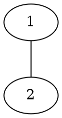
* Induction Hypothesis: 
    A tree $T=(V,E)$ with size $|V| < n$ and no vertices $v \in V$ with degree two has more leaves than internal nodes.
* Induction step: 
        We observe that $T= (V,E)$ and $|V| = n$ has some node $v \in V$ such that $v$ is connected to at most 1 non-leaf node but also at least 1 by n > 1. Since $\forall v \in V: d(v) \neq 2$, v is connected to at least 2 leaves and some subtree of $T$. We can then apply the induction hypothesis to $T'$, where $T'$ is a new tree, constructed by removing all leaves adjacent to $v$ and the edges connecting the leaves to $v$. $T'$ still has no vertex of degree 2 as $v$ is now a leaf, i.e. $d(v) = 1$ and all other vertices in $T'$ have degree $\neq 2$ by assumption. Then, by induction hypothesis $L(T') > I (T')$ since we removed at least two leaves from $T$ and one internal node in $T$ became a leaf in $T'$, $L(T') + 1 > I(T') + 1 \Rightarrow L(T) > I(T)$.
**2) Consider the average degree and use the Handshaking Lemma. 
    Let $T= (V,E)$ be a tree. Therefore, $|E| = |V| - 1$ as shown in exercise 1).
    We can insert this into the Handshaking Lemma:**
$$
\sum_{v \in V} d(v) = 2 (|V| -1)
$$
We consider the average degree of a node, which is 
$$
\frac{\sum_{v \in V} d(v)}{|V|} = \frac{2(|V|-1)}{|V|}
$$
Now, since each internal node, contributes at least 3 to the sum of degrees and each leaf contibutes exactly one to that sum, let $i$ be the number of internal nodes and $l$ the number of leaf nodes in $T$.
$$
\frac{2(|V|-1)}{|V|} \geq \frac{3i+l}{|V|} = 2(|V|-1) \geq 3i+l
$$
and since $|V| = i+l$, $2(|V| -1) \geq 2i+|V|$, from which we subtract $|V|$, to get 
$$|V| - 2\geq 2i \Leftrightarrow \frac{|V|}{2} - 1 \geq i \Leftrightarrow \frac{|V|}{2} > i.$$

Since $i$ represents less than half of the nodes in $V$, and all other nodes have to be leaf nodes, more nodes in $V$ are leaf nodes than internal nodes.

#### 13) Let $G = (V,E)$ be a connected graph with an even number of vertices. Show that there is a (not necessarily connected) spanning subgraph in which all vertices have odd degree. 
We show that this property holds for trees, as all connected grahs have a tree as a subgraph. 
--Proof by induction--
* Base case: $|V| = 2$, then $d(v) = 1$ for all vertices in the tree.
* Induction hypothesis: Let $G=(V,E)$ be a connected graph with an even number of vertices and $|V| = k$, $k < n$, $G$  has a connected spanning subgraph where all $v \in V$ have an odd degree. 
* Induction step: We observe that $T$ has some node $v$ which is connected to at most one non-leaf. We apply a case distinction on the degree of $v$:
    * $v$ has even degree:
        Then $v$ is connected to an odd number of leaves and one node $v_1$ which is connected to at least one other node,  since otherwise $G$ would have an odd number of vertices. 
        We can then delete the edge between $v$ and $v_1$. $v$ and its leaves represent a spanning subgraph $\dot G$, and since $v$ has an odd number of leaves it has an odd degree, foreach leaf this also holds trivially.
        The spanning tree $G$ can then be constructed by taking the subgraph connected to $v_1$ without the removed edge $v,v1$ and applying the induction hypothesis to it since we removed an even number of vertices it is applicable. We get some spanning subgraph $G'$ by this and the spanning subgraph for $G$ is $G' \cup \dot G$.
    * $v$ has odd degree:
        Then $v$ is connected to an even number of leaves and one node $v_1$ which could be connected to some other node. This means there is a spanning subgraph $\dot G$, comprised of $v$ and its leaves, where all leaves trivially have odd degree and since we keep $(v,v_1)$, $v$ has an odd degree as well. We construct a spanning subgraph $G'$ by removing $v'$'s leaves and the edges connecting the leaves to $v$ and applying the induction hypothesis, since the number of vertices we removed were even. We can then get a spanning subgraph of $G$ by $\dot G \cup G'$.
        
**Is this also true for non-connected graphs?**
    No, we provide a counterexample:
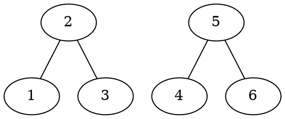
The number of vertices is even, but there is no spanning subgraph such that all vertices have odd degree, seeing as we cannot remove edges or we lose the spanning property.
     
#### 14) List all matroids $(E,S)$ with:
* $E = \{1\}$:
    $$\{\emptyset\}, \{\emptyset, \{1\}\}$$
* $E=\{1,2\}$:
    $$\emptyset,\\
    \{\emptyset, \{1\}\}, \{\emptyset, \{2\}\}, \{\emptyset, \{1\}, \{2\}\},\\
    \{\emptyset, \{1\}, \{2\}, \{1,2\} $$
* $E = \{1,2,3\}$:
    $$\emptyset,\\
    \{\emptyset, \{1\}\}, \{\emptyset, \{2\}\}, \{\emptyset, \{3\}\},\\
    \{\emptyset, \{1\}, \{2\}\} , \{\emptyset, \{2\}, \{3\}\}, \{\emptyset, \{1\}, \{3\}\}, 
    \{\emptyset, \{1\}, \{2\}, \{3\} \}, \\
    \{\emptyset, \{1\}, \{2\}, \{1,2\} \}, \{\emptyset, \{2\}, \{3\}, \{2,3\}\} , \\
    \{\emptyset, \{1\}, \{3\}, \{1,3\}\}, \\
    \{\emptyset, \{1\}, \{2\}, \{3\}, \{1,2\}, \{2,3\},\{1,3\}\},\\
    \{\emptyset, \{1\}, \{2\}, \{3\}, \{1,2\}, \{2,3\}\},\\
    \{\emptyset, \{1\}, \{2\}, \{3\}, \{1,2\}, \{1,3\}\},\\
    \{\emptyset, \{1\}, \{2\}, \{3\}, \{2,3\}, \{1,3\}\},\\
    \{\emptyset, \{1\}, \{2\}, \{3\}, \{1,2\}, \{2,3\}, \{1,3\}, \{1,2,3\}\}$$

#### 15) Let $E = \{a,b,c,d,e,f,g\}$ and $$S = \{A \subseteq E \ | \ |A| \leq 3 \} \backslash \{\{a,b,c\}, \{c,d,e\}, \{a,e,f\}, \{a,d,g\}, \{c,f,g\}, \{b,e,g\}, \{b,d,f\}\}.$$ Examine whether $(E,S)$ is a matroid.

$(E,S)$ is a matroid:
* The empty set is in $S$.
* $S$ is closed under inclusion, since all two, and one-element subsets of $E$ are in $S$.
* Assume some $\{i,h\} \in S$ and $\{x,y,z\} \in S$, then if $\{i,h\} \subset \{x,y,z\}$ we take the elem $j$ from $\{x,y,z\}$ which is not in $\{i,h\}$ and get $\{x,y,z\} = \{i,h\} \cup j$ thus trivially in $S$.
    If there is some element in $\{i,h\}$ which is not in $\{x,y,z\}$ then we have a choice of two elements in $\{x,y,z\}$ which we can add to $\{i,h\}$. 
    Since the excluded sets only have a max one element overlap, for any two element subset of $E$, we can choose the element in $E$ which does not create an excluded set.
    
#### 16) Prove that an independence system $(E,S)$ is a matroid iff for every $A \subseteq E$, all maximal independent subsets of $A$ have the same cardinality.
=>) Assume $A,B \in S$ such that $A$ and $B$ are both maximal and w.l.o.g. $|A| > |B|$ and by the matroid property $B \cup \{x\} \in S$. Therefore $B$ is not a maximal independent subset of $E$. Contradiction!

<=) This does not hold: 
    --Counterexample--
    Let $(E,S) = M$ be an independence system such that: 
    $$
    E = \{1,2,3,4,5,6,7\}
    $$
    and $S$ contains $\emptyset$, all subsets of $E$ of size 1 and $\{1,2\}, \{1,3\}, \{2,3\}, \{1,5\}, \{3,4\}, \{3,5\}, \{4,5\}, \{1,2,3\}, \{1,3,5\}, \{3,4,5\}$.
    Then, all maximal independent subsets $A \subseteq E$ have the same cardinality but $M$ is not a matroid as for $\{2,3\}$, and $\{3,4,5\}$, there exists no $x \in \{3,4,5\}$ such that $\{2,3\} \cup \{x\}$ is in $S$, since $\{2,3,4\} \notin S$ and $\{2,3,5\} \notin S$.
    
#### 17) Let $E_1$ and $E_2$ be two disjoint sets. Moreover, assume that $(E_1,S_1)$ and $(E_2,S_2)$ are matroids. Define $S := \{X \cup Y \ | \ X \in S_1 \text{ and } Y \in S_2\}$. Prove that $(E_1 \cup E_2, S)$ is a matroid.

Let $A,B$ be arbitrary elements in $S$ such that, w.l.o.g $|A| > |B|$, then by construction of $(E_1 \cup E_2, S)$ we can deconstruct the sets as follows:
$$
A := A_1 \cup A_2\\
B := B_1 \cup B_2
$$
where $A_1,B_1$ are all elements in $A,B$ which occur in $S_1$ and $A_2,B_2$ the ones from $S_2$.
Now, we know that either $|A_1| > |B_1|$ or $|A_2| > |B_2|$, let $A_i, B_i$ be the sets for which this property holds. Then, by $(E_i, S_i)$ being a matroid, there exists an $x \in A_i$ such that $B_i \cup \{x\} \in S_i$. 
Therefore, by definition of $(E_1 \cup E_2, S)$, $B_i \cup \{x\} \in S$.

## Exercise Sheet 3

#### 23) For a simple and undirected graph $G$ we define the *line graph* $\bar G$ as follows: $V(\bar G) = E(G)$ and $(e,f) \in E(\bar G)$ iff the edges $e$ and $f$ share a vertex. Prove that the line graph of a Eularian graph is Eularian and Hamiltonian.

* **Eularian:**
    For an arbitrary vertex $e \in \bar V$, its neighbours are defined as follows, by construction of $\bar G$:
    for $v_1, v_2$ such that $e$ connects $v_1$ to $v_2$ in $G$:
    where $v_1 = \{(v_1,v_j) \ | \ v_1 \neq v_j \land (v_1,v_j) \in E\}$, and 
     $v_2 = \{(v_i,v_2) \ | \ v_i \neq v_2 \land (v_i,v_2) \in E\}$.
     Then, $N(e) = V_1 \cup V_2$ where $V_1$ and $V_2$ are disjoint by construction.
     Thus, $|N(e)| = |V_1| + |V_2|$.
     Furthermore, we know $|V_1| = deg(v_1)-1$ and $|V_2| = deg(v_2)-1$ by construction of the respective sets.
     By $G$ Eularian, we know that $deg(v_1)$ and $deg(v2)$ are even, thus the sizes of $V_1,V_2$ are each odd, which means $|N(e)| = deg(e)$ is even by $|N(e)| = |V_1| + |V_2|$ and $V_1,V_2$ being odd.
     We have shown that for all $e \in \bar V$, $deg(e)$ is even, thus $\bar G$ is eularian.
* **Hamiltonian:**
    By construction, there exists a eularian cycle in $G$, which visits all edges once exactly. 
    Denote this cycle by $e_1, \dots, e_m$, where some vertex $v_1$ is incident to $e_1$ and $e_m$. 
    By definition, each edge pair $(e_1,e_2), \dots, (e_m,e_1)$ is incident to some shared vertex.
    By construction of $\bar G$ there then exists a hamiltonian cycle in $\bar G$, i.e. $e_1 \rightarrow e_2 \leadsto e_m \rightarrow e_1$ where no node is revisited.
     
#### 24) Prove that a graph $G$ is bipartite iff each cycle in $G$ has even length. 

=>) 
--Proof by Contradiction--
Let $G$ be a bipartite graph which contains a cycle $c$ with odd length.
By assumption, $c$ is defined by $v_1 \rightarrow v_2 \leadsto v_k \rightarrow v_1$ and $k$ is odd, i.e. c has odd length.
Then by $G$ being bipartite we can divide $V$ into $V_1,V_2$ such that $V = V_1 \cup V_2$ and $\forall e \in E$, $e$ connects a vertex in $V_1$ to some vertex in $V_2$.
Thus, w.l.o.g., by $(v_1,v_2) \in E$, $v_1 \in V_1$ and $v_2 \in V_2$, which means every second vertex on $c$ is in $V_2$ and every other vertex on $c$ in $V_1$. 
We know, $v_1 \leadsto v_{k-1}$ is of even length, thus $v_{k-1} \in V_2$ and by $(v_{k-1}, v_k) \in E$, $v_k \in V_1$, but then $v_1 \in V_2$ would have to hold, by $(v_k,v_1) \in E$. Contradiction!
Therefore, every cycle in $G$ has even length, assuming $G$ is bipartite.

<=) Let $G$ be a graph such that each cycle in $G$ has even length.
W.l.o.g. assume $G$ is connected.
We can then split $V$ into $V_1$ and $V_2$ such that $V = V_1 \cup V_2$ as follows:

We take some $v_1 \in V$ and say $v_1 \in V_1$, then forall other vertices in $v \in V$:
* let $V_1 = \{v \ | \ v \in V$ and the shortest path from $v$ to $v_1$ is of even length$\}$, and
* let $V_2 = \{v \ | \ v \in V$ and the shortest path from $v$ to $v_1$ is of odd length$\}$

We show, no vertex in $V_1$ is connected to some other vertex in $V_1$. (Analogous proof for $V_2$)

--Proof by Contradiction--
Assume there exist $v_i,v_j \in V_1/V_2$ such that $(v_i,v_j) \in E$, then there exists a cycle $c: v_1 \leadsto v_i \rightarrow v_j \leadsto v_1$ by construction of $V_1/V_2$.
    We distinguish:
    * $v_i,v_j \in V_1$: then the length of $c$ is defined by $v_1 \leadsto v_i + 1 + v_j \leadsto v_1$, by construction of $V_1$, $v_1 \leadsto v_i$ and $v_j \leadsto v_1$ are each even, meaning the length of $c$ is odd. Contradiction!
    * $v_i, v_j \in V_2$: then the length of $c: v_1 \leadsto v_i + 1 + v_j \leadsto v_1$, where $v_1 \leadsto v_i, v_j \leadsto v_1$ are each odd, thus their sum is even, if we now add 1 for the edge between $v_i$ and $v_j$, the length of $c$ is odd. Contradiction!

In both cases $c$ is of odd length, contradicting the assumption!

#### 25) Let $G$ be a Eularian graph and $H$ be a subdivision of $G$. 
* **Is $H$ Eularian?** 
--Yes--
Theorem: An undirected, connected graph is Eularian iff all its vertices have even degree.

Since $G$ is Eularian, all $v \in V$ have even degree. 
Now, all vertices in $H$ are either 
 * vertices from $G$:
     then either their edges are equivalent to the ones in $G$, meaning their degree remains unchanged from the one in the original graph or some edges connecting to the vertice were subdivided then their degree also remains unchanged as for each removed edge, a new one is added.
 * Or they are some new vertice $w$ which was added by a subdividing operation. Then their degree is exactly two and thus even. 
 
* **Suppose that $G$ is Hamiltonian. Does this imply that $H$ is Hamiltonian as well?**
--Counter example--
$G$ is Hamiltonian.
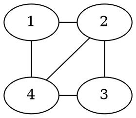

$H$ is not Hamiltonian.
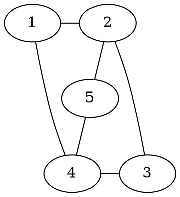

#### 26) 
(a) 
1) **Prove that every simple connected planar graph with at least 3 vertices satisfies $\alpha_1(G) \leq 3\alpha_0(G) - 6$.**

We know that each edge contributes to exactly two (not necessarily) different faces. A face touches at least 3 edges but maybe more.

Therefore, we can define the following inequality: 
$$
3 \alpha_2(G) \leq 2 \alpha_1(G)
$$
Now, by Euler's Formula: $\alpha_0(G) - \alpha_1(G) + \alpha_2(G) = 2$ i.e. $\alpha_2(G) = 2- \alpha_0(G) + \alpha_1(G)$

We can then substitute this into the defined inequality:
$$
3(2 - \alpha_0(G) + \alpha_1(G)) \leq 2\alpha_1(G) \Leftrightarrow
$$
$$
6 - 3\alpha_0(G) + 3\alpha_1(G) \leq 2\alpha_1(G) \Leftrightarrow
$$
$$
6 + 3 \alpha_1(G) \leq 2 \alpha_1(G) + 3\alpha_0(G) \Leftrightarrow
$$
$$
6 + \alpha_1(G) \leq 3 \alpha_0(G) \Leftrightarrow
$$
$$
\alpha_1(G) \leq 3\alpha_0(G) - 6
$$

2) **Show that this implies that $K_5$ is not planar:**

$\alpha_1(K_5) = 4 * 5 = 20$ and $\alpha_0(K_5) = 5$, then we put these numbers into the inequality: $20 \leq 3 \times 5 - 6 = 15 - 6 = 9$, therefore $K_5$ is not planar.

(b) **Prove the following statement or find a counter example: For all $n - m + f = 2$ and for which there exists a simple graph with $\alpha_0 = n, \alpha_1 = m$ there exists also a simple planar graph with $\alpha_0 = n, \alpha_1 = m$ and $\alpha_2 = f$.**

--Counter example--
$K_5$ with $n=5$, $m=20$, there exists a simple graph with $\alpha_0 = 5$ and $\alpha_1 = 20$ but there does not exist a planar simple graph for $n=5$ and $m=20$ as shown above.

#### 27) Let $n \in \mathbb{N}$ and $G = (V_1\cup V_2,E)$ be a bipartite graph with $min_{x \in V} d(x) \geq n/2$ and $|V_1| = |V_2| = n$. Use Hall's theorem to prove that $G$ has a perfect matching.

W.l.o.g. we argue over an arbitrary subset $S \subseteq V_1$.
We denote the set of all neighbours of all vertices in $S$ by: 

$$
N(S) = \{v_2 \ | \ (v_1,v_2) \in E \text{ and } v_1 \in S\}
$$

We distinguish two cases:

1) $|S| \leq n/2$: 
    then for some vertex $v \in S$, we know that $|N(v)| \geq n/2$.
    Additionally, $|N(S)| \geq |N(v)|$ by construction of $N(S)$. 
    Then, by assumption, $|N(S)| \geq |N(v)| \geq n/2 \geq |S|$, i.e. $|N(S)| \geq |S|$.
    
2) $|S| > n/2$:
    then for any vertex $v_2 \in V_2$, we know that is is connected to some vertex in $S$ as $d(v_2) \geq n/2$ and $V_2$ is only connected to vertices in $V_1$ of which more than $n/2$ vertices are in $S$.
    Thus, $\forall v_2 \in V_2$, $N(v_2) \cap S \neq \emptyset$, which means $\forall v_2 \in V_2$, $v_2 \in N(S)$.
    We conclude $|N(S)| = n$, thus $|S| \leq |N(S)|$, since $|S| \leq |V_1| = n = |N(S)|$. 
    
*Hall's Marriage Theorem*: There is a matching of size $|A|$ iff every set $S \subseteq A$ of vertices is connected to at least $|S|$ vertices in $B$. 

Since we showed $|S| \leq |N(S)|$ for all possible subsets $S \subseteq V_1$. We can apply Hall's Marriage theorem and derive that there is a matching of size $|V_1| = n$ which is a perfect matching.

#### 28) Let $G$ be a graph with $\alpha_0(G) = n$ and $\chi(G) = k$. Prove that $\alpha_1(G) \geq \binom{k}{2}$.

We know that any $k$-chromatic graph has at least $k$ vertices of degree $k-1$ each, otherwise it would not be $k$-chromatic.

Then, by Handshaking lemma: 
$$
k (k-1) \leq \sum_{v \in V} deg(v) = 2 |E| \Leftrightarrow 
$$
$$
\frac{k (k-1)}{2} \leq |E|
$$

Which is equivalent to $|E| \geq \binom{k}{2}$ as:
$$
\binom{k}{2}  = \frac{k!}{2(k-2)!} = \frac{k(k-1)(k-2)!}{2(k-2)!} = \frac{k(k-1)}{2}
$$

#### 29) Let $G_1 = (V, E_1)$ and $G_2 = (V, E_2)$ be two graphs. Set $G = (V, E_1 \cup E_2)$ and prove that $\chi(G) \leq \chi(G_1)\chi(G_2)$.

Since $G_1$ is $\chi(G_1)$-colourable, there exists some colouring $c_1$ such that $c_1$ $\chi(G_1)$-colours $G_1$.
Analogously, there exists some colouring $c_2$ such that $c_2$ $\chi(G_2)$-colours $G_2$. 

We can then construct a colouring $c$ which colours an arbitrary vertex $v  \in G$ by:
$$
c(v) = (c_1(v), c_2(v)),
$$
then $\chi(G) \leq \chi(G_1) \times \chi(G_2)$ as the number of colours which $c$ uses are all combinations of the colours $c_1, c_2$ use, thus $\chi(G_1) \times \chi(G_2)$, but there could be a smaller colouring, e.g. if $G_1 = G_2$. We now show that $c$ colours $G$ correctly, i.e. no connected vertices in $G$ are coloured the same colour.

W.l.o.g. for an arbitrary edge $e \in E_1$, where $e = (v_1,v_2)$ we know by $G_1$ being $\chi(G_1)$-colourable by function $c_1$, that $c_1(v_1) \neq c_2(v_2)$, thus $(c_1(v_1), c_2(v_1)) \neq (c_1(v_2),c_2(v_2))$.

Therefore, $c$ is a correct colouring of $G$.

#### 30) Show the following inequality for Ramsey numbers: If $r \geq 3$ then:
$$
R(n_1, \dots, n_{r-2}, n_{r-1}, n_r) \leq R(n_1, \dots, n_{r-2}, R(n_{r-1},n_r))
$$
*Hint*: Let $n= R(n_1, \dots, n_{r-2}, R(n_{r-1}, n_r))$ and consider an edge colouring of $K_n$ with $r$ colours, say $c_1, \dots, c_r$. Identify the colours $c_{r-1}$ and $c_r$ and apply the Ramsey property for $r-1$ colours. 

Let $n= R(n_1, \dots, n_{r-2}, R(n_{r-1}, n_r))$, $n_i' = n_i$ for $i \in \{1, \dots, r-2\}$ and $n_{r-1}' = R(n_{r-1},n_r))$, we consider an edge colouring $C$ of $K_n$ with $r$ colours, $c_1, \dots, c_r$. 
For each edge, coloured in $c_{r-1}$ or $c_r$, we colour it in $c_{r-1}$ to get a new colouring $C'$. 
Let $C'$ be a colouring derived from $C$, where all edges coloured $c_r$ are coloured $c_{r-1}$.

By definition of $n = R(n_1, \dots, n_{r-2}, R(n_{r-1},n_r))$, $C'$ contains some $K_{n_{i}'}$ coloured in $c_i$ and either:
* $i \in \{1, \dots, r-2\}$, then $K_{n_{i}}$ is coloured $c_i$ in $C$ by construction.
* $i = r-1$, then let $x = R(n_{r-1}, n_r)$, the edges in $K_x$ are coloured either $c_{r-1}$ or $c_r$ in $C$ by construction of $C'$.
    By definition of $x$, $K_x$ coloured in $C$ contains either $K_{n_{r-1}}$ with all edges coloured in $c_{r-1}$ or $K_{n_r}$ with all edges coloured in $c_r$.

Thus, $K_n$ coloured in $C$ contains some $K_{n_i}, i \in \{1, \dots, r\}$ with all edges coloured in $c_i$.
Since $C$ was arbitrary, $R(n_1, \dots, n_r) \leq n$.


## Exercise Sheet 4

#### 31) Let $A$ be a non-empty set. Show that $A$ has as many subsets with an odd number of elements as subsets with an even number of elements.

We proceed by induction on the size of $A$ and show that $A$ has $2^{|A|-1}$ odd-sized subsets.

* Base case: $|A| = n = 1$, then $A$ has two subsets, namely $A$ and $\emptyset$, thus we have $2^{0} = 2^{n-1}$ odd-sized subsets.

* Induction hypothesis: Let $A$ be a set of size $n$, then A has $2^{n-1}$ odd-sized subsets. 

* Induction step: Let $A$ be a set, such that $|A| = n+1$ and let $x \in A$. We construct a set $A'$ by $A' = A \backslash \{ x \}$.

    Then by construction of $A'$, $|A'| = n$ and thus by IH, $A'$ has $2^{n-1}$ odd-sized subsets. All possible subsets of $A$ can now be constructed through all subsets of $A'$ joined with $\{S \cup \{x\} | S \subseteq A'\}$. 
    Now, for each odd-sized subset $A'_{1} \subseteq A'$, $A'_{1} \cup \{x\}$ is even sized, and on the other hand for each even-sized, subset $A'_{2} \subseteq A'$, $A'_{2} \cup \{x\}$ is odd-sized. 

    The amount of odd-sized subsets of $A$ can thus be counted by taking all odd-sized subsets of $A'$, of which there are $2^{n-1}$ combined with all even-sized subsets of $A'$ which are combined with $x$ of which there are also $2^{n-1}$ thus we have $2^{n-1} + 2^{n-1} = 2^n$ odd-sized subsets.
    
    Since all subsets of $A$ are either even or odd, by the sum principle $|A_{even} \cup A_{odd}| = |A_{even}| + |A_{odd}|$, i.e. $2^{n+1} = 2^n + |A_{even}|$, thus $|A_{odd}| = 2^n = |A_{even}|$.
    
#### 32) Find the number of ways to place $n$ rooks on a $n \times n$ chessboard such that no two of them attack each other.

We observe that each of the $n$ rooks occupies one row, otherwise two rooks would attack each other. 

A column can then be chosen for each rook as follows:
The first rook can be placed on any of the $n$ columns, the second can be placed on any but the column the first rook occupies, etc.

The $n$-th rook has only a single column left since $n-1$ columns are already occupied.

Thus, there are $n \times n-1 \times \dots \times 1 = n!$ ways to place the $n$ rooks on the $n \times n$ checkerboard.


#### 33) Let $p_n(k)$ be the number of permutations of $\{1,2, \dots, n\}$ having exactly $k$ fixed points. Use the method of double counting to prove the identity $\sum_{k=0}^n kp_n(k) = n!$.

We define a matrix with $n$ rows and $n$ columns such that an entry $i,j$ is defined by the number of permutations with a fixed point of size $j$ which contain $i$ as part of their fixed point.

Then each row $i$ counts the number of permutations which have $i$ as a fixed point.
The amount of permutations which have $i$ as a fixed point is $(n-1)!$ as $i$ is fixed while all other spots are permuted. Thus $\sum_{k=1}^n (n-1)! = n*(n-1)! = n!$ when we count the sum of the entries of all rows.

On the other hand, each column $j$ counts the possible permutations with a fixed point of size $j$, but it is important to note that for each fixed point of size $j$ there are $j$ entries in the column, i.e. an entry for each element of the fixed point.
Therefore the sum over columns is defined by $\sum_{k=1}^n k \times p_n(k)$.

Example with $n=3$, i.e. $\{1,2,3\}$:
Here we have $3$ fixed points of size $1$ (in column 1), namely each of the elements, and one fixed point of size $3$, where all elements are contained (column 3).


|          | 1        |        2 |        3 |
|------    | -------- | -------- | -------- |
|**1**     | 1        | 0        | 1        |
|**2**     | 1        | 0        | 1        |
|**3**     | 1        | 0        | 1        |


#### 34) Let $A$ be a set of 11 positive integers such that for all $x \in A$ we have $20 \nmid x$. Prove that there are two distinct integers $a,b \in A$ such that $20 | (a+b)$ or $20 | (a-b)$.

We can create $10$ boxes such that we distribute the numbers into those boxes based on their remainder modulo $20$ as follows:
$$
\{1,19\}, \{2,18\}, \{3,17\}, \{4,16\}, \{5,15\}, \{6,14\}, \{7,13\}, \{8,12\}, \{9,11\},\{10\}
$$

For each of these boxes, one can see that each of them surmount to $20$ when it contains two different numbers and their difference surmounts to $0$ when equal. As we have $11$ integers, by the pigeonhole principle at least one class will have two numbers. 

Since, for each class, if there are two numbers $a,b$ assigned to the same class, we know either $20 | (a + b)$ if $a \neq b$ or $20 | (a-b)$ if $a = b$.

Thus, every set $A$ of $11$ integers such that $20 \nmid x$ for all $x \in A$ contains some $a,b$ such that $20 | (a + b)$ or $20 | (a-b)$.

#### 35) Let $n \in \mathbb{N}$, prove the identities:
$$
    \sum_{k=0}^{n} 2^k = 2^{n+1}-1
$$

We count the number of bitstrings of length $n+1$ containing at least one '1'.

* *RHS:* We can construct the bitstrings of length $n+1$ containing at least one '1', by fixing a '1' at each position $k+1$, where $0 \leq k \leq n$ in the string and fixing zeros in front of the '1', then for the bits behind the '1' there are $2^k$ possibilities of setting them one or zero each.  We count each string containing at least one '1', since, if there is some '1' in the bitstring, there also exists a rightmost '1' and since we fix each possible frontmost '1' exactly once, no string is counted twice.
* *LHS:*
    There are $2^{n+1}$ possible bitstrings of length $n+1$, but the string containing only zeroes contains no '1' thus we subtract $1$ from the possible bitstrings.

**and**
$$
\sum_{k=1}^n (n-k)2^{(k-1)} = 2^n - n - 1
$$
We count the number of bitstrings of length $n+1$ containing at least two '1's.

*  *LHS*: For each possible position $k$, $1 \leq k \leq n$ in the bitstring, we can place a '1' at position $k$ and place a second '1' at some position to the left of $k$ while fixing the rest of the bits toi the left of $k$ to zero guaranteeing two ones in the string, meaning there are $n-k$ possibilities to place that other '1' and for each position of that '1' to the left of $k$, we have $2^{k-1}$ possibilites to choose the bits to the right of $k$. Thus, we have $(n-k)2^{k-1}k$ possibilites for each fixed '1' at each position $k$.

* *RHS*: There are a total of 2^n bitstrings of length $n$, from which we subtract all strings with no ones, i.e. the string of only zeroes, and all strings with exactly one '1' of which there are $n$ different ones, as we can place the '1' in $n$ different positions and fix '0' in the other ones. Thus, the number of bitstrings with at least two '1's, are $2^n - n -1$.


#### 36) Let $D_n \subset S_n$ be the fixed-point-free permutations fo $\{1,2, \dots, n\}$, i.e. all permutations $\pi \in S_n$ with $\pi(i) \neq i$ for all $i$. The *derangement numbers* are defined as $d_n := |D_n|$. Prove the recurrence:
$$
    \begin{cases}
        d_n = (n-1)(d_{n-1} + d_{n-2}), & \text{for $n \geq 2$}.\\
        d_0 = 1, d_1 = 0.
    \end{cases}
$$
**using a combinatorial interpretation.**

We argue about the size of $D_n$ by counting its elements.
We know that forall derangements $(\pi(1), \dots, \pi(n)) \in D_n$ it holds that $\pi(i) \neq i$ forall $i \in \{1, \dots, n\}$.

Thus, it also holds that $\pi(n) \neq n$, i.e. we know that $\pi(n) = i$ for some $i \in \{1, \dots, n-1\}$,
we now distinguish based on the values of $\pi(i)$:

* case 1: $\pi(i) = n$, then $i$ and $n$ are mapped to each other and the number of derangements surmounts to $d_{n-2}$.
* case 2: $\pi(i) \neq n$: we can count the number of derangements by setting $\pi(n) = \pi(i)$ and derangement over $n-1$ elements, therefore the number of derangements here is $d_{n-1}$.
    
Since we have $n-1$ options for choosing $i$, we count:
$$
d_n = (n-1) (d_{n-1} + d_{n_2})
$$

**Furthermore, prove that this recurrence relation implies**
$$
d_n = n d_{n-1} + (-1)^n
$$
and 
$$
d_n = n! \sum_{k=0}^n \frac{(-1)^k}{k!}
$$

We first show that $d_n = n! \sum_{k=0}^n \frac{(-1)^k}{k!}$. We count the number $d_n$ of fixed point free permutations by subtracting the number of permutations which have some fixed point from all permutations. The former are defined as follows:
$$
\sum_{k=1}^n \binom{n}{k} (n-k)! (-1)^{k-1}
$$
i.e. we choose $k$ elements to fix, permute the remaining elements and apply the inclusion exclusion principle.

Then the number of derangements can be derived as follows.

$$
d_n = n! - \sum_{k=1}^n \binom{n}{k} (n-k)! (-1)^{k-1} = n!- \sum_{k=1}^n \frac{n!}{k!(n-k)!} (n-k)! (-1)^k-1 =
$$
$$
=n! - \sum_{k=1}^n \frac{n!}{k!} (-1)^{k-1} = \sum_{k=0}^n \frac{n!}{k!} (-1)^k = n! \sum_{k=0}^n \frac{(-1)^k}{k!}
$$

We then show $n! \sum_{k=0}^n \frac{(-1)^k}{k!} = n d_{n-1} + (-1)^n$ by induction.

* Base case: $n=1$: $1!(\frac{(-1)^0}{1!}) + 1!(\frac{(-1)^1}{1!}) = 1 \times 1 + (-1)^1 = 0 = 0$
* Induction hypothesis: $n \times d_{n-1} + (-1)^n = n! \sum_{k=0}^n \frac{(-1)^k}{k!}$

* Induction step: 
$$
\begin{aligned}
(n+1)d_{n} + (-1)^{n+1} &= (n+1)! \sum_{k=0}^{n+1} \frac{(-1)^k}{k!} \Leftrightarrow\\
(n+1) d_n + (-1)^{n+1} &= (-1)^{n+1} + (n+1)!\sum_{k=0}^{n} \frac{(-1)^k}{k!}
\Leftrightarrow \\ (n+1) d_n + (-1)^{n+1} &= 
(-1)^{n+1} + (n+1) n! \sum_{k=0}^n \frac{(-1)^k}{k!} \Leftrightarrow\\ (n+1) d_n + (-1)^{n+1} &= (-1)^{n+1} +(n+1) d_n
\end{aligned}
$$

#### 37) Compute the number of elements of the set $\{x \in \mathbb{N} \ | \ 1 \leq x \leq 100 000$ and $x$ is neither a square nor a 3rd, 4th or 5th power of some $y \in \mathbb{N}\}$. 

We define the following sets:

* $S_2 = \{x \in \mathbb{N} \ | \ 1 \leq x \leq 100 000 \land \exists y \in \mathbb{N}, x = y^2\} = \{1,2,4, \dots 99856\}$, where $|S_2| = 316$. 

* $S_3 = \{x \in \mathbb{N} \ | \ 1 \leq x \leq 100 000 \land \exists y \in \mathbb{N}, x = y^3\} = \{1,8,27, \dots 97336\}$, where $|S_3| = 46$. 

* $S_4$ does not need to be considered as all its elements are included in $S_2$ already. 

* $S_5 = \{x \in \mathbb{N} \ | \ 1 \leq x \leq 100 000 \land \exists y \in \mathbb{N}, x = y^5\} = \{1,32, \dots 100 000\}$, where $|S_5| = 10$. 

We observe the intersections of the considered sets in order to apply the Inclusion-Exclusion Principle:

* $S_2 \cap S_3 = \{x \in \mathbb{N} . \ | \ 1 \leq x \leq 100 000 \land \exists y \in \mathbb{N}, x = y^6\}$, where $|S_2 \cap S_3| = 6$.
* $S_3 \cap S_5 = \{x \in \mathbb{N} . \ | \ 1 \leq x \leq 100 000 \land \exists y \in \mathbb{N}, x = y^{15}\}$, where $|S_3 \cap S_5| = 2$.

* $S_2 \cap S_5 = \{x \in \mathbb{N} \ | \ 1 \leq x \leq 100 000 \land \exists y \in \mathbb{N},  x = y^{10}\}$, where $|S_2 \cap S_5| = 3$.

The size of the set is then defined by the Inclusion-Exclusion-Principle as follows:

$|S| - |S_2| - |S_3| - |S_5| + |S_2 \cap S_3| + |S_3 \cap S_5| + |S_2 \cap S_5| - |S_2 \cap S_3 \cap S_5|$ 
    $= 100 000 - 316 - 46 - 10 + 6 + 2 + 3 - 1 = 99638$

#### 38) 
**Let $n \in \mathbb{N}$. Prove Pascal's recurrence 
$$
\binom{n}{k} = \binom{n-1}{k-1} + \binom{n-1}{k}
$$
algebraically using the closed $\binom{n}{k} = \frac{n!}{k!(n-k)!}$ of the binomial coefficient**

$$
\frac{n!}{k!(n-k)!} = \frac{(n-1)!n}{k!(n-k)!} = (n-1)! \frac{n}{k!(n-k)!} =
$$
$$= (n-1)! \left( \frac{n-k}{k!(n-k)!} + \frac{k}{k!(n-k)!} \right)^\dagger = \frac{(n-1)!(n-k)}{k!(n-k)!} + \frac{(n-1)!k}{k!(n-k)!} =$$
$$
\frac{(n-1)!(n-k)}{k!(n-k)(n-k-1)!} + \frac{(n-1)!k}{k(k-1)!(n-k)!} = \frac{(n-1)!}{k!(n-k-1)!} + \frac{(n-1)!}{(k-1)!(n-k)!}=
$$
$$
= \binom{n-1}{k} + \binom{n-1}{k-1}
$$
Note that at $\dagger$ we simply calculated $+k-k$ which is equivalent to $0$ and thus a valid transformation.

**and prove 
$$
\sum_{k=0}^n \binom{n}{k}^2 = \binom{2n}{n}
$$
using a combinatorial interpretation of the binomial coefficients.**

We formulate the question *How many different subsets of size $n$ does a set of size $2n$ have?*
* $\binom{2n}{n}$: There are $\binom{2n}{n}$ possibilites to choose $n$ elements from a set of $2n$ elements.
* $\sum_{k=0}^n \binom{n}{k}^2$: We can answer the question by dividing the $2n$ elements into two sets $A,B$ of size $n$ each for which $A \cap B = \emptyset$. When we now choose $n$ elements from the original set, we can do this by choosing some from $A$ and some from $B$.

    The options for choosing are as follows:
    $0$ from $A$, $n$ from $B$: $\binom{n}{0} \binom{n}{n}$
    $1$ from $A$, $n-1$ from $B$: $\binom{n}{1} \binom{n}{n-1}$
    .
    .
    .
    $n$ from $A$, $0$ from $B$: $\binom{n}{n}\binom{n}{0}$

    Therefore, the total number of ways to choose sets of size $n$ from $A$ and $B$ is:
    $$
    \binom{n}{0}\binom{n}{n} + \binom{n}{1} \binom{n}{n-1} \dots + \binom{n}{n}\binom{n}{0}
    $$
    We observe that $\binom{n}{0} = \binom{n}{n}$, $\binom{n}{1} = \binom{n}{n-1}$, etc., therefore we can write:
    $$
    \binom{n}{0}^2+\binom{n}{1}^2 + \dots + \binom{n}{n}^2,
    $$ i.e. $$\sum_{k=0}^2 \binom{n}{k}^2$$

    Since both formulas answer the same question they are equivalent according to combinatorial interpretation.

#### Let $n,m \in \mathbb{N}$. Give two proofs of the identity 
$$
\sum_{k=0}^{n} \binom{m+k}{k} = \binom{n+m+1}{m+1}
$$
**one by induction:**

* Base case: $n=1$

$$
\binom{m}{0} + \binom{m+1}{1} = \binom{m+2}{m+1} \Leftrightarrow
$$
by Pascal's rule:
$$
\Leftrightarrow 1 + \binom{m+1}{1} = \binom{m+1}{m} + \binom{m+1}{m+1} \Leftrightarrow 1+ \binom{m+1}{1} = \binom{m+1}{m} + 1 \Leftrightarrow
$$
$$
\Leftrightarrow \binom{m+1}{1} = \binom{m+1}{m}
$$
which holds by symmetry ($\binom{n}{k} = \binom{n}{n-k}$)

* Induction hypothesis:
$$
\sum_{k=0}^{n} \binom{m+k}{k} = \binom{n+m+1}{m+1}
$$
holds for $n=i, i \in \mathbb{Z}_{+}$.

* Induction step: we start with the LHS:
$$
\sum_{k=0}^{n+1} \binom{m+k}{k} =
$$
we extract the first summand and apply the induction hypothesis:
$$
= \binom{n+m+1}{n+1} + \binom{n+m+1}{m+1} =
$$
by symmetry ($n = n+m+1, k = n+1$)
$$
= \binom{n+m+1}{m} + \binom{n+m+1}{m+1}=
$$
by Pascal's rule
$$
= \binom{n+m+2}{m+1}
$$

**and one by combinatorial interpretation:**
*Hint: Consider 0-1 sequences and group them according to the position of the last 1.*

We count the number of bitstrings of length $n+m+1$ with exactly $m+1$ $'1'$s.

* *RHS:* 
    We choose $m+1$ positions out of $n+m+1$ possible ones to place the $m+1$ $'1'$s.
* *LHS:*
    We consider the position of the last $'1'$ in the bitstring at $m+k+1$, then $n-k$ bits are $'0'$ after $m+k+1$. $k$ bits out of the possible $m+k$ positions can be $'0'$, i.e. $\binom{m+k}{k}$ possibilities to set the remaining bits exist. Taking the sum for all possible positions of the last $'1'$ from $m+1$ to $m+n+1$ yields all bitstrings of length $m+n+1$ with $m+1$.

#### 40) Prove that for all complex numbers $x$ and all $k \in \mathbb{N}$ we have:
$$
\binom{-x}{k} = (-1)^k \binom{x+k-1}{k}
$$

We know for complex numbers $x$:
$$
\binom{-x}{k} = \frac{-x^{\underline{k}}}{k!} =
$$
where $x^{\underline{k}}$ denotes the falling factorials, defined by: $x^{\underline{k}} = x * (x-1)* \dots * (x-k+1)$.
$$
= \frac{(-x)(-x-1)\times \dots \times (-x-k+1)}{k!} =
$$
we can extract $-1$ from each factor, meaning we extract $k$ times $(-1).
$$
= \frac{(-1)^k (x) (x+1) \times \dots \times (x+k-1)} = 
$$
we now expand by $\frac{(x-1)!}{(x-1)!}$, which is equivalent to $1$.
$$
= (-1)^k \frac{(x)(x+1) \times \dots \times (x+k-1)(x-1)!}{k!(x-1)!} =
$$
we observe that the numerator is equivalent to $(x+k-1)!$ which is then equivalent to the right hand side by definition of the binomial coefficient.
$$
(-1)^k \frac{(x+k-1)!}{k!(x-1)!} = (-1)^k \binom{x+k-1}{k}
$$

## Exercise Sheet 5

#### 41) Let $s_{n,k}$ be the Stirling numbers of the first kind. Prove $s_{n,2} = (n-1) H_{n-1}$ for $n \geq 2$, where $H_n = \sum_{k=1}^n \frac{1}{k}$.

By definition: $s_{n,k} = s_{(n-1, k-1)} + (n-1) s_{(n-1,k)}$

We proceed by induction on $n$:
    * Base case: $n=2$, then $s_(2,2) = 1! H_1 \Leftrightarrow 1 = 1$
    * Induction Hypothesis: $s_{(n,2)} = (n-1)! H_{n-1}$
    * Induction step: 
        $$
        s_{(n+1,2)} = n! H_n \Leftrightarrow s_{(n,1)} + n s_{(n,2)} = n! H_n \Leftrightarrow
        $$
        by IH and $s_{(n,1)} = (n-1)(n-2) \times \dots \times 1$
        $$
        \Leftrightarrow (n-1)! + n (n-1)! H_{n-1} = n! H_n \Leftrightarrow (n-1)! + n! H_{n-1} = n! H_n \Leftrightarrow
        $$
        now we divide by $n!$
        $$
        \Leftrightarrow \frac{1}{n} + H_{n-1} = H_n \Leftrightarrow \frac{1}{n} + \sum_{k=1}^{n-1} \frac{1}{k} = H_n \Leftrightarrow \sum_{k=1}^{n} \frac{1}{k} = H_n \Leftrightarrow H_n = H_n
        $$
        
#### 42) Let $S_{n,k}$ be the Stirling numbers of the second kind, that is, the number of partitions of the set $\{1,2, \dots, n\}$ into $k$ (non-empty subsets). Set $F_k(x) := \sum_{n \geq k} S_{n,k} x^n$. Prove that: 
$$
F_1(x) = \frac{x}{1-x}
$$

First, $S_{(n,1)} = 1$ since there is only one way to partition a set into size $1$ subsets.
Thus:
$$
F_1 (x) = \sum_{n \geq 1} x^n = x \sum_{n \geq 0} x^n = x \frac{1}{1-x} = \frac{x}{1-x}
$$

**and**
$$
F_2(x) = \frac{x^2}{(1-x)(1-2x)}
$$

$$
F_2(x) = \sum_{n \geq 2} S_{n,2} x^n = \sum_{n \geq 2} (2^{n-1} - 1) x^n = \sum_{n \geq 2} 2^{n-1} x^n - x^n =
$$
we apply an index shift
$$
= \sum_{n \geq 1} 2^nx^{n+1} - x^{n+1} = (\sum_{n \geq 1} 2^n x^{n+1})^\dagger - (\sum_{n \geq 1} x^{n+1})^\heartsuit =
$$
$$
= \frac{2x^2}{1-2x} - \frac{x^2}{1-x} = \frac{2x^2(1-x)}{(1-2x)(1-x)} - \frac{2x^2-2x^3-x^2+2x^3}{(1-2x)(1-x)} = \frac{x^2}{(1-x)(1-2x)},
$$
where
$$
\dagger = \sum_{n \geq 1} x^{n+1} = x^2 \sum_{n \geq 0} x^n = x^2 \frac{1}{1-x} = \frac{x^2}{1-x}
$$
and
$$
\heartsuit =  \sum_{n \geq 1} 2^n x^{n+1} = 2x^2 \sum_{n \geq 0} 2^n x^n = 2x^2 \frac{1}{1-2x} = \frac{2x^2}{1-2x}
$$
**Furthermore, show that the functions $F_k(x)$ satisfy the recurrence relation $F_k(x) = \frac{x}{1-kx}F_{k-1}(x)$** 
we start with the right hand side:
$$
\frac{x}{1-kx}F_{k-1}(x) = \frac{x}{1-kx} \sum_{n \geq k-1} S_{n,k-1} x^n =
$$
we replace by the series for the generating function:
$$
x \sum_{n \geq 0} k^n x^n \sum_{n \geq k-1} S_{n,k-1} x^n =
$$
we apply the cauchy product with $a_i = S_{i,k-1}, b_j = k^j$
$$
x \sum_{n \geq k-1} \sum_{i=k-1}^n S_{i, k-1} k^{n-i} x^n =
$$
drag the x into the sum and use the lemma: $S_{n+1,k+1} = \sum_{j=k}^n (k+1)^{n-j} S_{j,k}$
$$
\sum_{n\geq k-1} S_{n+1,k} x^{n+1}=
$$
we apply an index shift in the sum
$$
\sum_{n \geq k} S_{n,k} x^n
$$

**and solve the recurrence.**
Starting with:
$$
F_k(x) = \frac{x}{1-kx} F_{k-1}(x)
$$
we substitute repeatedly:

$$
F_k(x) = \frac{x}{1-kx} \frac{x}{1-(k-1)x}  F_{k-2}(x)
$$
we apply the substitution until the last term $F_1$
$$
F_k(x) = \frac{x^{k-1}}{(1-kx)(1-(k-1)x) \cdots (1-2x)} F_1(x)
$$
we substitute the definition of $F_1 = \frac{x}{1-x}$ and multiply it into the term.
$$
F_k(x) = \frac{x^{k}}{(1-kx)(1-(k-1)x)\cdots (1-2x) (1-x)} 
$$
#### 43) Prove the following identity:
$$
x^n = \sum_{k=0}^{n} S_{n,k} (x)_{k} \quad (n \geq 0)
$$
We proceed by induction:
* Base case: $n=1$
$$
x^1 = S_{1,0} (x)_0 + S_{1,1} (x)_1 = 0 + 1 \times x
$$

* Induction hypothesis:
For any case $n=1, i \in \mathbb{N}$:
$$
x^n = \sum_{k=0}^n S_{n,k}(x)_k
$$

* Induction step:
We show that the statement holds by starting with the left hand side
$$
x^n = x \times x^{n-1} =
$$
Let $i = n-1$, we apply the induction step for $i+1=n$:
$$
= x \sum_{k=0}^{n-1} S_{n-1,k} (x)_{k} = 
$$
we start the sum at 1 since $S_{n-1,0}$, thus the first summand does not affect the sum's value 

$$
= \sum_{k=1}^{n-1}S_{n-1,k} (x)_k x =
$$

by $x_{k+1} = x_k (x-k) = x \times x_k - kx_k$ we get $x \times x_k = x_{k+1} + k x_k$ by transforming the equation, which we can apply as follows:

$$
= \sum_{k=1}^{n-1} S_{n-1,k}( (x)_{k+1} + k(x)_k ) = \sum_{k=1}^{n-1} S_{n-1,k} (x)_{k+1} +  S_{n-1,k} k(x)_k  = \sum_{k=1}^{n-1} S_{n-1,k} (x)_{k+1} + \sum_{k=1}^{n-1} S_{n-1,k} k (x)_k =
$$
let $k' = k+1$, we set $k+1 = k'$:
$$
= \sum_{k'=2}^{n} S_{n-1,k'-1} (x)_{k'} + \sum_{k=1}^{n-1} S_{n-1,k} k (x)_k =
$$
since $S_{n-1,0} = S_{n-1,n} = 0$:
$$
= \sum_{k=1}^{n} S_{n-1,k-1} (x)_{k} + \sum_{k=1}^{n} S_{n-1,k} k (x)_k = \sum_{k=1}^{n} S_{n-1,k-1} (x)_{k} + k S_{n-1,k} (x)_k = \sum_{k=1}^{n} (S_{n-1,k-1} + k S_{n-1,k}) (x)_k =
$$
this is the definition of the recurrence relation of the Stirling numbers of the second kind:
$$
= \sum_{k=1}^{n} S_{n,k} (x)_k = \sum_{k=0}^{n} S_{n,k} (x)_k
$$

#### 44) Let $A,B$ be two finite sets with $|A| = n$ and $|B| = k$. How many injective mappings $f: A \rightarrow B$ are there?

We assume $k \geq n$ since otherwise no mapping is possible. For the first element in $n$, there are $k$ possibilities. 
For the second one, $k-1$, etc...
For the last element in $n$ there are still $k-(n-1)$ choices, thus we have $k(k-1)\times \dots \times (k-n+1)$ mappings, this is the falling factorial $k^{\underline{n}}$ which surmounts to 
$$
\frac{k!}{(k-n)!}
$$
**Furthermore, show that the number of surjective mappings $f: A \rightarrow B$ equals $k!S_{n,k}$.**

Assume $n \geq k$, otherwise no such mapping is possible. 
We want all possible partitions of $A$ into $k$ non-empty subsets which are calculated by $S(n,k)$. For each of these non-empty partitions of elements in $A$ we select one item in $B$ for the elements in the subset of $A$ to map to.
For the first partition we have $k$ options from $B$, $k-1$ for the second, etc. and for the last element in $B$, 1 option remains. Thus $k!$ options per partitioning exist, i.e. $k!S_{n,k}$.

#### 46) Compute:
$$
a_n = \sum_{k=0}^{n} k^2
$$
using generating functions:
Firstly, we know:
$$
\sum_{n \geq 0} z^n = \frac{1}{1-z}
$$
we take the derivative, applying the quotient rule and the chain rule
$$
\sum_{n \geq 0} n z^{n-1} = \frac{1'(1-z) - 1(1-z)'}{(1-z)^2}
$$
$$
\sum_{n \geq 0} n z^{n-1} = \frac{0 - (-1)}{(1-z)^2}
$$
we multiply by $z$ in order to preserve $z^n$ on the left side
$$
\sum_{n \geq 0} n z^{n} = \frac{z}{(1-z)^2}
$$
we take the derivative, again applying quotient and chain rule
$$
\sum_{n \geq 0} n^2 z^{n-1} = \frac{z'(1-z)^2 - z ((1-z)^2)'}{(1-z)^4}
$$
$$
\sum_{n \geq 0} n^2 z^{n-1} = \frac{(1-z)^2 +2z(1-z)}{(1-z)^4}
$$
$$
\sum_{n \geq 0} n^2 z^{n-1} = \frac{1-z+2z}{(1-z)^3}
$$
$$
\sum_{n \geq 0} n^2 z^{n-1} = \frac{1+z}{(1-z)^3}
$$
we multiply by $z$
$$
\sum_{n \geq 0} n^2 z^{n} = \frac{z+z^2}{(1-z)^3}
$$
Now, let $\tilde F(z)$ be the generating function for coefficient $n^2$, of which we just calculated the generating function.
We take the sum with coefficient $1$ of which we know the GF ($\frac{1}{1-z}$) and apply the cauchy product:
$$
\sum_{i \geq 0} i^2z^n \times \sum_{j \geq 0} z^n = \sum_{n \geq 0} \sum_{k=0}^{n} k^2 z^n 
$$
Therefore:
$$
\tilde F(z) \times \frac{1}{1-z} = F(z)
$$
we substitute the previously calculated GF of $\tilde F(z)$
$$
F(z) = \frac{z+z^2}{(1-z)^3}\times \frac{1}{1-z} = \frac{z+z^2}{(1-z)^4}
$$
Now we want to compute $[z^n]F(z)$, i.e.
$$
[z^n]\frac{z+z^2}{(1-z)^4}
$$
$$
[z^n]\frac{z}{(1-z)^4} + [z^n]\frac{z^2}{(1-z)^4}
$$
we apply an index shift, to remove the $z$ and $z^2$ respectively
$$
[z^{n-1}]\frac{1}{(1-z)^4} + [z^{n-2}]\frac{1}{(1-z)^4}
$$
$$
[z^{n-1}] (1-z)^{-4} + [z^{n-2}] (1-z)^{-4}
$$
we apply the generalised binomial theorem
$$
[z^{n-1}] \sum_{n \geq 0} \binom{-4}{n}(-1)^{-4-n}+z^n + [z^{n-2}] \sum_{n \geq 0} \binom{-4}{n}(-1)^{-4-n}+z^n
$$
now for the coefficient extraction we put in the respective indices
$$
\binom{-4}{n-1}(-1)^{-4-n-1} + \binom{-4}{n-2}(-1)^{-4-n-2}
$$
we apply some arithmetic equalities regarding the powers of $-1$
$$
\binom{-4}{n-1}(-1)^{n-1} + \binom{-4}{n-2}(-1)^{n-2}
$$
when writing out the respective quotients, we can drag the factors $-1$ into the quotients
$$
\frac{(-4)(-5) \dots (-4-(n-2)) (-1)^{n-1}}{(n-1)! } + \frac{(-4)(-5) \dots (-4-(n-3)) (-1)^{n-2}}{(n-2)!} =
$$
$$
= \frac{(4)(5) \dots (n - 2 + 4)}{(n-1)!} + \frac{(4)(5) \dots (n - 3 + 4)}{(n-2)!} = \frac{(4)(5) \dots (n + 2)}{(n-1)!} + \frac{(4)(5) \dots (n + 1)}{(n-2)!} = 
$$

$$
= \binom{n+2}{3} \binom{n+1}{3} = \frac{(n+2)(n+1)n + (n+1)n(n-1)}{3!} = \frac{(2n+1)(n+1)n}{3!}
$$

#### 48) Prove the following identity: 
$$
\sum_{n \geq 0} \binom{2n}{n}z^n = \frac{1}{\sqrt{1-4z}}.
$$

We start with the right hand side:

$$
\frac{1}{\sqrt{1-4z}} = (1-4z)^{-\frac{1}{2}} = 
$$
by the generalised binomial theorem with $x = 1$ and $y=-4z$, since $x$ is $1$, only $y$ is considered. 
$$
= \sum_{n=0}^{\infty} \binom{-\frac{1}{2}}{n} (-4z)^n = \sum_{n=0}^{\infty} \binom{-\frac{1}{2}}{n} (-4)^n z^n =
$$
again, by the theorem to handle $-\frac{1}{2}$ in the upper index
$$
= \sum_{n=0}^{\infty} \frac{-\frac{1}{2} * (-\frac{1}{2} - 1) \times \dots \times (-\frac{1}{2} - n +1)}{n!} (-4^n) z^n =
$$
we extract $(-\frac{1}{2}^n)$ from each factor
$$
= \sum_{n=0}^{\infty} (-4)^n (-\frac{1}{2}^n) \frac{1 \times 3 \times (2n - 1)}{n!} z^n = 
$$
all odds as factorials are $!!$
$$
= \sum_{n=0}^{\infty} 2^n \frac{(2n-1)!!}{n!} z^n = 
$$
since $(2n-1)!! = \frac{(2n)!}{2^n n!}$ by definition
$$
\sum_{n=0}^{\infty} 2^n \frac{\frac{(2n)!}{2^n n!}}{\frac{n!}{1}} z^n = \sum_{n=0}^{\infty} 2^n \frac{(2n)!}{2^n n! n!} z^n = \sum_{n=0}^{\infty} \binom{2n}{n} z^n
$$

#### 49) Compute
$$
[z^n] \frac{2+5z}{\sqrt{1-8z}}
$$
where $[z^n]\sum_{n \geq 0} a_n z^n := a_n$ is the coefficient extraction operator.
$$
\frac{2+5z}{\sqrt{1-8z}} = (2+5z^2) \frac{1}{\sqrt{1-8z}} =
$$
we apply the generalised binomial theorem for $(1-8z)^{-0.5}$
$$
= (2+5z^2) \sum_{k=0}^{\infty} \binom{-0.5}{k} (-8z)^k = (2+5z^2) \sum_{k\geq 0} \binom{-0.5}{k} (-1)^k 8^k z^k =
$$
$$
= 2 \sum_{k\geq 0} \binom{-0.5}{k} (-1)^k 8^k z^k + 5z^2 \sum_{k\geq 0} \binom{-0.5}{k} (-1)^k 8^k z^k =
$$

$$
= 2 \sum_{k\geq 0} \binom{-0.5}{k} (-1)^k 8^k z^k + 5 \sum_{k\geq 0} \binom{-0.5}{k} (-1)^k 8^k z^{k+2} =
$$
but we want $z^k$ for coefficient extraction

$$
= 2 \sum_{k\geq 0} \binom{-0.5}{k} (-1)^k 8^k z^k + 5 \sum_{k\geq 2} \binom{-0.5}{k-2} (-1)^{k-2} 8^{k-2} z^{k} =
$$
we want the same indices in both sums so we extract the first two elements on the left sum
$$
= 2 + 8z + (2 \sum_{k\geq 2} \binom{-0.5}{k} (-1)^k 8^k z^k + 5 \sum_{k\geq 2} \binom{-0.5}{k-2} (-1)^{k-2} 8^{k-2} z^{k}  =
$$

$$
= 2 + 8z + \sum_{k\geq 2} \left(\binom{-0.5}{k} (-1)^k 8^k 2 \right) + \left( \binom{-0.5}{k-2} (-1)^{k-2} 8^{k-2} 5 \right) z^{k}  =
$$
therefore (since $(-1)^k = (-1)^{k-2}$):
$$
[z^n]= \begin{cases}
      2, & \text{if}\ k=0 \\
      8, & \text{if}\ k=1 \\
      \left(\binom{-0.5}{k} (-1)^k 8^k 2 \right) + \left( \binom{-0.5}{k-2} (-1)^{k} 8^{k-2} 5 \right)  &  \text{if}\ k \geq 2
\end{cases}
$$
#### 50) Solve the following recurrence using generating functions.

$a_{n+1} = 3 a_n -2$, for $n \geq 0, a_0 = 2$

$$
\sum_{n=0}^{\infty} a_{n+1} z^{n+1} = 3 \sum_{n=0}^{\infty} a_{n} z^{n+1} - 2 \sum_{n=0}^{\infty} z^{n+1} \Leftrightarrow
$$
we want $z^n$ in all of our sums
$$
\Leftrightarrow \sum_{n=1}^{\infty} a_{n} z^{n} = 3z \sum_{n=1}^{\infty} a_{n} z^{n} - 2z \sum_{n=0}^{\infty} z^{n} \Leftrightarrow
$$
we can transform the sums to their respective generating functions on the right side, the first sum is simple, for the second we need to consider that $a_n = 1$ so the generating function is $\frac{1}{1-z}$
$$
\Leftrightarrow (\sum_{n=1}^{\infty} a_{n} z^{n}) + a_0z^0 - a_0z^0 = 3z F(z) - 2 \frac{z}{1-z} \Leftrightarrow
$$
now we want each sum to start at $0$, so we add the $0$th summand to the left sum
$$
\Leftrightarrow (\sum_{n=1}^{\infty} a_{n} z^{n}) + a_0z^0 - a_0z^0 = 3z F(z) - 2 \frac{z}{1-z} \Leftrightarrow
$$
we can drag the $0$-th summand into the sum, to shift the index
$$
\Leftrightarrow (\sum_{n=0}^{\infty} a_{n} z^{n}) - a_0z^0 = 3z F(z) - 2 \frac{z}{1-z} \Leftrightarrow
$$
we again replace by the generating function
$$
\Leftrightarrow F(z) - a_0 = 3z F(z) - 2 \frac{z}{1-z} \Leftrightarrow  $$

$$
\Leftrightarrow F(z) - 3z F(z) =  - 2 \frac{z}{1-z} + a_0 
$$

$$
\Leftrightarrow F(z) - 3z F(z) = - \frac{2z}{(1-z)(1-3z)} + \frac{a_0}{1-3z} \Leftrightarrow
$$
we apply partial fraction decomposition
$$
\Leftrightarrow F(z) =  \frac{1}{1-z} - \frac{1}{1-3z} + \frac{a_0}{(1-3z)} \Leftrightarrow
$$
$$
\Leftrightarrow F(z) =  (a_0  - 1) \frac{1}{(1-3z)} + \frac{a_0}{(1-3z)} \Leftrightarrow
$$
$$
\Leftrightarrow F(z) =  (a_0  - 1) \sum_{n=0}^{\infty} 3^n z^n + \sum_{n=0}^{\infty} z^n \Leftrightarrow
$$
$$
\Leftrightarrow F(z) = \sum_{n=0}^{\infty} (((a_0  - 1)3n)+1) z^n
$$

## Exercise Sheet 6

#### 51) A $t$-ary tree is a plane rooted tree such that every node has either $t$ or $0$ successors. A node with $t$ successors is called internal node. 
* How many leaves does a $t$-ary tree with $n$ internal nodes have? 
    We can count the number of nodes in our tree by counting all nodes with a parent and the nodes without a parent, the latter simply being the root. Each internal node has to have $t$ children, thus we have:
    $$
    t \times n +1
    $$
    nodes in total, meaning we have:
    $$
    (t n + 1) - n = t (n-1) + 1
    $$
    leaves, by removing the internal nodes from the total nodes.

* Moreover, let $a_n$ be the number of $t$-ary trees with $n$ internal nodes and $A(z)$ the generating function of this sequence. Find a functional equation for $A(z)$!
    We can construct a $t$-ary tree with $n$ internal nodes by taking $t$ $t$-ary trees which have $n-1$ internal nodes all together and attaching them to a root node.

$$
a_n = \sum_{n_1, \dots, n_t} a_{n_1} \times \dots \times a_{n_t},
$$
where $(n_1, \dots, n_t)$ are all possible combinations such that $n_1 + \dots n_t = n-1$

We define $a_0=1$ since there exists exactly one $t-ary$ tree with no internal nodes, namely the one consisting of only the root.
Then, since $A(z) = \sum_{n \geq 0} a_n z^n$, by definition of generating functions.

Furthermore, we know 
$$
(A(z))^t = (\sum_{n \geq 0} a_{n+1}z^n)^t = \sum_{n \geq 0} c_n z^n,
$$
where 
$$
c_n = \sum_{n_1 + \dots + n_t = n} a_{n_1} \times \dots \times a_{n_t}
$$
which can be observed from the definition of the cauchy product. 

We observe that $c_n=a_{n+1}$, hence 

$$
(A(z))^t = \sum_{n \geq 0} a_{n+1}z^n
$$
and 
$$
\sum_{n \geq 1} a_n z^{n-1} = \sum_{n \geq 1} a_n z^{n-1} + a_0 - a_0 = \frac{1}{z} \sum_{n \geq 0} a_n z^n - a_0
$$

Thus, our functional equation for $A(z)$ is defined by:
$$
(A(z))^t = \frac{A(z)-a_0}{z} \Leftrightarrow (A(z))^t \times z + 1 = A(z)
$$

#### 52) Compute the number $t_n$ of plane rooted trees with $n$ nodes which can be described by the equation:


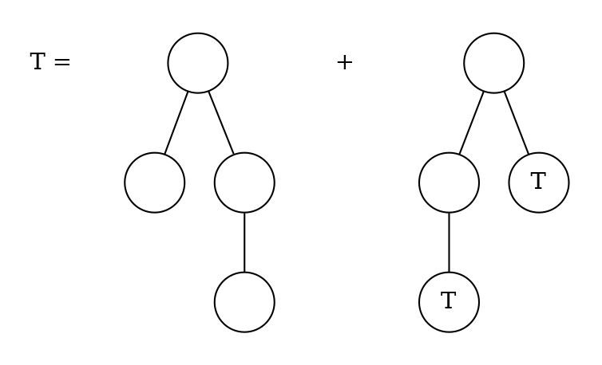

Then $t_4 = 1$ and $t_n = \sum_{i+j=n-2} t_i \times t_j$, for $n \geq 4$.

We observe that 
$$
t_{n+2} = \sum_{i+j=n} t_i \times t_j = c_n, \quad n > 2
$$
where, since, 

$$
(A(z))^2 = \sum_{n > 2} t_{n+2} z^n= A(z) \times A(z) = \sum_{n \geq 0} t_n z^n \times \sum_{n \geq 0} t_n z^n = \sum_{n \geq 0} (\sum_{l=0}^{n} t_l \times t_{n-l})z^n =
$$
$$
= \sum_{n \geq 0} (\sum_{i+j=n} t_i \times t_j)z^n = \sum_{n > 2} t_{n+2} z^n =
$$
$$
(\sum_{n > 2} t_{n+2} z^n) + t_4 z^2 - t_4 z^2 = (\sum_{n \geq 2} t_{n+2} z^n) - z^2 =
$$
$$
= z^{1/2} \sum_{n \geq 2} t_{n+2} z^{n+2}) - z^2 =
$$
since for $n = 0,1,2,3$, $t_n = 0$
$$
= z^{1/2} \sum_{n \geq 0} t_{n} z^{n}) - z^2 
$$

Then, we have $(A(z))^2 = z^2 A(z) - z^2$, we solve the quadratic equation:

$$
A(z) = \frac{1}{2z^2} \pm \sqrt{\frac{1}{4z^4} - z^2}
$$
refactor to get the same enumerator:
$$
A(z) = \frac{1-\sqrt{1- 4z^6}}{2z^2}
$$
where the negative square root denotes a common generating function, thus we substitute
$$
A(z) = \frac{1}{2z^2} \sum_{n \geq 1} \binom{\frac{1}{2}}{n} (-4^n) z^{6n} =
$$

we know the $0$th series number is $1$:
$$
\sum_{n \geq 1} -\frac{1}{2} \binom{1/2}{n} (-4^n) z^{6n -2}
$$
we can then define $t_n$:

$$  
t_n =
    \begin{cases}
      - \binom{\frac{1}{2}}{k} (-4^k) \frac{1}{2} & \text{if } n = 6k-2 \text{ for } k \in \mathbb{N}\\
      0 & \text{otherwise}
    \end{cases}       
$$
#### 53) Compute the number $t_n$ of plane rooted trees with $n$ nodes.
Since we are dealing with plane-rooted trees, left-right order matters, these trees can be described by the root combined with a sequence of subtrees:
$$
P = \{\circ \} \times seq(P)
$$
We apply the relevant generating functions:
$$
P(z) = \frac{z}{1- P(z)}
$$
we multiply by the denominator
$$
P(z) - (P(z))^2 = z
$$
and solve the quadratic equation, taking the positive result as $z_0=0$
$$
P(z) = \frac{1-\sqrt{1-4z}}{2}
$$
when comparing this to binary trees, only factor $1/z$ is missing for binary trees, thus we can state that $1/zP(z)$ is equivalent to the generating function for the Catalan numbers.

The number of plane-rooted trees with $n$ nodes can thus be defined by coefficient extraction of the Catalan numbers:
$$
[z^n]P(z) = [z^{n-1}] C(z) = \frac{1}{n} \binom{2(n-1)}{n-1} \quad \text{, for } n\geq 1 
$$
since
$$
C_n = \frac{1}{n+1} \binom{2n}{n}
$$

#### 54) Consider the following context-free grammar: $S \rightarrow aSb|\epsilon$. This defines a formal language $\mathcal{L}$ which consists of all words $w$ over the alphabet $\Sigma = \{a,b\}$ such that either (a) $w$ starts with $a$ followed by a word from $\mathcal{L}$, then a $b$ follows, which is itself followed by another word of $\mathcal{L}$, or (b) $w$ is the empty word. Compute the number of words in $\mathcal{L}$ that consist of $n$ letters. Do this by finding a combinatorial structure that specifies $\mathcal{L}$ and analysing the generating function of that structure.

```graphviz
graph graphname { 
splines=false
a[label="",shape=point]
b[label="",shape=point]
c[label="",shape=point]
d[label="",shape=point, style=invis]
e[label="",shape=point, style=invis]
f[label="",shape=point, style=invis]
g[label="",shape=point, style=invis]

		a -- b[label="a"]; 
		a -- c[label="b"];
        c--d[shape=none];
        c--e[shape=none];
        b--g[shape=none];
        b--f[shape=none];

} 
```
where the words of length $0$ have one possibility and there exist no words of odd length, since exerytime we write $a$, we write a $b$.

We can easily show that the language represented by this grammar can be translated to $D_1$, where $D_1$ is the Dyck language over one set of parentheses, we simply translate $a \rightarrow ($ and $b \rightarrow )$. Since we know that $C_n$ is the number of Dyck words of length $2n$, where $C_n$ is the $n$th catalan number, we can define the number of words in $\mathcal{L}$ with $n$ letters by: 
$$
[z^{n}] D_z = \frac{1}{\frac{n}{2} +1} \binom{n}{\frac{n}{2}}
$$, for even $n \geq0$ 
and by $0$ otherwise.

#### 55) Consider a regular $(n+2)$-gon $A$, say, with the vertices $0,1, \dots, n+1$. A triangulation is a decomposition of $A$ into $n$ triangles such that the $3$ vertices of each triangle are vertices of $A$ as well. Show that the set $\mathcal{T}$ of triangulations of regular polygons can be described as a combinatorial construction satisfying 
$$
\mathcal{T} = \{\epsilon\} \cup \mathcal{T} \times \Delta \times \mathcal{T}
$$
**where $\Delta$ denotes a single triangle and $\epsilon$ denotes the empty triangulation (consisting of no triangle and corresponding to the case $n=0$).** 

Order matters here, since we have labelled vertices.
We have $0$ triangulations for $n=0$, since we then only have 2 vertices. 
$$\{\epsilon\}$$
Otherwise, we can split our $(n+2)$-gon into a triangle and the remaining shapes to be triangulated, hence:
$$
\mathcal{T} \times \Delta \times \mathcal{T}
$$

**What is the number of triangulations of $A$?**
From the combinatorial construction, we directly get:
$$
T(z) = 1 + T(z) \times z \times T(z) \Leftrightarrow
$$

$$
\Leftrightarrow T(z) = 1 + zT(z)^2 \Leftrightarrow
$$
we solve the quadratic equation for $a=z, b = -1, c = 1$:
$$
T(z)= \frac{1- \sqrt{1-4z}}{2z}
$$
where we chose the negative solution, since for $n=0$ the number is 0.

This is the closed form of the Catalan numbers.
Therefore, the number of triangulations of $A$ is computed by:
$$
[z^n]\sum_{n \geq 0} \frac{1}{n+1} \binom{2n}{n}
$$
which is 
$$
 \frac{1}{n+1} \binom{2n}{n}
$$

#### 56) Use exponential generating functions to determine the number $a_n$ of ordered choices of $n$ balls such that there are $2$ or $4$ red balls, an even number of green balls and an arbitrary number of blue balls.
* $2$ or $4$ red balls: $(\frac{z^2}{2!} + \frac{z^4}{4!})$
* even number of green balls: $\frac{1}{2}(e^z + e^{-z})$
* arbitrary number of blue balls: $e^z$

We therefore get: 
$$
(\frac{z^2}{2!} + \frac{z^4}{4!}) \times \frac{1}{2}(e^z + e^{-z}) \times e^z = 
$$

$$
= (\frac{z^2}{2!} + \frac{z^4}{4!}) \times (\frac{e^{2z}}{2} + \frac{e^{0}}{2})= 
$$

$$
= \frac{1}{2} \frac{z^2}{2} + \frac{1}{2} \frac{z^4}{4!} + \frac{e^{2z}}{2} \frac{z^2}{2} + \frac{e^{2z}} {2}\frac{z^4}{4!} = 
$$

$$
\frac{1}{2} \frac{z^2}{2} + \frac{1}{2} \frac{z^4}{4!} + \frac{1}{4} z ^2 \sum_{n \geq 0} 2^n \frac{z^{n}}{n!} + 
\frac{1}{48} z ^4 \sum_{n \geq 0} 2^n \frac{z^{n}}{n!} = 
$$

$$
\frac{1}{2} \frac{z^2}{2} + \frac{1}{2} \frac{z^4}{4!} + \sum_{n \geq 0} \frac{1}{4}  2^n \frac{z^{n}}{n!} + 
\sum_{n \geq 0} \frac{1}{48}  2^{n} \frac{z^{n}}{n!} = 
$$

$$
\frac{1}{2} \frac{z^2}{2} + \frac{1}{2} \frac{z^4}{4!} + \sum_{n \geq 2} \frac{1}{4}  2^{n-2} \frac{z^{n}}{(n-2)!} + 
\sum_{n \geq 4} \frac{1}{48} 2^{n-4} \frac{z^{n}}{(n-4)!} = 
$$

$$
\frac{1}{2} \frac{z^2}{2} + \frac{1}{2} \frac{z^4}{4!} + \sum_{n \geq 2} \frac{1}{16} n (n-1) 2^n \frac{z^n}{(n-2)!} + 
\sum_{n \geq 4} \frac{1}{768} n (n-1)(n-2) (n-3) 2^n \frac{z^n}{n!} = 
$$

$$
\frac{z^2}{2} + 3 \frac{z^3}{3!} + 13 \frac{z^4}{4!} + \sum_{n \geq 5} \frac{1}{16} n (n-1) 2^n \frac{z^n}{n!} + 
\sum_{n \geq 5} \frac{1}{768} n (n-1) (n-2) (n-3) 2^n \frac{z^n}{n!} = 
$$

$$
\frac{z^2}{2} + 3 \frac{z^3}{3!} + 13 \frac{z^4}{4!} + \sum_{n \geq 5} (\frac{1}{16} + \frac{(n-2)(n-3)}{768}) n (n-1) 2^n \frac{z^n}{n!} = 
$$

$$
\frac{z^2}{2} + 3 \frac{z^3}{3!} + 13 \frac{z^4}{4!} + \sum_{n \geq 5} \frac{1}{768} (48 + n^2 - 5n + 6) n (n-1) 2^n \frac{z^n}{n!} = 
$$

$$
\frac{z^2}{2} + 3 \frac{z^3}{3!} + 13 \frac{z^4}{4!} + \sum_{n \geq 5} \frac{1}{768} (n^2 - 5n + 54) n (n-1) 2^n \frac{z^n}{n!} = 
$$
We therefore get the following numbers for $a_n$:
$$
a_n = \begin{cases}
1  &\textit{, if } n = 2 \\
3  &\textit{, if } n = 3 \\
13  &\textit{, if } n = 4 \\
\frac{1}{768} (n^2 - 5n + 54) n (n-1) 2^n  &\textit{, if } n \geq 5 
\end{cases}
$$

#### 57) Determine all solutions of the recurrence relation:
$$
a_n - 2 n a_{n-1} + n (n-1) a_{n-2} = 2n \times n! \textit{, } n \geq 2 \textit{, } a_0 = a_1 = 1.
$$
*Hint: Use exponential generating functions.*

$$
\sum_{ n \geq 2} a_n \frac{z^n}{n!}  - 2 \sum_{ n \geq 2} n a_{n-1} \frac{z^n}{n!} + \sum_{ n \geq 2} n (n-1) a_{n-2} \frac{z^n}{n!} = 2 \sum_{ n \geq 2} n  n! \frac{z^n}{n!} 
$$

$$
(\sum_{ n \geq 0} a_n \frac{z^n}{n!}) - a_0 - za_1  - 2z (\sum_{ n \geq 0} n a_{n} \frac{z^n}{n!}) - a_0 + z^2 (\sum_{ n \geq 0} a_{n} \frac{z^n}{n!}) = 2 ((\sum_{ n \geq 2} n z^n ) - z)
$$

we input the respective generating functions:
$$
\hat{A} - a_0 - za_1  - 2z \hat{A} - a_0 + z^2 \hat{A} = 2 \left( \frac{z}{(1-z)^2}  - z \right)
$$
$$
\hat{A} - 1 - z  - 2z \hat{A}  + 2z + z^2 \hat{A} = \frac{2z}{(1-z)^2}  - 2z
$$
$$
\hat{A} (1-2z+z^2) + 3z - 1 = \frac{2z}{(1-z)^2}
$$

$$
\hat{A} (1-z)^2 + 3z - 1 = \frac{2z}{(1-z)^2}
$$

$$
\hat{A} (1-z)^4 + 3z(1-z)^2 - (1-z)^2 = 2z
$$

$$
\hat{A} (1-z)^4 + 3z - 6z^2 + 3z^3 - 1 + 2z -z^2 = 2z
$$

$$
\hat{A} (1-z)^4 = -3z^3 + 7z^2 -3z + 1 =
$$

$$
\hat{A} = \frac{(1-z)^3}{(1-z)^4} + \frac{4z^2 - 2z^3}{(1-z)^4} =
$$

$$
\hat{A} = \sum_{n \geq 0} z^n + 4z^2 \sum_{n \geq 0} \binom{-4}{n} z^n- 2z^3 \sum_{n \geq 0} \binom{-4}{n} z^n =
$$

$$
\hat{A} = \sum_{n \geq 0} z^n - 2 \sum_{n \geq 3} \binom{-4}{n-3} z^n + 4 \sum_{n \geq 2} \binom{-4}{n-2} z^n =
$$

$$
\hat{A} = 1 + z + z^2 \sum_{n \geq 3} z^n - \sum_{n \geq 3} 2\binom{-4}{n-3} z^n + 4z^2 \sum_{n \geq 3} \binom{-4}{n-2} z^n =
$$

$$
\hat{A} = 1 + z + 5z^2 +  \sum_{n \geq 3} (1 -  (2\binom{-4}{n-3}) + (4 \binom{-4}{n-2})) z^n
$$

Therefore:

$$
a_n = \begin{cases}
1  &\textit{, if } n = 0 \\
1  &\textit{, if } n = 1 \\
5  &\textit{, if } n = 2 \\
1 -  (2\binom{-4}{n-3}) + (4 \binom{-4}{n-2})  &\textit{, if } n \geq 3 
\end{cases}
$$

#### 58) An involution is a permutation $\pi$ such that $\pi \circ \pi = id_M$, where $M = \{1,2, \dots, n\}$. Let $\mathcal{I}$ be the set of involutions. Determine the exponential generating function $I(z)$ of $\mathcal{I}$.

The possible structures of permutations which satisfy the condition $\pi \circ \pi = id_M$, are either 1-cycles, where $\pi(i) = i$ or 2-cycles where $\pi(i) = j$ for some $j \neq i$ and $\pi(j) = i$.

Therefore, $\mathbb{I}$ can be defined as a combinatorial structure:
$$
\mathcal{I} = set(1cycle(\{\circ\}) + 2cycle(\{\circ\}))
$$
Hence, $I$ can be computed by: 
$$
exp\left(log(\frac{1}{1-z}) + \frac{1}{2} log(\frac{1}{1-z})^2\right) = 
$$

$$
exp\left(log(\frac{1}{1-z}) + log(((\frac{1}{1-z})^2)^{\frac{1}{2}})\right) = e^z + e^{z^2 \frac{1}{2}} = e^{z + \frac{z^2}{2}}
$$

#### 59) Let $\mathcal{T}$ be the class of rooted and labelled trees, i.e. the $n$ vertices of a tree of size $n$ are labelled with the labels $1,2, \dots, n$. Use the theory of combinatorial constructions to determine a functional equation for the exponential generating function of $\mathcal{T}$. 


**Finally, apply the following theorem to prove that the number of trees in $\mathcal{T}$ which have $n$ vertices is equal to $n^{n-1}. (You are not asked to prove the theorem.)**
*Theorem: Let $\Phi(w) = \sum_{n \geq 0} \phi_0 \neq 0$ with $\phi_0 \neq 0$. If $z = w/\Phi(w)$, then $[z^n]w = \frac{1}{n} [w^{n-1}] \Phi(w)^n$*

#### 60) Show the following formula for Stirling numbers of the second kind: 
$$
\sum_{n \geq 0} \sum_{k = 0}^{n} S_{n,k} \frac{z^n}{n!} u^k = e^{u(e^x -1)}
$$

We start with the left hand side:
$$
\sum_{n,k} S_{n,k} \frac{z^n}{n!} u^k
$$

## Exercise Sheet 7

#### 61) Let $P$ be the set of all divisors of $12$. Determine the Möbius function of $(P,|)$ using the definition of the Möbius function and compare your result with the one from the last example in the lecture. 


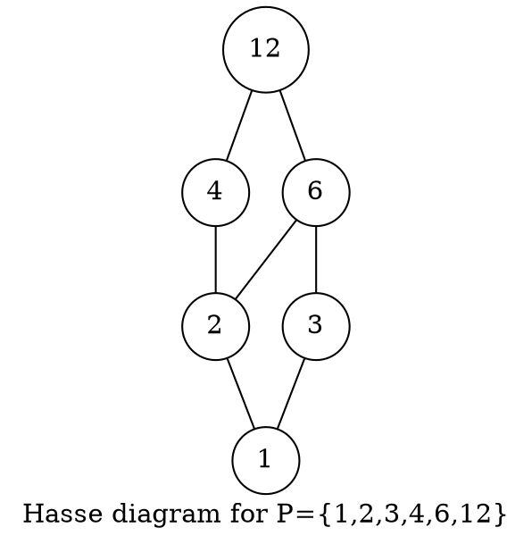

The Möbius function is defined as follows:
$$
\forall x,y \in P: \quad \sum_{z \in [x,y]} \varphi(z,y) = 
    \begin{cases}
    &1 \textit{, if } x=y \\
    &0 \textit{, if } x \neq y
    \end{cases}
$$

By definition $\varphi(12,12) = 1$ and
$$
\varphi(6,12) + \varphi(12,12) = 0
$$
meaning $\varphi(6,12) = -1$. Thus, by
$$
\varphi(3,12) + \varphi(6,12) + \varphi(12,12) = 0
$$
we derive $\varphi(3,12) = 0$.
And by 
$$
\varphi(4,12) +  \varphi(12,12) = 0
$$
we get that $\varphi(4,12) = -1$.
Now we have:
$$
\varphi(2,12) +  \varphi(4,12) + \varphi(6,12) +  \varphi(12,12) ) = 0
$$
from which we can derive $\varphi(2,12) = 1$
Therefore, we know by:
$$
 \varphi(1,12) +  \varphi(2,12) + \varphi(3,12) +  \varphi(4,12) +  \varphi(6,12) +  \varphi(12,12) = 0
$$
that $\varphi(1,12) = 0$.
The last example from the lecture states:
$$
\varphi(1,n) = \varphi(n)= \varphi_{\geq}(0,e_1) \cdots \varphi_{geq}(0,e_r)
$$
where $n = p_1^{e_1} \cdots p_r^{e_r}$ (prime factorisation of $n$).
$$
\varphi(n)=
    \begin{cases} 
        1 &\text{, if } n=1\\
        (-1)^r &\text{, if } n=p_1 \cdots p_r\\
        0 &\text{, if $n$ is not square free}.
    \end{cases}
$$
Since $1 \cdot 2 \cdot 3 \cdot 4 \cdot 6 \cdot 12$ is not square free $\varphi(12)=0$, which coincides with our findings.

#### 62) Let $(P,|)$ be the poset defined by $P =\{0,1,2,3,4\} and $0 \geq 1 \geq 4$, $0 \geq 2 \geq 4$, $0 \geq 3 \geq 4$. Compute all values $\varphi(x,y)$ for $x,y \in P$.

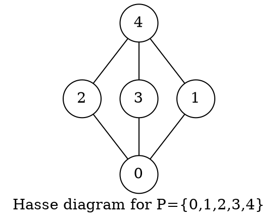
We know:
$$
\varphi(4,4) = \varphi(3,3) = \varphi(2,2) = \varphi(1,1) = \varphi(0,0) = 1
$$
and 
$$
\varphi(0,1) = \varphi(0,3) = \varphi(0,2) = \varphi(1,4) = \varphi(2,4) = \varphi(3,4) = -1
$$
and by the calculated values and 
$$
\varphi(0,4) + \varphi(1,4) + \varphi(2,4) + \varphi(3,4) + \varphi(4,4) = 0
$$
we derive $\varphi(0,4) = 2$.

#### 63) Let $(P_1, \leq_1)$ and $(P_2, \leq_2)$ be two locally finite posets with $0$-element and $(P,\leq)$ be defined by $P = P_1 \times P_2$ and for $(a,x),(b,y) \in P$:
$$
(a,x) \leq (b,x) \Leftrightarrow a \leq_1 b \land x \leq_2 y.
$$
Show that $(P,\leq)$ is a locally finite poset with $0$-element.

A poset has to satisfy *reflexivity*, *asymmetry* and *transitivity*. We first show that $P$ is a poset.
* Reflexivity ($\forall (a,x) \in P: (a,x) \leq (a,x)$)
    By $P_1,P_2$ being posets and thus reflexive, we know for each $(a,x) \in P$ that $a \leq_1 a$ and $x \leq_2 x$, thus by definition of $P$, $(a,x) \leq (a,x)$.
* Antisymmetry ($\forall (a,x),(b,y): (a,x) \leq (b,y) \land (b,y) \leq (a,x) \implies (a,x) = (b,y)$)
    We take arbitrary $(a,x), (b,y)$ such that $(a,x) \leq (b,y)$ and $(b,y) \leq (a,x)$. 
    Then $a \leq_1 b$ and $b \leq_1 a$ by definition of $P$, thus $a = b$ by $P_1$ being a poset.
    And $x \leq_2 y$ and $y \leq_2 x$ by definition of $P$, thus $x = y$ by $P_2$ being a poset.
    Therefore, $(a,x) = (b,y)$ by $a = b$ and $x = y$.
* Transitivity ($\forall (a,x), (b,y), (c,z): (a,x) \leq (b,y) \land (b,y) \leq (c,z) \implies (a,x) \leq (c,z)$)
        We take arbitrary $(a,x), (b,y), (c,z)$ such that $(a,x) \leq (b,y)$ and $(b,y) \leq (c,z)$.
        Then $a \leq_1 b$ and $b \leq_1 c$ by definition of $P$, thus $a \leq_1 c$ by $P_1$ being a poset.
        And  $x \leq_2 y$ and $y \leq_2 z$ by definition of $P$, thus $x \leq_2 z$ by $P_2$ being a poset.
        It follows, that $(a,x) \leq (c,z)$ by definition of $P$.
* $(P,\leq)$ has a $0$-element
    By $P_1, P_2$ having $0$-elements, there exist $a \in P_1$ and $x \in P_2$ such that $\forall b \in P_1: a \leq_1 b$ and $\forall y \in P_2: x \leq_2 y$, 
    thus we know $(a,x)$ is the $0$-element of $P$, since $\forall (b,y) \in P: (a,x) \leq (b,y)$ by the above and definition of $P$.
* $(P,\leq)$ is locally finite
    Since $P_1,P_2$ are locally finite, we know:
    $\forall a,b \in P_1: |[a,b]| < \infty$ and $\forall x,y \in P_2: |[x,y]| < \infty$
    Therefore, for any $a,b \in P_1$ and $x,y \in P_2$, $|[a,b]| = k$ for some finite $k$ and $|[x,y]| = d$ for some finite $d$. 
    Inspecting the intervall $[(a,x),(b,y)]$ of $P$, by the above $|[(a,x),(b,y)]| = k \cdot d$, where $k,d$ are respectively finite, thus $k \cdot d$ is finite.

#### 64) We use the notations from exercise 63. Let the Möbius functions of $P,P_1,P_2$ be denoted by $\varphi_P, \varphi_{P_1}, \varphi_{P_2}$, respectively. Prove that forall $(a,x) (b,y) \in P$ we have $\varphi_P((a,x),(b,y)) = \varphi_{P_1} \cdot \varphi_{P_2}(x,y)$.

For $\varphi_P((a,x),(b,y))$ it has to hold that:
$$
\sum_{(c,z) \in [(a,x),(b,y)]}
\varphi_{P((c,z),(b,y))} = \begin{cases}
1 &\text{ ,if $a=b$ and $x=y$}\\
0 &\text{ ,if $a \neq b$ or $x \neq y$}
\end{cases}
$$

The first condition holds, since:

$\varphi_{P_1}(a,b) = 1$, when $a=b$ and $varphi_{P_2}(x,y) = 1$ when $x = y$ thus $\varphi_P((a,x),(b,y)) = 1 \cdot 1 = 1$, if $a=b$ and $x = y$.

We show, the second condition holds:
$$
\sum_{(c,z) \in [(a,x),(b,y)]} \varphi_P((c,z),(b,y)) = \sum_{(c,z) \in [(a,x),(b,y)]} \varphi_{P_1}(c,b) \cdot \varphi_{P_2}(z,y) =
$$
we split the sum
$$
\sum_{(c) \in [a,b]} \sum_{(z) \in [x,y]} \varphi_{P_1}(c,b) \cdot \varphi_{P_2}(z,y)
$$
we extract the constant factor $\varphi_{P_1}(c,b)$
$$
\sum_{(c) \in [a,b]} \varphi_{P_1}(c,b) \cdot \sum_{(z) \in [x,y]} \varphi_{P_2}(z,y)
$$
Now either $x \neq y$ or $a \neq b$, w.l.o.g. we say $x = y$
$$
\sum_{(c) \in [a,b]} \varphi_{P_1}(c,b) \cdot 0 = 0
$$

#### 65) Draw the Hasse diagram of $(2^{1,2,3}, \supseteq)$ and redo the proof of the principle of inclusion and exclusion for the special case of three sets $A_1, A_2, A_3 \subseteq M$. Carry out every step in detail.

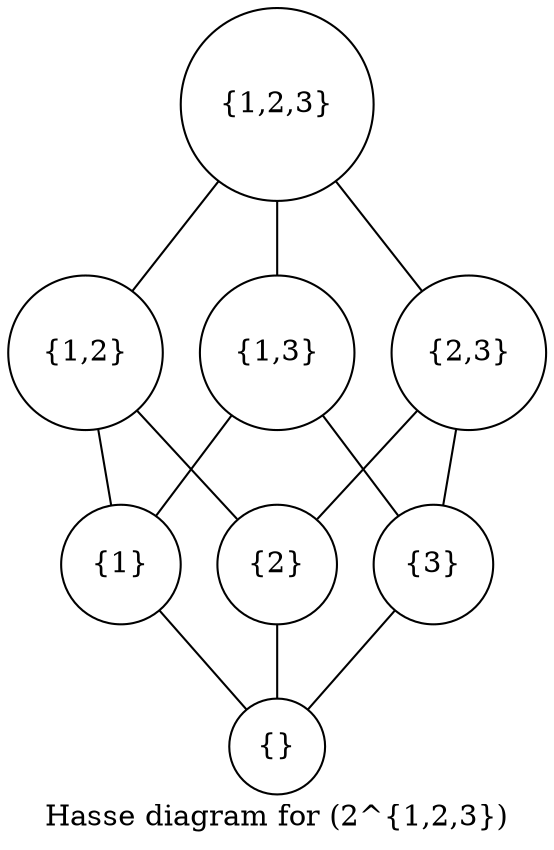

#### 66) Let $p,q,r$ be three distinct prime numbers and $m = pqr$. How many of the numbers $1,2, \dots, m$ are relatively prime to $m$? (Two numbers $x$ and $y$ are called relatively prime if their greatest common divisor is $1$.)
$$
m - ((\frac{m}{p} + \frac{m}{q} + \frac{m}{r}) - (\frac{m}{pq} + \frac{m}{pr} + \frac{m}{qr}) + \frac{m}{pqr}) = 
$$
since, $m = pqr$
$$
= m - (\frac{pqr}{p} + \frac{pqr}{q} + \frac{pqr}{r} - \frac{pqr}{pq} - \frac{pqr}{pr} - \frac{pqr}{qr} + \frac{pqr}{pqr}) = 
$$
we cancel the respective factors in each term
$$
= m - qr - pr - pq + r + q + p - 1
$$

#### 67) Prove: If $gcd(a,b) = 1$ then $gcd(a+b,a-b)$ is either $1$ or $2$.

Let $d = gcd(a+b,a-b)$,
then by $\dagger$, $d | (a+b)+(a-b)$, thus $d|2a$, 
and $d | (a+b)-(a-b)$, thus $d | 2b$.

And since $d|2a$ and $d |2b$, $d|gcd(2a,2b)$, by definition of the $gcd$,
and by $gcd(a,b) = 1$, $d$ can only either be $1$ or $2$.

*Lemma $\dagger$:*
    Let $z = gcd(x,y)$, then $\exists m,n$, such that $x=zm$ and $y=zn$. 
    Then $x+y = zm + zn = z(m+n)$, thus $z|(x+y)$ for arbitrary $x,y$, where $z = gcd(x,y)$
    and $x-y = zm - zn = z(m-n)$, thus $z|(x-y)$ for arbitrary $x,y$ such that $z=gcd(x,y)$.
    
#### 68) Let $n = \prod_{p \in \mathbb{P}} p^{v_p (n)}$ be a positive integer such that for all $p \in \mathbb{P}$ we have $v_p(n) \leq 1$. Moreover, a prime $p$ divides $n$ if and only if $p-1$ divides $n$ too ($\dagger$). Compute $n$.

We know that forall positive integers, $1 | n$, thus by $\dagger$ $2 | n$, therefore also $3|n$. Since $2$ and $3$ divide $n$, $6 | n$, hence by $\dagger$, $7 |n$. 
Then, $n = 2 \cdot 3 \cdot 7 = 42$.

#### 69) Use the Euclidian algorithm to find two integers such that:
$$
2863a + 1057b = 42
$$

We first compute the division chain: 
$$
\begin{aligned}
2863 &= 1057 \cdot 2 + 749 \\
1057 &= 749 \cdot 1 + 308 \\
749 &=308 \cdot 2 + 133 \\
308 &= 133 \cdot 2 + 42 \\
133 &= 42 \cdot 3 + 7 \\
42 &= 7 \cdot 6 + 0
\end{aligned}
$$

We then find the linear combination for $2863$ and $1057$:
$$
\begin{aligned}
42 &= 308 - (133 \cdot 2) \\
42 &= 308 - ((749 - 308 \cdot 2) \cdot 2) = 308 \cdot 5 - 749 \cdot 2\\
42 &= (1057 - 749 \cdot 1) \cdot 5 - 749 \cdot 2 = 1057 \cdot 5 - 749 \cdot 7
42 &= 1057 \cdot 5 - (2863 - 1057 \cdot 2) \cdot 7 = 1057 \cdot 19 - 2863 \cdot 7
\end{aligned}
$$

Thus we have found $a = -7$ and $b = 19$ which satisfy the equation.

#### 70) Use the Euclidian algorithm to find all the greatest common divisors of $x^3 + 5x^2 + 7x + 3$ and $x^3 + x^2 - 5x +3$ in $\mathbb{Q}[x]$.

$$
\begin{aligned}
x^3 + 5x^2 + 7x + 3 = 1 \cdot (x^3 + x^2 - 5x + 3) + (4x^2 + 12x)
x^3 + x^2 - 5x + 3 = (4x^2 + 12x) \cdot (1/4 x - 1/2) + (x+3)
4x^2 + 12x = (x+3) \cdot (4x) + 0
\end{aligned}
$$

Thus, forall $x \in \mathbb{Q}^x: a \cdot x + 3 \cdot a$ is a gcd of $x^3 + 5x^2 + 7x + 3$ and $x^3 + x^2 - 5x +3$.

## Exercise Sheet 8

#### 71) Let $(F)_{n \geq 0}$ be the Fibonacci sequence, i.e. $F_0 = 0, F_1 = 1, F_{n+1} = F_n + F_{n-1}$. Prove $gcd(F_{n+2}, F_n) = 1$.
We proceed by induction:

* Base case: 
    $F_2 = F_1 + F_0 = 0 + 1 = 1$ and $gcd(F_2, F_0) = 1$ since $gcd(1,0) = 1$.

* IH: $gcd(F_{n+2}, F_n) = 1$ holds for $n \in \mathbb{N}$.

* Induction step:
    We are now interested in $gcd(F_{n+3}, F_{n+1})$ which is equivalent to $gcd(F_{n+2} + F_{n+1}, F_{n+1})$ and since $gcd(a+bm, b) = gcd(a,b)$, $gcd(F_{n+2} + F_{n+1}, F_{n+1}) = gcd(F_{n+2}, F_{n+1})$. This again is equivalent to $gcd(F_{n+1} + F_{n}, F_{n+1})$ and by the same argument as before $gcd(F_{n+1} + F_{n}, F_{n+1}) = gcd(F_n, F_{n+1})$ which is equivalent to $gcd(F_n, F_{n+1} + F_n)$ by the same argument again, which is $gcd(F_n, F_{n+2})$ by definition of the Fibonacci sequence, thus $gcd(F_{n+3},F_{n+1}) = gcd(F_n, F_{n+2})$ which is 1 by IH.
    
#### 72) Prove that there exist infinitely many primes which are solutions of the equation $p \equiv 3$ mod $4$.

Proof by contradiction: 
Assume there are only finitely many such primes:
$$
\mathcal{p}_1, \dots \mathcal{p}_n \text{ for some } n \in \mathbb{N}. 
$$
We consider the number:
$$
x = 4\mathcal{p_1}\cdot \mathcal{p}_2 \cdots \mathcal{p_n} -1
$$
We distinguish as follows
* case 1: x is prime
    by definition of $\mathcal{p}_1, \dots \mathcal{p}_n$, 
    $4 \mathcal{p_1}\cdot \mathcal{p}_2 \cdots \mathcal{p_n}  \equiv 0$ mod $4$, therefore
    $4 \mathcal{p_1}\cdot \mathcal{p}_2 \cdots \mathcal{p_n} -1 \equiv 3$ mod $4$. 
    Now, since $x$ is prime, there are $n+1$ primes which satisfy the equation. Contradiction!

* case 2: x is not prime
    Then, there exist $q_1, \dots , q_m$, such that $q_i \in \mathbb{P}$, where $1 \leq i \leq m$ and $q_1 \cdot q_2 \cdots q_m = x$.
    $x$ has to be odd, since $x \equiv 3$ mode $4$, thus $q_i \neq 2$ holds for all $1 \leq i \leq m$. 
    There has to be some $q_i$ such that $q_i \equiv 3$ mod $4$, else $\forall j: q_j \equiv 1$ mod 4 would have to hold, thus $x \equiv 1$ mod $4$ would have to hold.
    
    Now, $q_i \neq p_j$ holds forall $1 \leq j \leq n$, else $\exists j$ such that $q_i = p_j$, thus $q_i |x$ (by definition of $q_i$) and $q_i | x+1$ since $pj | x+1$.

    Therefore, there exist $n+1$ primes which satisfy the equation namely $\mathcal{p}_1, \dots \mathcal{p}_n$ and $q_i$.
    
#### 73) Find (without using a computer) the last two digits of $2^{1000}$.

We can find the last two digits by:
$$
2^{1000} \text{ mod } 100
$$

We cannot apply Euler's theorem since $gcd(2,100) \neq 1$. 
But $gcd(25,2) = 1$ and $\varphi(25) = 20$.
So: 
$$
2^{20} \equiv 1 \text{ mod } 25
$$
therefore
$$
(2^{20})^{50} \equiv 1^{50} \text{ mod } 25
$$
Additionally we know $2^2 + 2^{998}$ and $2^2 = 0$ mod $4$.
We can therefore define the following system of congruence equations:
$$
2^{1000} \equiv 0 (4) \\
2^{1000} \equiv 1 (25)
$$
We can then apply the Chinese Remainder Theorem to find $2^{1000}(100)$, i.e. $2^{1000}(4 \cdot 25)$.

We remind ourselves of the Chinese Remainder Theorem:
$$
x \equiv \sum_{j=1}^{r} \frac{m}{m_j} \cdot bj a_j (m) \text{, with } b_j = (\frac{m}{m_j})^{-1} (m_j)
$$

We apply $x = 2^{1000}, a_1 = 0, a_2 = 1, m = 100, m_1 = 4, m_2 = 25$: 
$$
2^{1000} \equiv \frac{100}{25} \cdot 19 \cdot 1 (100) + \frac{100}{4} \cdot 1 \cdot 0 (100)
$$
$$
2^{1000} \equiv 4 \cdot 19 (100) 
$$
$$
2^{1000} \equiv 76 (100) 
$$
Hence the last two digits are $76$.

#### 74) Consider the ring $\mathbb{Z}[i] = \{a + b_i | a,b \in \mathbb{Z} \}$ (addition and multiplication taken from $\mathbb{C}$) and determine a $gcd(19 + 5i, 16-6i)$.

*Hint: you may assume without proof, that $\mathbb{Z}[i]$ with $n(a+bi) = a^2 + b^2$ is a Euclidian ring. Now find $q,r$ in $u = qv + r$ by determining $\frac{u}{v}$ in $\mathbb{Z}[i]$ and rounding real and imaginary part.*

We apply the Euclidian algorithm, since $\mathbb{Z}[i]$ is a Euclidian ring. 

$$
\begin{aligned}
19 + 5i &= (1+i) (16 -6i) + (-3-5i)\\
16 - 6i &= (-1 + 3i) \cdot (-3i -5i) + (-2-2i)\\
-3i - 5i &= (2+i) \cdot (-2-2i) + (-1+i)\\
-2-2i &= (0 + 2i) \cdot (-1 + i) + 0
\end{aligned}
$$

Thus $-1+i$ is a gcd of $19+5i$ and $16-6i$. 

#### 75) Which of the following mappings is well defined?
a) $f : \mathbb{Z}_m \rightarrow \mathbb{Z}_m, \bar x \mapsto \bar{x^2}$ 
    We show $f$ is well defined by showing that for any $x,y$ with $\bar x \equiv \bar y$, $\bar{x^2} \equiv \bar{y^2}$ holds.
    We thus assume
    $\bar x \equiv \bar y$, i.e. $\exists k (x = km +y)$.
    We compute an $l$ such that $x^2 = lm + y^2$.
    Since we know $x = km +y$ for some $k$, we can write: 
    $$
    (km + y)^2 = lm +y^2\\
    (km)^2 + 2kmy + y^2 = lm +y \\
    (km)^2 + 2kmy = lm \\
    k^2m+2ky = l
    $$
    Since we computed an $l$ such that $x^2 = lm+y$, we have shown $\bar{x^2} \equiv \bar{y^2}$ for any $x,y$, such that $\bar x \equiv \bar y$.

b) $g: \mathbb{Z}_m \rightarrow \mathbb{Z}_m$, $\bar x \mapsto \bar{2^x}$
    For all $m > 1$, $\bar0 = \bar m$ but $\bar{2^0} = \bar 1$ and $\bar{2^m} \neq \bar 1$, thus $\bar{2^0} = \bar 1$ and $\bar{2^m} \neq \bar 1$, thus $\bar{2^0} \neq \bar{2^m}$, but $\bar0 = \bar m$.
    
#### 76) Use the Chinese remainder theorem to solve the following system of congruence relations:
$$
3x \equiv 12(13) \mathit{\dagger}, \quad 5x \equiv 7(22)\clubsuit, \quad 2x \equiv 3 (7) \heartsuit.
$$
* $\dagger$: we can divide $3$ and $12$ by $3$, $13$ remains as $ggT(13,3) = 1$.
* $\clubsuit$: we calculate times $9$ since $5^{-1} = 9$ in $\mathbb{Z}_{22}$
* $\heartsuit$: times $4$ since $2^{-1} = 4$ in $\mathbb{Z}_7$
Thus we get:
$$
x \equiv 4(13) \mathit{\dagger}, \quad x \equiv 19(22)\clubsuit, \quad x \equiv 5 (7) \heartsuit.
$$
Now since, $ggT(13,22) = ggT(13,7) = ggT(22,7) = 1$, 
we can apply the Chinese Remainder Theorem:
$$
\begin{aligned}
x \equiv &\frac{2002}{13} \cdot b_1 \cdot 4 \ (2002) \ + \\
&\frac{2002}{22} \cdot b_2 \cdot 19 \ (2002) \ + \\
&\frac{2002}{7} \cdot b_3 \cdot 5 \ (2002)
\end{aligned}
$$
where 
$$
\begin{aligned}
b_1 &= (\frac{2002}{13})^{-1} (13) = 154^-1 (13)  = 6\\
b_2 &= (\frac{2002}{22})^{-1} (22) = 91^{-1} (22) = 15\\
b_3 &= (\frac{2002}{7})^{-1} (7) = 286^{-1} (7) = 6
\end{aligned}
$$
thus
$$
\begin{aligned}
x &\equiv 154 \cdot 6 \cdot 4 + 91 \cdot 15 \cdot \cdot 19 + 286 \cdot 6 \cdot 5 \ (2002) \\
x &\equiv 173 \ (2002)
\end{aligned}
$$

#### 76) Use the Chinese Remainder Theorem to solve the following system of congruence relations:
$$
5x \equiv 8(32) \mathit{\dagger}, 
\quad 14x \equiv 2(22)\clubsuit, 
\quad 9x \equiv 3 (15) \heartsuit.
$$
* $\dagger$: we calculate times $13$ since $5^{-1} = 13$ in $\mathbb{Z}_{32}$
* $\clubsuit$: we divide by $2$, then  calculate times $8$ since $7^{-1} = 7$ in $\mathbb{Z}_{11}$
* $\heartsuit$: we divide by $3$, then calculate times $2$ since $3^{-1} = 2$ in $\mathbb{Z}_5$

$$
x \equiv 8(32) \mathit{\dagger}, 
\quad x \equiv 8(11)\clubsuit, 
\quad x \equiv 2 (5) \heartsuit.
$$

Since $gcd(32,11) = gcd(11,5) = gcd(32,5) = 1$, we apply the CRT with $m = 32 \cdot 11 \cdot 5 = 1760$.

$$
\begin{aligned}
x \equiv &\frac{1760}{32} \cdot b_1 \cdot 8 \ (1760) \ + \\
&\frac{1760}{11} \cdot b_2 \cdot 8 \ (1760) \ + \\
&\frac{1760}{5} \cdot b_3 \cdot 2 \ (1760)
\end{aligned}
$$
where 
$$
\begin{aligned}
b_1 &= (\frac{1760}{32})^{-1} (32) = 55^-1 (32)  = 7\\
b_2 &= (\frac{1760}{11})^{-1} (11) = 160^{-1} (11) = 2\\
b_3 &= (\frac{1760}{5})^{-1} (5) = 352^{-1} (5) = 3
\end{aligned}
$$
thus 
$$
\begin{aligned}
x \equiv &55 \cdot 7 \cdot 8 \ (1760) \ + \\
&160 \cdot 2 \cdot 8 \ (1760) \ + \\
&352 \cdot 3 \cdot 2 \ (1760)
\end{aligned}
$$
$$
\begin{aligned}
x \equiv 3080 + 2560 + 2112 \equiv 712 \ (1760)
\end{aligned}
$$

#### 78) Let $(n,e) = (3233,49)$ be a public RSA key. Compute the decryption key $d$.

We know $d = 49^{-1} (v)$, where $v = lcm(p-1, q-1) = \frac{(p-1)(q-1)}{gcd(p-1,q-1)}$.
And we know $n = q\cdot p= 3233$, where $p,q \in \mathbb{P}, q \neq 2, p \neq 2$ and $p \neq q$. 

We simply try primes and divide $3233$ by them, checking whether the resulting number is prime.

We get: $3233 = 53 \cdot 61$.

We then calculate $gcd(52,60)$ by the Euclidian algorithm:
$$
\begin{aligned}
60 &= 52 \cdot 1 + 8\\
52 &= 8 \cdot 6 + 4\\
8 = 4 \cdot 2 + 0
\end{aligned}
$$

Hence, $\frac{52 \cdot 60}{4} = 780$.
Therefore, $d = 49^{-1} (780)$, meaning 
$$
d \cdot 49 \equiv 1 (780)
$$
we conclude $d = 589$.

#### 79) Use the key of exercise 78) to encrypt the string $\mathtt{"COMPUTER"}$. Decompose the string into blocks of length $2$ and apply the mapping $\mathtt{A} \mapsto 01, \mathtt{B} \mapsto 02, \dots \mathtt{Z} \mapsto 26$.
$$
\mathtt{CO} \mapsto 0315, \quad 0315^{49} \ (3233) = 2701 \\
\mathtt{MP} \mapsto 1316, \quad 1316^{49} \ (3233) = 2593 \\
\mathtt{UT} \mapsto 2120, \quad 2120^{49} \ (3233) = 0371 \\
\mathtt{ER} \mapsto 0518, \quad 0518^{49} \ (3233) = 1002 \\
$$
Thus the encrypted string is: $2701 2593 0371 1002$.

#### 80) Let $(e,n)$ and $(d,n)$ be Bob's public and private RSA key, respectively. Suppose that Bob receives an encrypted message $c$ which is also caught by an eavesdropper. The eavesdropper wants to find out the original message $m$ and has the idea to send Bob a message and ask him to sign it. How can this idea be used to find out $m$?

*Hint: Pick a random integer $r$ and consider the message $r^{e}c$ mod $n$.*

We choose an arbitrary integer $r$, such that $gcd(r,n) = 1$ consider the message $x = r^{e} \cdot c \ (n)$.

We know for any $a_j$, $a_j \equiv a_j^{e \cdot d} \ (n)$, $E(a_j) = (a_j \text{ mod } n)$, and $D(b_j) = (b_j^d \text{ mod } n)$. 

The signed message from bob is then of the form:
$$
x^d \equiv (r^{e} \cdot c)^d \equiv (r^{e})^d \equiv c^d \equiv r \cdot c^d \ (n)
$$
we simply need to calculate $x \cdot r^{-1}$ to get $c^d$, which in turn we can use to calculate $m(n)$. Note, that $x \cdot r^{-1}$ exists since we chose $r$ such that $gcd(r,n) = 1$.

## Exercise Sheet 9

#### 81) Let $G$ be a finite, abelian group and $a \in G$ an element for which $ord_G(a)$ is maximal. Prove that for all $b \in G$  the order $ord_G(b)$ is a divisor of $ord_G(a)$.

Proof by contradiction: 

Assume $a \in G$ for which $ord_G(a)$ is maximal and $b \in G$ where $ord_G(b) \nmid ord_G(a)$.

We denote $k = ord_G(a)$ and $l = ord_G(b)$, and can write 
$$
k = \prod_{p \in \mathbb{P}} p^{\varphi_p(k)} \text{ ,and } l = \prod_{p \in \mathbb{P}} p^{\varphi_p(l)}
$$
By $l \nmid k$, there exist $p_1, \dots, p_n \in \mathbb{P}$ such that $\varphi_{p_i}(l) > \varphi_{p_i}(k)$.

Then, by definition: $lcm(k,l) = \prod_{p \in \mathbb{P}} p^{max(\varphi_p(k), \varphi_p (l))}$ which means $lcm(k,l)>k$.

This means $\exists c \in G$ such that $ord(c) = lcm(k,l)$ by

$$
\forall a,b \in G (ord(a) = r \land ord(b) = s) \Rightarrow \exists c \in G (ord(c) = lcm(r,s))
$$

We know $lcm(k,l) > k$, i.e.:
$$
lcm(ord_G(a), ord_G(b)) > ord_G(a)
$$

thus $ord_G(c) > ord_G(a)$ but $ord_G(a)$ is maximal. Contradiction!

#### 82) Let $\lambda$ and $\varphi$ denote the Carmicheal function and Euler's totient function respectively. Compute $\lambda(172872)$ and $\varphi(172872)$.
We recall the definitions of the Carmicheal and totient functions:
$$
\varphi(n) = lcm(\lambda(p_1^{r_1}) \cdot \lambda(p_2^{r_2}) \cdots \varphi(p_k^{r_k})),\\
\varphi(p^r) = 
    \begin{cases} \varphi(p^r) &\text{, if } p^r = 2,3^r,4,5^r,7^r,11^r,13^r, \dots \\
                            \frac{1}{2} \varphi(p^r) &\text{, if } p^r = 8,16,32,64, \dots
    \end{cases}\\
\varphi(n) = n \cdot \prod_{p | n} (1-\frac{1}{p})
$$
We apply integer factorisation to $172872$ and get 
$$
172872 = 2^3 \cdot 3^2 \cdot 7^4
$$
thus
$$
\lambda(172872) = \lambda(2^3 \cdot 3^2 \cdot 7^4) = lcm(\lambda(2^3), \lambda(3^2), \lambda(7^4))
$$
we calculate the respective Carmicheal values:
$$
\begin{aligned}
\lambda(2^3) &= \frac{1}{2} \varphi(2^3) = \frac{1}{2} 4 = 2\\
\lambda(3^2) &= \varphi(3^2) = 6\\
\lambda(7^4) &= 7^3 \cdot 6 = 2058
\end{aligned}
$$
$$
lcm(2,6,2058) = 2058
$$

$$
\varphi(172872) = 172872 \cdot (1- \frac{1}{2}) \cdot (1- \frac{1}{3}) \cdot (1- \frac{1}{7}) = \\
= 172872 \cdot \frac{1}{2} \cdot \frac{2}{3} \cdot \frac{6}{7} = 
172872 \cdot \frac{2}{7} = 49392
$$

#### 83) Consider an RSA cryptosystem with $n = pq$, $p$ and $q$ being odd primes with $p \neq q$. Let $N_{p,q}$ denote the number of possible pairs $(e,d)$ such that $(e,n)$ and $(d,n)$ are the public and private key respectively. Show that $N_{p,q} = \varphi(\lambda(n))$, where $\lambda$ is the Carmicheal function and $\varphi$ Euler's totient function, and that $2 \leq N_{p,q} \leq \lambda(n)/2$. 

By definition we need to choose $e$, coprime to $lcm(p-1,q-1)$. (Since $d$ is the inverse of $e$ in $\mathbb{Z}_{\lambda(pq)}$, each $e$ has a unique $d$, thus we only count possible $e$s.)
Now $\lambda (pq) = lcm(\lambda(p), \lambda(q))$ since $p,q$ are primes.
And by $p,q$ prime, $\lambda(p) = \varphi(p) = p(1- \frac{1}{p})$ = p-1, the same holds for $q$.
Hence, $\lambda(pq) = lcm(p-1,q-1)$ and $\varphi(lcm(p-1,q-1))$ counts all integers coprime to $lcm(p-1, q-1)$. 
Thus $N_{p,q} = \varphi(\lambda(n))$.

Show that $2 \leq N_{p,q} < \frac{\lambda(pq)}{2}$.
*Counterexample: $p=3, q=5 \Rightarrow \varphi(\lambda (3 \cdot 5)) < \frac{\lambda(3 \cdot 5)}{2} \Rightarrow \varphi(4) < \frac{4}{2} \Rightarrow 2 < 2$*

We instead show: $2 \leq N{p,q} \leq \frac{\lambda(pq)}{2}$, i.e.
$$
2 \leq \varphi(\lambda(pq)) \leq \frac{lcm(p-1,q-1)}{2}
$$

$\varphi(\lambda(pq)) \leq \frac{\lambda(pq)}{2}$
since $\lambda(pq) = lcm(p-1, q-1)$ and $p,q$ are odd primes, $lcm(p-1, q-1)$ is even and has at least prime factor $2$, thus by 3) $\varphi(\lambda(pq)) \leq \lambda(pq) \cdot \frac{1}{2}$.

$2 \leq \varphi(\lambda(pq))$ 
Assuming $\varphi(\lambda(pq)) = 1$ then by definition of $\varphi$, $\lambda(p,q) = 2$. Hence, by $\lambda(pq) = lcm(p-1, q-1)$, $p-1, q-1 = 2$, i.e. $p = q = 3$. 
Contradiction, we conclude $2 \leq \varphi(\lambda(pq)) \leq \frac{\lambda(pq)}{2}$.

#### 84) Show that $m|n$ implies $\lambda(m) | \lambda (n)$ where $\lambda$ denotes the Carmicheal function.

*Hint: Prove first that $a_i | b_i$ for $i = 1, \dots k$ implies $lcm(a_1,a_2,\dots , a_k) | lcm(b_1,b_2, \dots, b_k)$.*

We assume $a_i | b_i$, with $i = 1, \dots, k$.
Thus $\forall i: b_i | lcm(b_1, \dots, b_k)$, and thus by $a_i|b_i$, $a_i|lcm(b_1, \dots, b_k)$ follows.

Let
$$
\dagger := a|b \Leftrightarrow \forall p : v_p(a) \leq v_p(b) \\
\heartsuit := lcm(a,b) = \prod_{p \in \mathbb{P}} \\
\text{,where: } v_p(a) \text{ is the multiplicity of } p \text{ in the factorisation of } n. 
$$

Since, forall $i$, $a_i | b_i$, by $\dagger$ every prime factor of $a_i$'s exponent is smaller or equal than $b_i$'s.
By $\heartsuit$, $lcm(a_1, \dots a_k)$ contains the largest of all prime exponents which as shown before are still smaller of equal than the maximum of all primes' exponents in $lcm(b_1, \dots, b_k)$.

Hence, $lcm(a_1, \dots, a_k) | lcm(b_1, \dots, b_k$. 
Let $n = \prod_{i = 1}^{r} p_i^{n_i}$ and $m = \prod_{i=1}^r p_i^{n_i}$ and  $m | n$.
Then, $p_i^{m_i} | p_i^{n_i}$ forall $i = 1, \dots, r$, now by the hint we showed to hold and by definition of the Carmicheal function: $\lambda(p_i^{n_i}) = p_i^{n_i-1} (p_i -1)$ all exponents in the prime factorisation of $m$ as well as $n$ are reduced , hence forall $p_i^{m_i}, p_i^{n_i}$ where $p_i^{m_i} | p_i{n_i}$, $\lambda(p_i^{n_i}) | \lambda(p_i^{m_i})$ also holds.

Thus, $lcm(\lambda(p_1^{m1}), \dots, \lambda(p_r^{mr})) | lcm(\lambda(p_1^{n1}) , \dots , \lambda(p_r^{nr}))$, holds by the hint which we proved.

#### 85) Let $\mathbb{Z}[i] = \{a + bi | a,b \in \mathbb{Z}\}$ where $i = \sqrt(-1)$. Show that $\mathbb{Z}[i]$ is a subring of $(\mathbb{C},+,\cdot)$.

$\mathbb{Z}[i]$ is a subring of $(\mathbb{C},+,\cdot)$ if it is a nonempty subset of $\mathbb{C}$ and 

$\forall z_1, z_2 \in \mathbb{Z}[i] z_1 - z_2 \in \mathbb{Z}[i]$, and 
$z_1 \cdot z_2 \in \mathbb{Z}[i]$, where $z_1 = a_1 + b_1i, z_2 = a_2 + b_2i$.

* $\mathbb{Z}[i]$ is trivially nonempty
* Assume $z_1,z_2 \in \mathbb{Z}[i]$, then 
    * $z_1 - z_2$ = $(a_1 + b_1i) - (a_2 + b_2i) = $a_1-a_2 + (b_1 - b_2 i)$ thus the resulting coefficients are both in $\mathbb{Z}[i]$.
    * $z_1 \cdot z_2$ = $(a_1 + b_1i) \cdot (a_2 +b_2i) = a_1a_2 - b1b2 + (a_1b_2 + a_2b1)i$, where, again the resulting coefficients are both in $\mathbb{Z}[i]$.
    
**Determine its group of units $(\mathbb{Z}[i]^*, \cdot)$** 
Let $a+bi$ be a unit in $\mathbb{Z}[i]$, then trivially $a$ and $b$ cannot both be zero.
Additionally $\exists c,d \in \mathbb{Z}$ such that $(a+bi)(c+di) = 1+0i$, meaning 
$$
ac + adi + cbi -bd = 1 + 0i
$$
thus $ac-bd = 1$ and $ad +cb = 0$. Hence:
$$
c = \frac{ad}{b} \Rightarrow a(-\frac{ad}{b}) - bd = 1 \Rightarrow a^2d+b^2d = -b \Rightarrow  d = \frac{-b}{a^2+b^2}
$$
now 
$$
\frac{a(-\frac{b}{a^2+b^2})}{b} = \frac{\frac{ab}{a^2+b^2}}{\frac{b}{1}} = \frac{ab}{a^2b + b^3} = \frac{a}{a^2+b^2} = c
$$

Now let $n = a^2+b^2$, we know $n >0$ and $n \in \mathbb{Z}$, since $c,d \in \mathbb{Z}$, $n |a$ and $n |b$, there are $x,y \in \mathbb{Z}$ such that $a = nx$ and $b = ny$:
$$
n = (nx)^2 + (ny)^2 \Leftrightarrow n = n2(x^2+y^2) \Leftrightarrow 1 = n(x^2+y^2)
$$
This means, either 
* $n = 1$ , or
* (x^2 + y^2) = 1$, w.l.o.g. we assume $x = 0, y = 1$, then $a = 0$ by $nx = a$ and $b = n$ by $ny = b$ but $n = a^2 +b^2 = 0 +n^2$, thus $n = n^2$, meaning $n$ can only be $1$.

Hence, in any case $a^2+b^2 = 1$, meaning either $a^2 = 1, b^2 = 0$ or $a^2 = 0, b^2 = 1$. 
We conclude, the units of $\mathbb{Z}[i]$ are $\{1, -1, i, -\}$.

**Is $\mathbb{Z}[i]$ an integral domain?**
Yes, as it is a subring of $(\mathbb{C},+,\cdot)$ and $(\mathbb{C},+,\cdot)$ is an integral domain.

#### 86) Let $(R,+,\cdot)$ be an integral domain. Two elements $a$ and $b$ are associated if there is a unit $r\in R^*$ such that $a = br$. Show that two elements $x,y \in R$ are associated iff $x | y$ and $y | x$.

* $\Rightarrow$: We assume arbitrary $x,y \in R$ that are associated:
    Then $x | y$ trvially, since $rx = y$ by definition. Additionally since $r \in R^*$, we take the multiplicative inverse $r^{-1}$ to show $y|x$, as $x = y \cdot r^{-1}$.
    
* $\Leftarrow$: We assume arbitrary $x,y \in R$ such that $x|y$ and $y|x$:
    Then, $\exists c_1: x \cdot c_1 = y$ and $\exists c_2: y \cdot c_2 = x$ thus $y = c_1 \cdot c_2$. Since $R$ is an integral domain, we can cancel $y$ and get $1 = c1 \cdot c_2$ therefore $c_1$ and $c_2$ are units as they are each other's multiplicative inverses.

#### 87) Let $(R,+,\cdot)$ be an integral domain. Show that $x \in R$ is a unit iff it is a divisor of every $a \in R$.

* $\Rightarrow$: We assume an arbitrary $x \in R^*$. 
    Then $\exists x^{-1}: x \cdot x^{-1} = 1$. We know $x |y$ in $R$ iff $\exists t \in R : tx = y$.
    Now, forall $a \in R: a = a \cdot x \cdot x^{-1}$. 
    Therefore we can satisfy $\exists t \in R : tx = a$, namely $t = a \cdot x^{-1}$, meaning $x|a$ holds for all $a \in R$.
* $\Leftarrow$: We assume an arbitrary $x \in R$ such that $\forall a \in R: x |a$
    This holds specifically for $a = 1$, meaning $x | 1$, this means $\exists t: t \cdot x = 1$ but by definition $t = x^{-1}$. Thus $x$ is a unit.

#### 88) Let $(R,+,\cdot)$ be a Euclidian ring and let its Euclidian function be denoted by $n$. Show that $n(x) = n(1)$ for all units $x$ of $R$.
We recall the properties of $n$ in $R$:

$$
\forall a,b \in R: b \neq 0: \exists q,r \in R:\\
\heartsuit: a = bq+r \text{ with } n(r) < n(b) \text{ or } r = 0\\
\dagger: \quad \forall a,b \in R\backslash \{0\}: n(a) \leq n(ab) 
$$

Let $x$ be a unit, then $1 = x \cdot x^{-1}$.
As $1$ divides any element in $R$, $n(1) \leq n(x) = n(1x)$, by $\dagger$.

$x|1$ since $1 = x \cdot x^{-1}$, thus
$n(x) \leq n(x \cdot x ^{-1}) = n(1)$ by $\dagger$ thus $n(x) = n(1)$.


**Prove, moreover, if $x,y \in R$ and $y$ is a unit, then $n(xy) = n(x)$.**
$$
n(x) \leq n(xy)
$$ 
holds trivially by $\dagger$.

By $y$ unit $y \cdot y^{-1} \cdot x = x$. By $\dagger$:
$$
n(y \cdot x) \leq n(y\cdot x \cdot x^{-1}) = n(x)
$$
Thus $n(xy) = n(x)$.

#### 89) List all irreducible polynomials up to degree $4$ over $\mathbb{Z}_3$.

We recall: *A nonzero, nonunit $a \in R$ is irreducible iff $a=bc$ with $b,c \in R$ means that either $b$ is unit or $c$ is unit.*

All linear polynoms $p \in \mathbb{Z}_3$ are irreducible since one of the factors of $p$ has to be constant and the possible constant factors in $\mathbb{Z}_3$ are $1,2$ which are both unit ($1 \cdot 1 = 1$, $2 \cdot 2 = 1$).

Thus the irreducible polynoms in $\mathbb{Z}_3$ of degree $1$ are: $x, 2x, x+1, x+2, 2x+1, 2x+2$.

For a polynomial $p \in \mathbb{Z}_3$ with degree $>1$, $p$ cannot have a constant factor as we argued before, thus we need to check whether $p$ has a linear factor, i.e. if $p$ has no zeroes.

 A polynomial in $\mathbb{Z}_3$ has no zeroes iff $ax^3 +bx^2 + cx + d \neq 0$, which in turn holds if:

* $d \neq 0$ for the case of $x = 0$
* $a+b+c+d \neq 0$ for the case of $x = 1$
* $2a + b + 2c + d \neq 0$ for the case of $x = 2$

Now, we can generate all irreducible polynomials in $\mathbb{Z}_3$ with degree $geq 2$ by setting all possible values for $a,b,c,d$ such that the conditions are satisfied:

* a = 0, b = 1, c = 0, d = 1: $x^2 + 1$
* a = 0, b = 1, c = 1, d = 2: $x^2 + x + 2$
* a = 0, b = 1, c = 2, d = 2: $x^2 + 2x + 2$
* a = 0, b = 2, c = 1, d = 1: $2x^2 + x + 1$
* a = 1, b = 0, c = 2, d = 1: $x^3 + 2x + 1$
* a = 1, b = 0, c = 2, d = 2: $x^3 + 2x + 2$
* a = 1, b = 1, c = 0, d = 2: $x^3 + x^2 + 2$
* a = 1, b = 1, c = 2, d = 1: $x^3 + x^2 + 2x + 1$
* a = 1, b = 2, c = 0, d = 1: $x^3 + 2x^2 + 1$
* a = 1, b = 2, c = 1, d = 1: $x^3 + 2x^2 + x + 1$
* a = 1, b = 2, c = 2, d = 2: $x^3 + 2x^2 + 2x + 2$
* a = 2, b = 0, c = 1, d = 1: $2x^3 + x + 1$
* a = 2, b = 0, c = 1, d = 2: $2x^3 + x + 2$
* a = 2, b = 1, c = 0, d = 2: $2x^3 + x^2 + 2$
* a = 2, b = 1, c = 1, d = 1: $2x^3 + x^2 + x + 1$
* a = 2, b = 2, c = 0, d = 1: $2x^3 + 2x^2 + 1$
* a = 2, b = 2, c = 1, d = 2: $2x^3 + 2x^2 + x + 2$
* a = 2, b = 2, c = 2, d = 2: $2x^3 + 2x^2 + 2x + 2$

#### 90) Decompose $x^4 + x^3 + 1$ into irreducible factors over $\mathbb{Z}_2$.

We try to find non-unit, i.e. non-constant, factors of $p := x^4 + x^3 + 1$.
Since $p$ has degree $4$ it can either be a product of two quadratic factors or one linear and one cubic factor.
* case 1: $x^4 +x^3 +1 = b \cdot d$ and w.l.o.g. $b$ is linear, we know either
    * $b = x$, but $\frac{x^4 +x^3 +1}{x}$ does not result in an element from $\mathbb{Z}_2$, or
    * $b = x+1$ but again $\frac{x^4 +x^3 +1}{x}$ does not result in an element from $\mathbb{Z}_2$.
* case 2: $x^4 +x^3 +1 = b \cdot d$ where $b$ and $d$ are quadratic, irreducible polynomials, these are 
    * $x^2+1$ but $x^2+1$ does not divide $p$ cleanly in $\mathbb{Z}_2$.
    * $x^2+x+1$ but this does not divide $p$ either.

We conclude, there exists no factorisation of $x^4+x^3+1$ in $\mathbb{Z_2}$.

## Exercise Sheet 10

#### 91) Let $K$ be a field and $p(x) \in K[x]$ a polynomial of degree $m$. Prove that $p(x)$ cannot have more than $m$ zeros in $K$ (counted with multiplicities).
*Hint: Use the fact that $K[x]$ is a factorial ring.*

Firstly we recall:
$$
\begin{aligned}
p(a) = 0 &\ \Leftrightarrow (x-a) | p\\
\text{"$a$ has an $n$-fold zero"} &:\Leftrightarrow (x-a)^n | p
\end{aligned}
$$

By $K[x]$ being a factorial ring, $p$ can be written as:
$$
p = u \prod_i p_i, \quad i \geq 0
$$
We can partition this product as follows:
$$
p = u \prod_i (x-a_i)^{ni} \cdot \prod q
$$
where the left product represents the product of all $n$-fold zeros of $p$, where each $(x-a_i)$ is irreducible and the right product represents the remaining factors of $p$.
Additionally, 
$$
\prod_i (x-a_i)^{ni} | p 
$$
by construction. Hence, the degree of the left side has to be smaller or equal to the degree of the right side, otherwise $p$ would be zero. This means the degree of the left side is smaller or equal to $m$. Since the left side represents the amount of zeros in $p$ this means the number of zeros in $p$ has to be less or equal to $m$.

#### 92) Let $R$ be a ring and $(I_j)_{j \in J}$ be a family of ideals of $R$. Prove that $\bigcap_{j \in J} I_j$ is an ideal of $R$.

We recall: 
I is an ideal of $R$ iff:
1) $I \neq \emptyset$: Since $0$ is contained in any ideal by definition, it will also be in the cut of ideals.
    
3) $\forall x,y \in I: x -y \in I$:
    Since $\forall j \in J: I_j$ is an ideal: by definition of the cut operation $\forall a,b \in I_j$, $a +(-b) \in I_j$ as $I_j$ is an ideal.
    As this holds for any $I_j$, $a+ (-b) \in I$.
5) $\forall i \in I, r \in R: i \cdot r \in I \land r \cdot i \in I$
    Assume an arbitrary $r \in R$ and $i \in I$, then forall $j \in J, x \in I_j$ and $r \cdot x \in I_j$ by $I_j$ being an ideal. Thus $r \cdot i \in I$ by definition of the cut operation.
    The same argument holds for $I \cdot r$.

#### 93) Let $R$ be a ring and $I,J$ two ideals of $R$. Does this imply that $I \cup J$ is an ideal of $R$?

No, we provide a counterexample:

Let $R = (\mathbb{Z}, +)$, $I = 2 \mathbb{2}$ and $J = 3 \mathbb{Z}$, then 
    $2 \in I$ thus $2 \in I \cup J$, and 
    $3 \in J$, thus $3 \in I \cup J$.
    
But $2+3 \not \in 2\mathbb{Z} \cup 3\mathbb{Z}$ since $5 \not \in 2\mathbb{Z}$ and $5 \not \in 3\mathbb{Z}$.

#### 94) Let $R$ be a ring and $I$ be an ideal of $R$. Then $(R/ I,+)$ is the quotient group of $(R,+)$ over $(I,+)$. Define a multiplication on $R/I$ by
$$
(a+I)\cdot (b+I) := (ab)+I
$$
**Prove that this operation is well-defined, i.e. that**

$$
\left.
  \begin{array}{lr}
    &a+I = c+I \\
    \text{and } &b+I  = d+I
  \end{array}
\right\} \Longrightarrow (ab) + I = (cd) +I.
$$

Assume, $a,b,c,d$ such that $a + I = c + I$ and $b + I = d + I$. 

By $a + I = c + I$, we know $(a+I) - (c+I) = I$ (since $I$ is the neutral element in the quotient group).

But additionally by definition of addition in $R/I$, $(a+I) - (c+I) = (a-c) + I$ and $(a-c) + I = I \Leftrightarrow (a-c) \in I$.
Thus $a-c \in I$ and similarly $(b-d) \in I$.
Now by ideal properties: $b(a-c) \in I$ and $c(b-d) \in I$ and by subgroup properties: $b(a-c) + c(b-d) \in I$, i.e. $ba-bc+bc-bd = ab - bd \in I$. 
Therefore, $ab + I = cd + I$. 
**Furthermore, show that $(R/I,+,\cdot)$ is a ring.**
* **$(R/I, +)$ is abelian:** 
    This follows directly from $(R,+)$ being abelian and $I$ being a normal subgroup.
* **$(R/I, \cdot)$ is a semigroup, i.e. satisfies associativity:**
    We show associativity by repeatedly applying the definitions of the respective $+$ and $\cdot$ operations:
    $((a+I) \cdot (b+I)) \cdot (c+I) =$ 
    $(ab + I) \cdot (c+I) = abc + I = (a+I) \cdot (bc + I) =$
    $(a+I) \cdot ((b+I) \cdot (c+I))$ 
* **distributivity:** 
    We show distributivity by repeatedly applying the definitions of the respective $+$ and $\cdot$ operations:
    $(a+I) \cdot ((b+I) + (c +I )) =$
    $(a+I) \cdot ((c+b) + I) = a(c+b) + I = (ac +ab) + I =(ac + I) + (ab + I) =$
    $(a+I) \cdot (c + I) + (a + I) \cdot (b+I)$
#### 95) Let $U = \{\bar0, \bar2, \bar4\} \subseteq \mathbb{Z}_6$. Show that $U$ is an ideal $\mathbb{Z}_6$. 
Let $R = (\mathbb{Z}_6,+,\cdot)$:
We recall, $U$ is an ideal of $R$ iff 
1) $U \neq \emptyset$
    $U \neq \emptyset$ 
2) $\forall x,y \in U: x + (-y) \in U$

| $-$      | $\bar 0$ | $\bar 2$ | $\bar 4$ |
| -------- | -------- | -------- | -------- |
| $\bar 0$ | $\bar 0$ | $\bar 4$ | $\bar 2$ |
| $\bar 2$ | $\bar 2$ | $\bar 0$ | $\bar 4$ |
| $\bar 4$ | $\bar 4$ | $\bar 2$ | $\bar 0$ |

3) $\forall u \in U, r \in R: u \cdot r \in U \land r \cdot u \in U$

| $\cdot$  | $\bar 0$ | $\bar 2$ | $\bar 4$ |
| -------- | -------- | -------- | -------- |
| $\bar 0$ | $\bar 0$ | $\bar 0$ | $\bar 0$ |
| $\bar 1$ | $\bar 0$ | $\bar 2$ | $\bar 4$ |
| $\bar 2$ | $\bar 0$ | $\bar 2$ | $\bar 0$ |
| $\bar 3$ | $\bar 0$ | $\bar 0$ | $\bar 0$ |
| $\bar 4$ | $\bar 0$ | $\bar 2$ | $\bar 4$ |
| $\bar 5$ | $\bar 0$ | $\bar 4$ | $\bar 2$ |

All conditions are satisfied, thus $U$ is an ideal of $R$.

**Is it a subring as well?**
Conditions 1) and 2) show $U$ is a subgroup of $R$. 
In 3) we showed $U$ is closed under multiplication.

**Does it have a $1$-element?**
In 3) one can see the multiplicative identity, namely $\bar 4$.

#### 96) Show that $(\mathbb{Z}[x], +, \cdot)$ is a ring and that $1 \neq (\{x, x+2\})$.

Let $i$ be an arbitrary element such that $i \in (\{x, x+2\})$, we can rewrite $i = i_1 x + i_2(x+2)$.
Now let $i_2 = i_2'x + c$, where $c$ is some constant factor, this means 
$$
p = p_1 x + (p_2'x+c)(x+2) = p_1 x + p_2'x^2 + cx + 2p_2'x + 2c
$$
we can partition this product into factors of $x$ and constant factors:
$$
p = x(p_1 + p_2' + 2p_2' x + c) + 2c
$$

Now, assume $p = 1$, then $(p_1 + p_2' + 2p_2' x + c) = 0$ has to hold, but $2c \neq 1$. Contradiction!

*Remark: It can be showen that a principal deal which is generated by $a_1,a_2,\dots,a_k$ can be alternatively generated by $gcd(a_1,a_2, \dots, a_k)$. Therefore this example shows that $\mathbb{Z}[x]$ is a ring where not every ideal is a principal ideal. As a consequence, $\mathbb{Z}[x]$ cannot be a Euklidian ring.*

#### 97) Prove: If $(R,+,\cdot)$ is a ring and $I_1$, $I_2$ two of its ideals, then
$$
\begin{aligned}
I_1 + I_2 &:= \{a+b| a \in I_1, b \in I_2\} \text{, and} \\
I_1 * I_2 &:= \{a_1 b_1 + a_2 b_2 + \cdots + a_n b_n | n \geq 1, a_i \in I_1, b_i \in I_2 \text{ for } 1 \leq i \leq n\}
\end{aligned}
$$
**are ideals as well.**
Let $I' = I_1 + I_2$, then:
1) $I' \neq \emptyset$
    by $I_1 \neq \emptyset$ and $I_2 \neq \emptyset$, $I' \neq \emptyset$ by construction.
2) $\forall x,y \in I': x + (-y) \in I'$
    we can write $x$ as $a_1+b_1$ and $y$ as $a_2 + b_2$, then $x + (-y) = (a_1+b_1) - (a_2 + b_2) = a_1 -a_2 + b_1 - b_2$, 
    and since $a_1,a_2 \in I_1$ , $a_1 - a_2 \in I_1$ by $I_1$ being an ideal.
    Similarly, since $b_1,b_2 \in I_2$ , $b_1 - b_2 \in I_2$ by $I_2$ being an ideal.
    Therefore, by definition $(a_1 - a_2) + (b_1 - b_2) \in I'$.
    
3) $\forall i \in I', r \in R: i \cdot r \in I' \land r \cdot i \in I'$
    Assume arbitrary $r \in R, i \in I'$, we can rewrite $i$ by $(a+b)$ for some $a \in I_1, b \in I_2$. 
    Then $r \cdot i  = r \cdot (a+b) = r \cdot a + r \cdot b$ and 
    since $a \in I_1, r \in R$, $r \cdot a \in I_1$ by $I_1$ being an ideal, 
    similarly, since $b \in I_2, r \in R$, $r \cdot b \in I_2$ by $I_2$ being an ideal.
    Therefore, $r \cdot a + r \cdot b \in I'$ by definition.

Since all necessary conditions hold, we conclude $I'$ is an ideal.

Let $I'' = I_1 * I_2$, then:
1) $I' \neq \emptyset$
    by $I_1 \neq \emptyset$ and $I_2 \neq \emptyset$, $I' \neq \emptyset$ by construction.
2) $\forall x,y \in I'': x + (-y) \in I''$
    we can write $x$ as $a_1 b_1+ \cdots + a_n b_n$ and $y$ as $a'_1b'_1 + \cdots + a'_m b'_m$.
    W.l.o.g. assume $n > m$:
    then $x-y = (a_1 b_1 - a'_1b'_1 + \cdots + a'_m b'_m - a_m b_m - \dots - a_n b_n)$
    then each summand takes one of two forms:
    * $a_ib_i$, where $a_i \in I_1$ and $b_i \in I_2$, or
    * $(-a_i)b_i$, where since $a_i \in I_1$ and $0 \in I_1$ (by definition), $-a_i \in I_1$ and $b_i \in I_2$.
    Thus, $(a_1 b_1 - a'_1b'_1 + \cdots + a'_m b'_m - a_m b_m - \dots - a_n b_n)$ is in $I''$.
    
3) $\forall i \in I'', r \in R: i \cdot r \in I'' \land r \cdot i \in I''$
    Assume arbitrary $r \in R, i \in I'$, we can rewrite $i$ by $a_1 b_1 + a_2 b_2 + \cdots + a_n b_n$ and $r \cdot i$ by $r(a_1 b_1) + \cdots + r(a_n b_n)$.
    Now, for any $a_ib_i$, $1 \leq i \leq n$:
        $r \cdot a_i$ has to hold for any $r \in R$ by $I_1$ being an ideal, therefore $r a_1 b_1 + \dots + ra_n b_n \in I''$.
Since all necessary conditions hold, we conclude $I''$ is an ideal.

#### 98) Show that the set $R = \{a+b\sqrt{2} | a,b \in \mathbb{Z}\}$ with the usual addition and multiplication is an integral domain but not a field. 

*An integral domain is a commutative ring with $1$-element and no zero divisor*
* **Commutative ring:** 
    We show $R \leq \mathbb{R}$:
        * $R \neq \emptyset$ trivially by $\mathbb{Z} \neq \emptyset$
        * $\forall x,y \in R: x-y \in R$:
            we can write $x = a + b \sqrt{2}$ and $y = a' + b' \sqrt{2}$ then:
            $x-y = a + b \sqrt{2} - (a' + b' \sqrt{2}) = a + b\sqrt{2} - a' - b'\sqrt{2} = a-a' + (b-b')\sqrt{2}$, where $a-a' \in \mathbb{Z}$ and $b-b'\in \mathbb{Z}$.
        * $\forall x,y \in R: x \cdot y \in R$:
            we again can write $x = a + b \sqrt{2}$ and $y = a' + b' \sqrt{2}$ then:
            $x \cdot y = (a + b \sqrt{2}) \cdot (a' + b'\sqrt{2}) = aa' + ab'\sqrt{2} + a'b\sqrt{2} + 2bb' = (aa'+2bb') + (ab' + a'b)\sqrt{2}$, where $(aa'+2bb') \in \mathbb{Z}$ and $(ab' + a'b) \in \mathbb{Z}$.
    Thus, $R$ is a ring, and $R$ is commutative by commutativity of $\mathbb{R}$.
* **$1$-element:** 
    The one element is inherited from $\mathbb{R}$, namely $1 + 0 \sqrt{2} = 1$.
* **No zero divisor:**
    Assume there exists a non-zero zero divisor $a \in R$, meaning there is some $x \in R$ such that  $ax = 0$ and $x \neq 0$.
    We define a homomorphism $\varphi: R \mapsto \mathbb{Z}$, where $\varphi(a+b\sqrt{2}) = a^2 -2b^2$.
    We show $\varphi(x) \cdot \varphi(y) = \varphi(xy)$:
        Let $x = a'^2 - 2b'^2$ and $y = a''^2 - 2b''^2$, then:
        $\varphi(x) \cdot \varphi(y) = a'^2a''^2 - 2a'^2b''^2 - 2a''^2b'^2 + 4b'^2b''^2$
        and:
        $\varphi(xy) = (a'a'' + 2b'b'')^2 - 2(a'b'' + a''b')^2 =$
        $a'^2a''^2 + 4a'a''b'b'' + 4 b'^2b''^2 - 2a'^2b''^2 - 4a'b''a''b' - 2a''^2b'^2 =$
        $a'^2a''^2 - 2a'^2b''^2 - 2a''^2b'^2 + 4b'^2b''^2 = \varphi(x) \cdot \varphi(y)$ 
        
    Then $ax = 0$ has to hold, and $\varphi(ax) = \varphi(0)$ has to be satisfied, now by $\varphi$ being a homomorphism: 
    $\varphi(a) \cdot \varphi(x) = \varphi(0) = 0$, but $\varphi(y) = 0$ only holds for $y = 0$, thus either $a = 0$ or $x = 0$. Contradiction!

* **But not a field, i.e.: $\exists a \neq 0$ such that $a$ has no multiplicative inverse.**
    $\varphi(2) = 4$, $\varphi(1) = 1$
    $\varphi(2x)$ = $\varphi(2) \cdot \varphi(x) = 4 \varphi(x)$
    Now if $2$ was unit: 
    $\varphi(2x) = 1$ would have to hold, but $\varphi(2x) = 4\varphi(x) = 1$ cannot be the case since $\varphi(x) \in \mathbb{Z}$.
    
**Furthermore, prove that there are infinitely many units in $R$ and give three concrete examples.**

#### 99) Find all irreducible polynomials of $\mathbb{R}[x]$.
*Hint: Show first that, if a polynomial $p(x) \in \mathbb{R}[x]$ has a complex zero $a+bi$, then its conjugate $a-bi$ is a zero of $p(x)$, too. Use this fact to conclude that every polynomial of degree at least $3$ is reducible in $\mathbb{R}[x]$.*


#### 100) Show that $\sqrt{2} + \sqrt{3}$ is algebraic over $\mathbb{Q}$ and determine its minimal polynomial.

Note the definition of algebraic:
*Let $P(x)$ be monic and irreducible over $K$, with degree $deg(P) = n$ and $P(a) = 0$. Then $a$ is algebraic over $K$ and $P(x)$ is a minimal polynomial of $a$ over $K$.*

Thus, we determine whether $a = \sqrt{2} + \sqrt{3}$ is algebraic over $\mathbb{Q}$ by:

$$
\begin{aligned}
x   &= \sqrt{2} + \sqrt{3}\\
x^2 &= (\sqrt{2} + \sqrt{3})^2 = 2 + 2 \sqrt{6} + 3\\
x^2 - 5 &= 2 \sqrt{6}\\
(x^2 - 5)^2 &= (2 \sqrt{6})^2 = 4 \cdot 6\\
x^4 -10x^2 + 25 &= 24\\
x^4 -10x^2 + 1 &= 0
\end{aligned}
$$
Thus $f(x) = x^4 -10x^2 + 1$ has $a$ as a zero in $\mathbb{Q}$, meaning $a$ is algebraic over $\mathbb{Q}$.

Additionally $f(x)$ is the minimal polynomial of $a$ over $\mathbb{Q}$, since the minimal polynomial of $a$ has to have degree at least $4$, and it is already monic (the coefficient of the largest degree component is $1$).

## Exercise Sheet 11

#### 101) Each element of $\mathbb{Q}(\sqrt{2}, \sqrt{3})$ can be uniquely represented in the form $a + b\sqrt{2} + c \sqrt{3} + d\sqrt{6}$ where $a,b,c,d \in \mathbb{Q}$. Therefore it can be identified with a quadruple $(a,b,c,d) \in \mathbb{Q}^4$. Determine the quadruple corresponding to $(a + b\sqrt{2} + c \sqrt{3} + d\sqrt{6})(a' +  b' \sqrt{2} + c' \sqrt{3} + d' \sqrt{6})$.
We mark and sort the summands according to their square root factor:
$$
\color{green}{aa'} + \color{brown}{ab'\sqrt{2}} + \color{blue}{ac'\sqrt{3}} + \color{pink}{ad'\sqrt{6}} + \color{brown}{b\sqrt{2}a'} + \color{green}{b\sqrt{2}b'\sqrt{2}} + \color{pink}{b\sqrt{2}c'\sqrt{3}} + \color{blue}{b\sqrt{2}d'\sqrt{6}} + \\
\color{blue}{c\sqrt{3}a'} + \color{pink}{c\sqrt{3}b'\sqrt{2}} + \color{green}{c \sqrt{3} c'\sqrt{3}} + \color{brown}{c\sqrt{3}d'\sqrt{6}} + \color{pink}{d\sqrt{6}a'} + \color{blue}{d\sqrt{6} b'\sqrt{2}} + \color{brown}{d\sqrt{6} c' \sqrt{3}} + \color{green}{d\sqrt{6} d' \sqrt{6}} 
$$

Thus the quadrupel is the following:
$$
(\color{green}{aa'} + \color{green}{b\sqrt{2}b'\sqrt{2}} + \color{green}{c \sqrt{3} c'\sqrt{3}} + \color{green}{d\sqrt{6} d' \sqrt{6}},\\
\color{brown}{ab'\sqrt{2}} + \color{brown}{b\sqrt{2}a'} + 
\color{brown}{c\sqrt{3}d'\sqrt{6}} + \color{brown}{d\sqrt{6} c'}, \\
\color{blue}{ac'\sqrt{3}} + \color{blue}{b\sqrt{2}d'\sqrt{6}} + \color{blue}{d\sqrt{6} b'\sqrt{2}} + \color{blue}{c\sqrt{3}a'}, \\
\color{pink}{ad'\sqrt{6}} + \color{pink}{b\sqrt{2}c'\sqrt{3}} + \color{pink}{c\sqrt{3}b'\sqrt{2}} + \color{pink}{d\sqrt{6}a'})
$$

#### 102) Show that the set $\{a+b\sqrt{2}|a,b \in \mathbb{Q}\}$ with the usual addition and multiplication is a field. 

Let $S = \{a+b\sqrt{2}|a,b \in \mathbb{Q}\}$, 
* $S$ is trivially closed under addition by $\mathbb{Q}$ being a field.
* As can be shown analogously to 101), $S$ is closed under multiplication.
* Each element in $S$ has a multiplicative inverse, i.e.:
    For any $a+ \sqrt{2}b \neq 0$ there exists $c + \sqrt{2}d$ such that       $(a+\sqrt{2}b)(c + \sqrt{2}d = 1$ meaning $ac + 2bd + \sqrt{2}ad +         \sqrt{2}bc = 1$
    thus we get the set of equations: 
    $$
    ad + bc = 0\\
    ac + 2bd = 1
    $$
    
    We can use matrices to solve this system of equations: 

    $$
    \begin{bmatrix}
    a & 2b\\
    b & a
    \end{bmatrix} \cdot \begin{bmatrix}
    c \\
    d 
    \end{bmatrix} = \begin{bmatrix}
    1 \\
    0
    \end{bmatrix}
    \iff \begin{bmatrix}
    c\\
    d 
    \end{bmatrix}=
    \begin{bmatrix}
    a & 2b\\
    b & a
    \end{bmatrix}^{-1} \cdot
    \begin{bmatrix}
    1 \\
    0
    \end{bmatrix}
    $$

    and 

    $$
    \begin{bmatrix}
    a & 2b\\
    b & a
    \end{bmatrix}^{-1} = \frac{1}{a^2-2b^2}\begin{bmatrix}
    a & -2b\\
    -b & a
    \end{bmatrix}^{-1}
    $$

    thus 

    $$
    \begin{bmatrix}
    c \\
    d 
    \end{bmatrix} = \frac{1}{a^2-2b^2} \begin{bmatrix}
    a \\
    -b 
    \end{bmatrix}
    $$

    meaning $c = \frac{a}{a^2-2b^2}, d = \frac{-b}{a^2-2b^2}$ which are both in $\mathbb{Q}$ since $a = b = 0$ is not possible by construction.
    
    **Compute $(3-5\sqrt{2})^{-1}$.**
    $(3-5\sqrt{2})^{-1}$ is thus $c = \frac{3}{-41}, d = \frac{-5}{41}$.
    
#### 104) Let $K$ be a field with $char(K) = p$. Prove that $(a+b)^p = a^p + b^p$ for all $a,b \in K$.
*Hint: Use the binomial theorem and consider the equation $\binom{p}{k} = p \cdot \frac{(p-1)!}{k!(p-k)!}$ for $0 < k < p$. Show that $\binom{p}{k} \in \mathbb{N}$ implies that the fraction on the right-hand side must be an integer, too, since the factors in the denominator do not divide $p$.*
We apply the binomial theorem: 
$$
(a+b)^p = \sum_{k=0}^p \binom{p}{k} a^{p-k} b^k 
$$
we split the sum in order to be able to apply the next step of the hint:
$$
\binom{p}{0} a^pb^0 + \sum_{k=1}^{p-1} p\cdot \frac{(p-1)!}{k!(p-k)!} a^{p-k}b^k + \binom{p}{p}a^0 b^p = \\
= a^p + \sum_{k=1}^{p-1} p \cdot \frac{(p-1)!}{k!(p-k)!} \cdot a^{p-k} \cdot b^k + b^p
$$
Now, we know $\binom{p}{k} = p \cdot \frac{(p-1)!}{k!(p-k)!} \in \mathbb{N}$ and we know $k!(p-k)!$ does not divide $p$ as $k \leq p-1 < p$ and thus each $k (k-1) \cdots 1$ does not divide $p$, analogously this holds for $(p-k)!$'s factors. Since $p$ is prime, no number smaller than $p$ divides $p$, therefore $\frac{(p-1)!}{k!(p-k)!} \in \mathbb{N}$ as $p \in \mathbb{N}$ and $\binom{p}{k} \in \mathbb{N}$.
Thus $p \cdot \frac{(p-1)!}{k!(p-k)!}$ can be written as $p \cdot x$ where $x \in \mathbb{N}$ and thus $x \in K$ as well. 

This means $px = (x + x + \dots + x) = x(1+ \dots + 1) = 0$ by definition of $char(K) = p$.

#### 105) Consider the field $\mathbb{Z}_2[x] / m(x)$ where $m(x) = x^3 + x^4 + x^3 + x +1$. Hence the residue classes module $m(x)$ are 
$$
\bar{b(x)} = \bar{b_7 x^7 + b_6 x^6 + \dots + b_1x + b_0} 
$$
and can be identified with a byte $b_7b_6 \dots b_1b_0$.
Compute the sum of the two bytes $10010101$ and $11001100$ in the field.
$$
\begin{aligned}
&10010101\\
+&11001100\\
\hline
&01011001
\end{aligned}
$$
no carry by addition over polynoms and xor since $\mathbb{Z}_2$.
Thus $x^6 + x^4 + x^3 +1$ mod $m(x)$. 

#### 106) Show that the repetition code of order $r$ (i.e. each bit of the original word is sent $r$ times) is a linear code. Determine a generator matrix and a check matrix of this code.

We show $C$ is a linear code by defining a generating matrix of dimensions $k \times r \cdot k$ for it:
$$
\begin{bmatrix}
1^r & 0^r & 0^r & \dots \\
0^r & 1^r & 0^r & \dots \\
0^r & 0^r & 1^r & \dots \\
\vdots & \vdots & \vdots & \ddots
\end{bmatrix}
$$
and the check matrix of dimensions $(r-1)k \times (r\cdot k)$ by: 
$$
\begin{bmatrix}
m & m_0 & m_0 & \dots \\
m_0 & m & m_0 & \dots \\
m_0 & m_0 & m & \dots \\
\vdots & \vdots & \vdots & \ddots
\end{bmatrix}
$$
where each $m,m_0$ represents a block of size $(r-1)\cdot r$ and $m_0$ is defined by a block of only zeros while $m$ is defined by:
$$
\begin{matrix}
1 & 1 & 1 & \dots \\
-1 & 0 & 0 & \dots \\
0 & -1 & 0 & \dots \\
0 & 0 & -1 & \dots \\
\vdots & \vdots & \vdots & \ddots
\end{matrix}
$$
each of these blocks represents a system of equations which check all $r$ bits are the same, i.e. bit $1$ is the same as bit $2$ etc.

#### 107) Four symbols have to be encoded with elements of $\mathbb{Z}_2^5$ such that the code forms a $(5,k)$ linear code ($k$ to be determined) with which $1$-bit errors can be detected and corrected. Determine a generating matrix and a check matrix of this code.

We want $d=3$ in order to be able to correct $1$ error. 

$$
G = \begin{pmatrix}
0 & 1 & 1 & 0 & 1\\
1 & 0 & 0 & 1 & 1
\end{pmatrix}
$$

$$
H = \begin{pmatrix}
1 & 1 & 0 & 1 & 0\\
1 & 0 & 1 & 1 & 0\\
-1 & 0 & -1 & 0 & 1\\
-1 & -1 & 0 & 0 & 1\\
0 & 0 & 0 & -1 & -1
\end{pmatrix}
$$
from the system of equations:
$$
b_1 + b_2 = b_3 + b_4\\
b_1 = b_4\\
b_2 = b_3\\
b_1 + b_2 = b_5\\
b_3 + b_4 = b_5
$$


