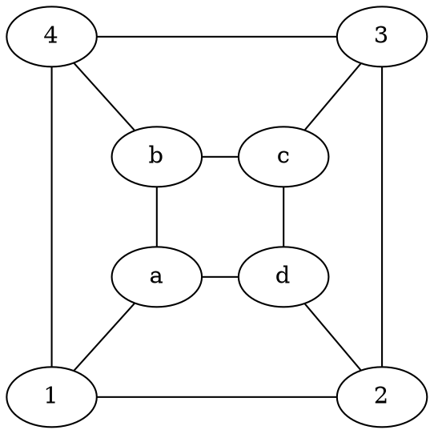
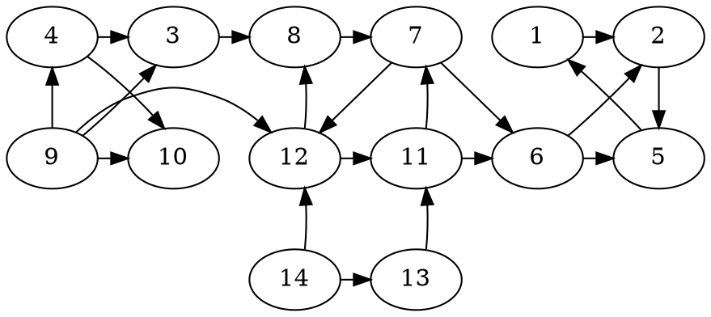
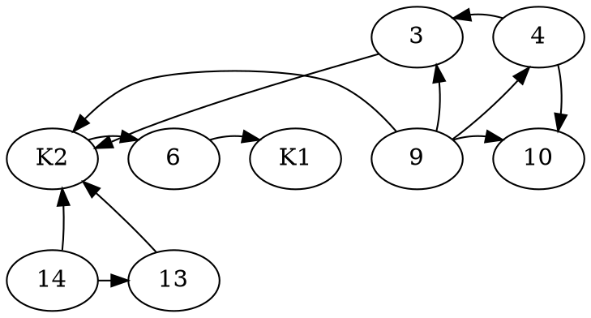
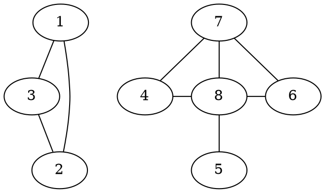

# Exercise Sheet 1

#### 1) Use a suitable graph theoretical model to solve the following problems:
**a) Show that in every city at least two of its inhabitants have the same number of neighbours!**
    Let $G = (V,E)$ such that 
        * $v \in V$ if $v$ is an inhabitant of the city and 
        * $(v,w) \in E$ iff $v$ and $w$ are neighbours.
    Now, we show the (a) by proving that in any simple, undirected graph there exist two vertices which have the same degree:
-- Proof by contradiction--
    
Assume a simple, undirected graph $G = (V,E)$, such that $\forall v,w \in V: v \neq w \rightarrow deg(v) \neq deg(w)$.
Then, by assumption, the nodes $\{v_1,\dots , v_n\} = V$, have degrees $\{0, \dots, n-1\}$ (seeing as $G$ is simple, no node has an edge to itself).

Thus, there is a node $v_i \in V$ with $deg(v_i) = n-1$ meaning it is connected to all other nodes, but there also exists a node $v_j \in V$ with $deg(v_j) = 0$ meaning it is connected to no other nodes, including $v_i$. *Contradiction!*

**b) 11 friends want to send postcards according to the following rules:**
* (i) Each person sends and receives exactly 3 cards.
* (ii) Each one only receives cards from those to whom he or she sent a card and vice versa.
Tell us how this can be done or prove that this is impossible.

Let $G=(V,E)$ a graph such that the nodes $V = \{v_1, \dots, v_{11}\}$ represent the 11 friends and there is an edge $v,w \in E$ if $v$ sends a card to $w$ and vice versa.

--Proof that this is impossible--
By the Handshaking Lemma, $\sum_{v \in V} deg(v) = 2*|E|$ holds for any finite, undirected graph.
By (i), for each vertice $v \in V$, $deg(v) = 3$ and by assumption $|V| = 11$.
If we apply this to the handshaking lemma: $\sum_{v \in V} deg(v) = 33 = 2* k$, where $k = |E|$. But this holds for no integer amount of edges. *Contradiction!*

**c) Determine all graphs in which all vertices have degree 1.** 

In order for all vertices in a graph to have degree 1, each edge in the graph has to be connected to exactly two vertices, which themselves may not be connected to any other vertices.
Therefore we can construct the set of all graphs with only vertices of degree 1, based on their number of edges.
For $G = (V,E)$, with $|E| = k, k \in \mathbb{N}$:
$$
E = \{e_1, \dots , e_k\},\\
V = \{v_{i1}, v_{i2} | e_i \in E\}
$$

#### 2) Compute the number of walks of length $l$ from $i$ to $j$ in the following graph:


The number of walks of length $l$ from $i$ to $j$ is defined by the sum of all values in $A(G)^l$, where 
$$A(G) = \begin{pmatrix}
0 & 1 & 0\\
1 & 0 & 1\\
0 & 1 & 0
\end{pmatrix}$$
The element $(i,j)$ in $A(G)^l$ represents the walks of length $l$ from vertex $i$ to vertex $j$. 

**How could you use the adjacency matrix to compute the number of triangles (cycles of length 3) in a (loopless) graph?**
The number of triangles is defined by the trace (the sum of elements on the main diagonal) of $A(G)^3$ divided by 6 for undirected, and 3 for directed graphs.

**Perform the computation for two graphs of your choice on four vertices.**

#### 3) Show that each of the following four statements is equivalent to the statement "T is a tree":
* (1) Every two nodes of $T$ are connected by exactly one path.
* (2) T is connected and $\alpha_0(T) = \alpha_1(T) + 1$.
* (3) T is a minimal, connected graph, i.e., deleting an edge destroys connectivity.
* (4) T is a maximal, acyclic graph, i.e., adding an edge generates a cycle.

Let (0) := "T is a tree", i.e. *A graph is a tree iff it is connected, acyclic, and undirected.*

* (2) -> (0)
    * Connected: holds by assumption.
    * By the pidgeonhole principle, we can find a node $l \in T$ , which is connected only to one edge, i.e. a leaf node, since there are $n-1$ edges and $n$ nodes, not all nodes can be connected to two edges.
    * We proceed by induction on the number of nodes:
        * n = 2: then, there exist two nodes connected by one edge, thus $T$ is acyclic.
        * IH: For $T$ with $n$ nodes and $n-1$ edges, $T$ is acyclic.
        * Induction step: Let $T$ be a graph that satisfies (2), with $n+1$ nodes and $n$ edges. Then there exists a node $l \in T$ which is connected only to one edge, we know that the subtree $T'$ of $T$ with $l$ and the edge connected to $l$ removed is acyclic by IH, as we removed exactly one node and one edge, thus $T'$ has $n$ nodes and $n-1$ edges. Additionally $T'$ with $l$ attached to one of its nodes, cannot introduce a cycle, as $l$ is a leaf. 
    * Thus, $T$ is acyclic. 
* (0)  -> (1)
    * each $x,y \in V$ are connected by at least one path: by connected
        * each $x,y \in V$ are connected by at most one path: by acyclic
* (1) -> (3) 
    * Connected: holds by assumption.
    * Minimal: Let $(x,y)$ be an arbitrary edge in $T$, if we remove this edge, then, by (1), there no longer exists a path connecting $x$ and $y$ in $T$, thus connectivity of $T$ is destroyed. Since, this holds for an arbitrary edge, $T$ is minimal.

* (3) -> (4)
    * Acyclic: Assume $T$ contains a cycle. Then for some vertices $v_1,v_2 \in V$, w.l.o.g. assume $(v_1,v_2) \in E$ and there exists a path $v_2 \leftrightarrow y \leftrightsquigarrow v_1$. If we now delete $(v_1,v_2)$ from $E$, connectivity is maintained.
    * Maximal acyclic: For an arbitrary two nodes $v_1,v_2 \in V$ that are not connected by a direct edge, they must be connected by some path $P := v_1 \leftrightarrow y \leftrightsquigarrow v_2$ by $T$ connected. If we add a new edge $(v_1,v_2)$ to $E$, we create a cycle. 
        * Thus adding a new edge to $T$ always creats a cycle.
* (4) -> (2)
    * Let $T$ be a maximal acyclic graph. 
    * *connected:* assume $T$ is not connected and maximal acyclic, then by $T$ not being connected there are two nodes $v_1,v_2 \in T$ between which there is no path. Adding an edge $(v_1,v_2)$ has to create a cycle by $T$ maximal acyclic, but $(v_1,v_2)$ is the only path between $v_1,v_2$ by construction. Contradiction.
        * Thus, $T$ is connected.
    * $\alpha_0(T) = \alpha_1(T) + 1$:
        * Assume $T$ is the smallest maximal acyclic graph such that $|V| > |E| + 1$
            * trivially $|V| \neq 1$ and by the pidgeonhole principle $\exists l \in T$ such that $l$ is a leaf.
            * Let $T' = T \backslash \{l\}$ which removes exactly one edge and one node from $T$ by $l$ leaf. Thus, $|V| > |E| + 1$ holds for T'.
            * Now, assume $T'$ not maximal acyclic, then $\exists (x_1,x_2)$ with $x_1,x_2 \in T'$. and adding $(x_1,x_2)$ to $T'$ creates a cycle in $T'$. But by construction of $T'$, adding $(x_1,x_2)$ to $T$ would create a cycle in $T$ as well. Contradiction since $T$ is maximal acyclic. 
            * Thus $T$ cannot be the smallest acyclic graph since $T' \subset T$ and $T'$ maximal acyclic.
        * Assume $T$ is the smallest maximal acyclic graph such that $|V| < |E| + 1$
            * trivially $|V| \neq 1$, we distinguish as follows:
                * case 1: $\exists l \in T$ such that $l$ is a leaf.
                    * Let $T' = T \backslash \{l\}$, then $T'$ is maximal acyclic as shown previously and $V' < E' + 1$ as $V'=V-1$ and $E' = E-1$.
                    * Thus, $T' \subset T$ and $T'$ maximal acyclic. Contradiction.
                * case 2: No leaf node exists in $T$.
                    * We construct a path $p$ by: 
                        * selecting any node $v_1$ and choosing some neighbour of $v_1$ to add to $p$
                        * choosing a neighbour of the current node which we did not visit in the last step and adding it to $p$
                        * repeating this process iteratively. Since there are no leaves in $T$, this process can be repeated infinitely.
                        * By the pidgeonhole principle, some node $x$ repeats in $p$, i.e. $v_1 \rightsquigarrow x \rightsquigarrow x \rightsquigarrow \dots$, from this we construct a cycle $c := x \rightsquigarrow x$. Contradiction.
    * Thus T is the smallest maximal acyclic graph, such that $|V| = |E|+1$. 

Since we showed, (2) -> (0) -> (1) -> (3) -> (4) -> (2), we have shown equivalence of all statements by transitivity of implication.
#### 4) Prove that the edge set of an undirected, simple graph can be partitioned into cycles iff every vertex set has even degree. 
*Hint:* To prove the existence of a cycle, consider a maximal path and use the even degree condition.

* =>
    Let $G = (V,E)$ be a graph such that $E$ can be partitioned into cycles $C = \{C_1, \dots, C_k\}$. 
     Then for an arbitrary vertex $v$, the degree is defined as follows:
     Let $d(v)_G = 0$, then for every cycle $C_i \in C$, 
            - if $v \in C_i$,  $d(v)_{G \cup C_i} = d(v)_{G \cup C_{i-1}} + 2$
            - else $d(v)_{G \cup C_i} = d(v)_{G \cup C_{i-1}}$.
    Since we start with even degree and in each step the degree either remains unchanged or is increased by 2, the degree of all nodes is even.

* <=
    Let $G = (V,E)$ be a graph, such that every vertex $v \in V$ has even degree.

    --Proof by induction--
    * Base Case: n=1 
        * Since $|V| = 1$ and the graph is simple by assumption, $E = \{\}$, thus the partition is simply the empty set.

    * Induction Hypothesis: A graph with $|V| < n$ can have its edge set partitioned into cycles.
    * Induction step: 
        * Assume an arbitrary graph $G = (V,E)$ with $|V| = n$. 
            * case 1: $G$ is not connected
                * Then $G = G_1 \dot \cup G_2$ and by induction hypothesis both $G_1$ and $G_2$ can be partitioned into cycles. as their number of vertices are both strictly smaller than $n$.
            * case 2: $G$ is connected
                1. Then for an arbitrary vertex $v_1 \in V$, we know $d(v_1) \geq 2$ since $G$ is connected and all vertices in $G$ have even degree. 
                2. Therefore, there exists a vertex $v_2 \in V$ which is connected to $v_1$ and $v_1 \neq v2$. 
                3. Additionally, $deg(v_2) \geq 2$ by assumption and $G$ being connected. 
                4. We can apply expansion step 2. an arbitrary number of times until we reach a vertex $v_i$ for which $v_i = v_j$ holds for some $j \in \{1, \dots, i-2\}$ (i.e. a node we already expanded).
                5. We furthermore argue that the amound of expansion steps needed to find such a node/cycle is at most $n-1$ as there are only $n$ vertices in $G$ and thus after $n-1$ steps a node already on the path has to be encountered.

                After, such a cycle $C = v_1 \rightarrow v_2 \rightarrow \dots \rightarrow v_1$ is found, we can define a subgraph $G' = G \backslash C = (V',E')$. We then repeat steps 1. to 5. until there only remain nodes with no edges connected to them, which are then removed to construct $G'$.
                Now, $V' < n$ holds for $G'$ and thus $G'$ is partitionable into a set of cycles $C$ by IH. We can thus partition $G$ by $C_1 \dot \cup C$.


#### 5) Let $G = (V,E)$ be an undirected graph with $n$ vertices which does not have any cycle of length 3. Prove:
**1. If $xy \in E$ then $d(x) + d(y) \leq n$.**
        Let $G = (V,E)$ be an undirected graph such that $|V| = n$ which contains no cycles of length 3. 
        --Proof by contradiction--
        Assume two nodes $x,y \in V$ such that $d(x) + d(y) > n$, then the nodes $x$ and $y$ are connected to at least $n-1$ other nodes (since they are also connected by an edge themselves).
        Now, $|V \backslash \{x,y\}| = n-2$ by assumption. 
        Thus, there exists at least one node $z \in V$ such that $xz \in E$ and $yz \in E$ which means $G$ contains a cycle of length 3. Contradiction!
**2. The previous inequality $d(x) + d(y) \leq n$ implies that $\sum_{v \in V} d(v)^2 \leq n|E|$.**
        Since forall edges $xy \in E$, $d(x) + d(y) \leq n$, we know $n*|E| \geq \sum_{vw \in E} d(v) + d(w)$. 
        Now:
        $\sum_{vw \in E} d(v) + d(w) = \sum_{v \in V} \sum_{1}^{d(v)} d(v)$
        since for each vertice, its degree is contained in the left sum as many times as it occurs in an edge (i.e. as many times as its degree). Additionally, 
        $\sum_{v \in V} \sum_{1}^{d(v)} d(v) = \sum_{v \in V} d(v)^2$ 
        seeing as the left side simply sums up $d(v)$ times $d(v)$. Now we can apply transitivity of equality and get
        $n* |E| \geq \sum_{v \in V} d(v)^2$
**3. The graph has at most $n^2/4$ edges. *Hint:* Use the Handshaking-Lemma, the Cauchy-Schwarz inequality $(\sum_{i=1}^r a_i b_i)^2 \leq (\sum_{i=1}^r a_i^2) (\sum_{i=1}^r b_i^2)$, and what you have proved so far.**
    Assume $\sum_{v \in V} d(v)^2 \leq |E| * n$, we apply the Cauchy-Schwarz inequality with $a = d(v)$ and $b=1$ to get 
        $(\sum_{v \in V} d(v) * 1)^2 \leq (\sum_{v \in V} d(v)^2) * (\sum_1^n 1),$
        i.e. 
        $(\sum_{v \in V} d(v))^2 \leq \sum_{v \in V} d(v)^2 * n$
        Now, this can be inserted into the Handshaking Lemma, $4*|E|^2 = (\sum_{v \in V} d(v))^2 \leq n * \sum_{v \in V} d(v)^2$
        And in turn, from exercise 5.2): 
        $4*|E|^2 = (\sum_{v \in V} d(v))^2 \leq n * \sum_{v \in V} d(v)^2 \leq n^2 * |E|$
        we divide by $n$ and remove the sandwiched inequalities:
        $\frac{4*|E|^2}{n} \leq n * |E|$
        now only simple arithmetic transformations: $\frac{4*|E|^2}{n} \leq n * |E| \Leftrightarrow \frac{4m}{n} \leq n \Leftrightarrow 4m \leq n^2 \Leftrightarrow m \leq \frac{n^2}{4}$
        
#### 6) Let $G = (V,E)$ and $G' = (V',E')$ be two undirected graphs. A graph isomorphism is a bijective mapping $\phi : V \rightarrow V'$ such that two vertices $x,y \in V$ are adjacent iff $\phi(x)$ and $\phi(y)$ are adjacent. The two graphs $G$ and $G'$ are called isomorphic, if there exists an isomorphism $\phi: V \rightarrow V'$. Prove the following statements: 
* If $G$ and $G'$ are isomorphic graphs and $\phi : V \rightarrow V'$ is an isomorphism, then $d_G(x) = d_G'(\phi(x))$ forall $x \in V$.
    --Proof by contradiction--
    Let $x \in V$ be a vertice such that $d_G(x) \neq d_G(\phi(x))$.
    * Case 1: There exists some node $ y \in V$ such that $\phi(y)$ is adjacent to $\phi(x)$ but $y$ is not adjacent to (x), this contradicts the definition of $\phi$.
    * Case 2: There exists some node $y \in V$ such that $x$ is adjacent to y, but $\phi(x)$ is not adjacent to $\phi(y)$. This also contradicts the definition of §\phi$.
    Since we arrive at a contradiction in both cases, $d_G(x) = d_G(\phi(x))$ has to hold forall $x \in V$.
    
* If $\phi : V \rightarrow V'$ is a bijective mapping satisfying $d_G(x) = d_G(\phi(x))$ forall $x \in V$, then $G$ and $G'$ are not necessarily isomorphic.
    We provide $G$, $G'$ and $\phi$ such that $d_G(x) = d_G(\phi(x))$, but $G$ and $G'$ are not isomorphic.
    
    G:
    ```mermaid
    flowchart LR

        1((v1)):::myClass --- 2((v2)):::myClass --- 3((v3)):::myClass;
        3 --- 1
        4((v4)):::myClass --- 5((v5)):::myClass --- 6((v6)):::myClass;
        6 --- 4
        classDef myClass fill:#999; 
    ```
    G':
    ```mermaid
    flowchart LR

        1((v1')):::myClass --- 2((v2')):::myClass --- 3((v3')):::myClass;
        3 --- 4
        4((v4')):::myClass --- 5((v5')):::myClass --- 6((v6')):::myClass;
        6 --- 1
        classDef myClass fill:#999; 
    ```
    and $\phi(v_i) = v'_i$ for each $v_i \in V$.
    
    This means, forall $v_i \in V$, $d_G(x) = d_G(\phi(x))$ as all vertices in both graphs have degree 2.
    
    But $G$ and $G'$ are not isomorphic, since $v_5$ and $v_4$ are adjacent but $v_4'$ and $v_5'$ are not.

#### 7) Are the following two graphs isomorphic?

```graphviz
graph G2 { 
	rankdir=TD;
		A, B, C, D;
        A -- {<&#946;>, <&#947;>, <&#948;>};
        B -- {<&#945;>,<&#947;>, <&#948;>};
        C -- {<&#945;>, <&#946;>, <&#948;>};
        D -- {<&#945;>, <&#946;>, <&#947;>};
        <&#945;>, <&#946;>, <&#947;>, <&#948;>;
	}
```



Yes, we provide the following isomorphism:
    $f(1) = A$, $f(3) = B$, $f(b) = C$, $f(d) = D$, $f(c) = \alpha$, $f(a) = \beta$, $f(2) = \gamma$, $f(4) = \delta$, which is edge preserving and bijective.
#### 8) Let $G = (V,E)$ be a simple graph. Moreover let $G_R$ be its reduction. Prove that $G_R$ is acyclic.
--Proof by contradiction--
Let $G_R$ be a graph reduction which contains a cycle $C$, then $C$ is a walk $V_1^R \rightarrow V_2^R \leadsto V_1^R$. Thus, there exist strongly connected components $V_1, V_2$ in $G$ such that there is a walk from some $v_1 \in V_1$ to some $v_2 \in V_2$ and from $v_2$ to $v_1$. By construction of $G_R$ this means that $v_1$ and $v_2$ have to be in the same component in $G_R$. Contradiction!

#### 9) Find the strongly connected components and the reduction $G_R$ of the graph $G$ below. Furthermore, determine all vertex bases of $G$.


* Strongly connected components: $K1 = \{1,2,5\}$, $K2 = \{7,8,11,12\}$. 
* $G_R$:


* Vertex base: $K_B$ = \{9,14\}.

#### 10) Use the matrix tree theorem to compute the number of spanning forests of the graph below!


*Kirchoff's Matrix-Tree Theorem:* If $G=(V,E)$ is an undirected graph and $L$ is its graph Laplacian, then the number $N_T$ of spanning trees contained in $G$ is given by: 1.) Choose a vertex $v_j$ and eliminate the $j$-th row and column from $L$ to get a new matrix $\hat L_j$,
* Compute $N_T = det(\hat L_j)$ (The number $N_T$ counts spanning trees that are distinct as subgraphs of $G$. The resulting sum of trees that contribute to $N_T$ may be isomorphic.)

    To get all spanning forests of $G = G_1 \dot \cup G_2$, we simply calculate $N_T(G1) * N_T (G_2)$:
    The adjacency matrix of $G_1$:
    $$A(G_1) = \begin{pmatrix}
    0 & 1 & 1\\
    1 & 0 & 1\\
    1 & 1 & 0
    \end{pmatrix}$$
    
    The corresponding degree matrix: 
    
    $$D(G_1) = \begin{pmatrix}
    2 & 0 & 0\\
    0 & 2 & 0\\
    0 & 0 & 2
    \end{pmatrix}$$
    
    The laplacian:

    $$L(G_1) = \begin{pmatrix}
    2 & -1 & -1\\
    -1 & 2 & -1\\
    -1 & -1 & 2
    \end{pmatrix}$$
    
    after deleting the first row and column:
    
    $$\hat L(G_1) = \begin{pmatrix}
    2 & -1\\
    -1 & 2
    \end{pmatrix}$$
    
    calculating the determinant:
    
    $$ 
    det(\hat L_1(G_1)) = 4 - 1 = 3
    $$

    The adjacency matrix of $G_2$:
    $$A(G_2) = \begin{pmatrix}
    0 & 0 & 0 & 1 & 1\\
    0 & 0 & 0 & 0 & 1\\
    0 & 0 & 0 & 1 & 1\\
    1 & 0 & 1 & 0 & 1\\
    1 & 1 & 1 & 1 & 0
    \end{pmatrix}$$
    
    The laplacian matrix: 
    
    $$L(G_2) = \begin{pmatrix}
    2 & 0 & 0 & -1 & -1 \\
    0 & 1 & 0 & 0 & -1  \\
    0 & 0 & 2 & -1 & -1 \\
    -1 & 0 & -1 & 3 & -1 \\
    -1 & -1 & -1 & -1 & 4
    \end{pmatrix}$$
    
    after deleting the fourth row and column:

    $$\hat L_4(G_2) = \begin{pmatrix}
    2 & 0 & 0 & -1 \\
    0 & 1 & 0 & 0  \\
    0 & 0 & 2 & -1 \\
    -1 & 0 & -1 & 3 
    \end{pmatrix}$$
    
    calculating the determinant:
    
    $$ 
    det(\hat L_4(G_2)) = -1 \times \begin{pmatrix}
    2 & 0 & -1 \\
    0 & 2 & -1 \\
    -1 & -1 & 3
    \end{pmatrix} 
    = -1 \times (12 + 0 + 0 - 2 - 0 - 2) = -8
    $$
    we take $8$ as the sign only depends on which row and column you eliminate.
    Thus the number of $G = 3 \times 8$. 