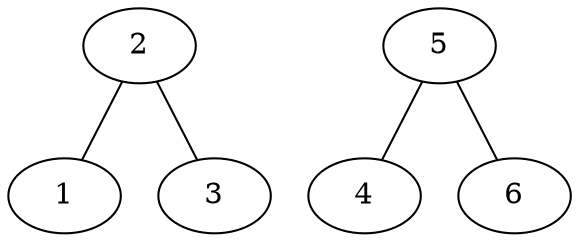

#### 11) $K_n$ denotes the complete graph with  $n$ vertices. Show that the number of spanning trees of $K_n$ is $n^{n-2}$.

We observe that by completeness of $K_n$, its adjacency matrix is the $n \times n$ matrix of ones, similarly its degree matrix is the $n \times n$ matrix with $n$ on its diagonal.

\begin{gather*}
$D(K_n) = \begin{pmatrix}
        n & 0 & 0 & \dots \\
        0 & n & 0 &\dots \\
        0 & 0 & n &\dots \\
        \vdots & \vdots & \vdots & \ddots & \\
    \end{pmatrix}$
\end{gather*}

\begin{gather*}
$A(K_n) = \begin{pmatrix}
        1 & 1 & 1 & \dots \\
        1 & 1 & 1 &\dots \\
        1 & 1 & 1 &\dots \\
        \vdots & \vdots & \vdots & \ddots & \\
    \end{pmatrix}$
\end{gather*}

We can thus see that $L(K_n) = D(K_n) - A(K_n)$ is defined as follows:

\begin{gather*}
$L(K_n) = \begin{pmatrix}
        n-1 & -1 & -1 & \dots \\
        -1 & n-1 & -1 &\dots \\
        -1 & -1 & n-1 &\dots \\
        \vdots & \vdots & \vdots & \ddots & \\
    \end{pmatrix}$
\end{gather*}

We then delete the first row and column from $L(K_n)$ to get a new $n-1 \times n-1$ matrix $L_1$.

\begin{gather*}
$L_1(K_n) = \begin{pmatrix}
        1 & 1 & 1 & \dots \\
        -1 & n-1 & -1 &\dots \\
        -1 & -1 & n-1 &\dots \\
        \vdots & \vdots & \vdots & \ddots & \\
    \end{pmatrix}$
\end{gather*}

We can then add all other rows to the first row. We observe that each column in the resulting matrix $L_1(K_n)'$ contains exactly $n-2$ negative ones and one $n-2$ entry, thus the value in each column of row 1 is defined by $n-1-n-2 = 1$.

\begin{gather*}
$L_1(K_n)' = \begin{pmatrix}
        n-1 & -1 & -1 & \dots \\
        -1 & n-1 & -1 &\dots \\
        -1 & -1 & n-1 &\dots \\
        \vdots & \vdots & \vdots & \ddots & \\
    \end{pmatrix}$
\end{gather*}

We can then derive the matrix $L_1(K_n)''$ by adding the first row to each other row.

\begin{gather*}
$L_1(K_n)'' = \begin{pmatrix}
        1 & 1 & 1 & \dots \\
        0 & n & 0 &\dots \\
        0 & 0 & n &\dots \\
        \vdots & \vdots & \vdots & \ddots & \\
    \end{pmatrix}$
\end{gather*}

We observe that, $L_1(K_n)''$ is an upper triangular matrix and the determinant is thus calculated by $det(L_1(K_n)'')= l_{11} \times l_{22} \times \dots l_{n-1 \ n-1} = 1 \times n^{n-2} = n-2$.

#### 12) If $T$ is a tree having no vertex of degree 2, then $T$ has more leaves than internal nodes. Prove this claim:

**1) By induction.**

--Proof by induction--

* Base case: 2 leaves, no internal nodes :heavy_check_mark:

    ```graphviz
        graph G {
        1 -- 2
        }
    ```

* Induction Hypothesis:
    A tree $T=(V,E)$ with size $|V| < n$ and no vertices $v \in V$ with degree two has more leaves than internal nodes.
* Induction step:
        We observe that $T= (V,E)$ and $|V| = n$ has some node $v \in V$ such that $v$ is connected to at most 1 non-leaf node but also at least 1 by n > 1. Since $\forall v \in V: d(v) \neq 2$, v is connected to at least 2 leaves and some subtree of $T$. We can then apply the induction hypothesis to $T'$, where $T'$ is a new tree, constructed by removing all leaves adjacent to $v$ and the edges connecting the leaves to $v$. $T'$ still has no vertex of degree 2 as $v$ is now a leaf, i.e. $d(v) = 1$ and all other vertices in $T'$ have degree $\neq 2$ by assumption. Then, by induction hypothesis $L(T') > I (T')$ since we removed at least two leaves from $T$ and one internal node in $T$ became a leaf in $T'$, $L(T') + 1 > I(T') + 1 \Rightarrow L(T) > I(T)$.

**2) Consider the average degree and use the Handshaking Lemma.**

Let $T= (V,E)$ be a tree. Therefore, $|E| = |V| - 1$ as shown in exercise 1).
We can insert this into the Handshaking Lemma:

\begin{gather*}
\sum_{v \in V} d(v) = 2 (|V| -1)
\end{gather*}

We consider the average degree of a node, which is

\begin{gather*}
\frac{\sum_{v \in V} d(v)}{|V|} = \frac{2(|V|-1)}{|V|}
\end{gather*}

Now, since each internal node, contributes at least 3 to the sum of degrees and each leaf contibutes exactly one to that sum, let $i$ be the number of internal nodes and $l$ the number of leaf nodes in $T$.

\begin{gather*}
\frac{2(|V|-1)}{|V|} \geq \frac{3i+l}{|V|} = 2(|V|-1) \geq 3i+l
\end{gather*}

and since $|V| = i+l$, $2(|V| -1) \geq 2i+|V|$, from which we subtract $|V|$, to get

\begin{gather*}
|V| - 2\geq 2i \Leftrightarrow \frac{|V|}{2} - 1 \geq i \Leftrightarrow \frac{|V|}{2} > i.
\end{gather*}

Since $i$ represents less than half of the nodes in $V$, and all other nodes have to be leaf nodes, more nodes in $V$ are leaf nodes than internal nodes.

#### 13) Let $G = (V,E)$ be a connected graph with an even number of vertices. Show that there is a (not necessarily connected) spanning subgraph in which all vertices have odd degree.

We show that this property holds for trees, as all connected grahs have a tree as a subgraph.

--Proof by induction--

* Base case: $|V| = 2$, then $d(v) = 1$ for all vertices in the tree.
* Induction hypothesis: Let $G=(V,E)$ be a connected graph with an even number of vertices and $|V| = k$, $k < n$, $G$  has a connected spanning subgraph where all $v \in V$ have an odd degree.
* Induction step: We observe that $T$ has some node $v$ which is connected to at most one non-leaf. We apply a case distinction on the degree of $v$:
    * $v$ has even degree:
        Then $v$ is connected to an odd number of leaves and one node $v_1$ which is connected to at least one other node,  since otherwise $G$ would have an odd number of vertices.
        We can then delete the edge between $v$ and $v_1$. $v$ and its leaves represent a spanning subgraph $\dot G$, and since $v$ has an odd number of leaves it has an odd degree, foreach leaf this also holds trivially.
        The spanning tree $G$ can then be constructed by taking the subgraph connected to $v_1$ without the removed edge $v,v1$ and applying the induction hypothesis to it since we removed an even number of vertices it is applicable. We get some spanning subgraph $G'$ by this and the spanning subgraph for $G$ is $G' \cup \dot G$.
    * $v$ has odd degree:
        Then $v$ is connected to an even number of leaves and one node $v_1$ which could be connected to some other node. This means there is a spanning subgraph $\dot G$, comprised of $v$ and its leaves, where all leaves trivially have odd degree and since we keep $(v,v_1)$, $v$ has an odd degree as well. We construct a spanning subgraph $G'$ by removing $v'$'s leaves and the edges connecting the leaves to $v$ and applying the induction hypothesis, since the number of vertices we removed were even. We can then get a spanning subgraph of $G$ by $\dot G \cup G'$.

**Is this also true for non-connected graphs?**
No, we provide a counterexample:



The number of vertices is even, but there is no spanning subgraph such that all vertices have odd degree, seeing as we cannot remove edges or we lose the spanning property.

#### 14) List all matroids $(E,S)$ with:

* $E = \{1\}$:
    \begin{gather*}
    \{\emptyset\}, \{\emptyset, \{1\}\}
    \end{gather*}
* $E=\{1,2\}$:
    \begin{gather*}
    \emptyset,\\
    \{\emptyset, \{1\}\}, \{\emptyset, \{2\}\}, \{\emptyset, \{1\}, \{2\}\},\\
    \{\emptyset, \{1\}, \{2\}, \{1,2\}
    \end{gather*}
* $E = \{1,2,3\}$:
    \begin{gather*}
    \emptyset,\\
    \{\emptyset, \{1\}\}, \{\emptyset, \{2\}\}, \{\emptyset, \{3\}\},\\
    \{\emptyset, \{1\}, \{2\}\} , \{\emptyset, \{2\}, \{3\}\}, \{\emptyset, \{1\}, \{3\}\},
    \{\emptyset, \{1\}, \{2\}, \{3\} \}, \\
    \{\emptyset, \{1\}, \{2\}, \{1,2\} \}, \{\emptyset, \{2\}, \{3\}, \{2,3\}\} , \\
    \{\emptyset, \{1\}, \{3\}, \{1,3\}\}, \\
    \{\emptyset, \{1\}, \{2\}, \{3\}, \{1,2\}, \{2,3\},\{1,3\}\},\\
    \{\emptyset, \{1\}, \{2\}, \{3\}, \{1,2\}, \{2,3\}\},\\
    \{\emptyset, \{1\}, \{2\}, \{3\}, \{1,2\}, \{1,3\}\},\\
    \{\emptyset, \{1\}, \{2\}, \{3\}, \{2,3\}, \{1,3\}\},\\
    \{\emptyset, \{1\}, \{2\}, \{3\}, \{1,2\}, \{2,3\}, \{1,3\}, \{1,2,3\}\}
    \end{gather*}

#### 15) Let $E = \{a,b,c,d,e,f,g\}$ and $$S = \{A \subseteq E \ | \ |A| \leq 3 \} \backslash \{\{a,b,c\}, \{c,d,e\}, \{a,e,f\}, \{a,d,g\}, \{c,f,g\}, \{b,e,g\}, \{b,d,f\}\}.$$ Examine whether $(E,S)$ is a matroid.

$(E,S)$ is a matroid:

* The empty set is in $S$.
* $S$ is closed under inclusion, since all two, and one-element subsets of $E$ are in $S$.
* Assume some $\{i,h\} \in S$ and $\{x,y,z\} \in S$, then if $\{i,h\} \subset \{x,y,z\}$ we take the elem $j$ from $\{x,y,z\}$ which is not in $\{i,h\}$ and get $\{x,y,z\} = \{i,h\} \cup j$ thus trivially in $S$.
    If there is some element in $\{i,h\}$ which is not in $\{x,y,z\}$ then we have a choice of two elements in $\{x,y,z\}$ which we can add to $\{i,h\}$.
    Since the excluded sets only have a max one element overlap, for any two element subset of $E$, we can choose the element in $E$ which does not create an excluded set.

#### 16) Prove that an independence system $(E,S)$ is a matroid iff for every $A \subseteq E$, all maximal independent subsets of $A$ have the same cardinality.

* =>) Assume $A,B \in S$ such that $A$ and $B$ are both maximal and w.l.o.g. $|A| > |B|$ and by the matroid property $B \cup \{x\} \in S$. Therefore $B$ is not a maximal independent subset of $E$. Contradiction!

* <=) This does not hold:

    --Counterexample--

    Let $(E,S) = M$ be an independence system such that:
    $$
    E = \{1,2,3,4,5,6,7\}
    $$
    and $S$ contains $\emptyset$, all subsets of $E$ of size 1 and $\{1,2\}, \{1,3\}, \{2,3\}, \{1,5\}, \{3,4\}, \{3,5\}, \{4,5\}, \{1,2,3\}, \{1,3,5\}, \{3,4,5\}$.
    Then, all maximal independent subsets $A \subseteq E$ have the same cardinality but $M$ is not a matroid as for $\{2,3\}$, and $\{3,4,5\}$, there exists no $x \in \{3,4,5\}$ such that $\{2,3\} \cup \{x\}$ is in $S$, since $\{2,3,4\} \notin S$ and $\{2,3,5\} \notin S$.

#### 17) Let $E_1$ and $E_2$ be two disjoint sets. Moreover, assume that $(E_1,S_1)$ and $(E_2,S_2)$ are matroids. Define $S := \{X \cup Y \ | \ X \in S_1 \text{ and } Y \in S_2\}$. Prove that $(E_1 \cup E_2, S)$ is a matroid.

Let $A,B$ be arbitrary elements in $S$ such that, w.l.o.g $|A| > |B|$, then by construction of $(E_1 \cup E_2, S)$ we can deconstruct the sets as follows:

\begin{gather*}
A := A_1 \cup A_2\\
B := B_1 \cup B_2
\end{gather*}

where $A_1,B_1$ are all elements in $A,B$ which occur in $S_1$ and $A_2,B_2$ the ones from $S_2$.
Now, we know that either $|A_1| > |B_1|$ or $|A_2| > |B_2|$, let $A_i, B_i$ be the sets for which this property holds. Then, by $(E_i, S_i)$ being a matroid, there exists an $x \in A_i$ such that $B_i \cup \{x\} \in S_i$.
Therefore, by definition of $(E_1 \cup E_2, S)$, $B_i \cup \{x\} \in S$.
