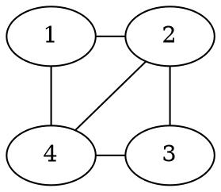
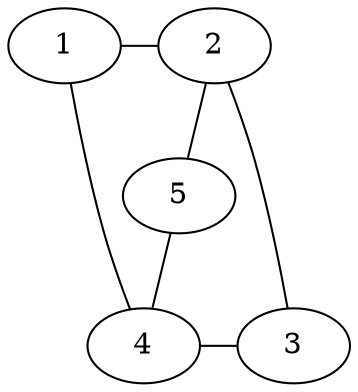

# Exercise Sheet 3

#### 23) For a simple and undirected graph $G$ we define the *line graph* $\bar G$ as follows: $V(\bar G) = E(G)$ and $(e,f) \in E(\bar G)$ iff the edges $e$ and $f$ share a vertex. Prove that the line graph of a Eularian graph is Eularian and Hamiltonian.

* **Eularian:**
    For an arbitrary vertex $e \in \bar V$, its neighbours are defined as follows, by construction of $\bar G$:
    for $v_1, v_2$ such that $e$ connects $v_1$ to $v_2$ in $G$:
    where $v_1 = \{(v_1,v_j) \ | \ v_1 \neq v_j \land (v_1,v_j) \in E\}$, and 
     $v_2 = \{(v_i,v_2) \ | \ v_i \neq v_2 \land (v_i,v_2) \in E\}$.
     Then, $N(e) = V_1 \cup V_2$ where $V_1$ and $V_2$ are disjoint by construction.
     Thus, $|N(e)| = |V_1| + |V_2|$.
     Furthermore, we know $|V_1| = deg(v_1)-1$ and $|V_2| = deg(v_2)-1$ by construction of the respective sets.
     By $G$ Eularian, we know that $deg(v_1)$ and $deg(v2)$ are even, thus the sizes of $V_1,V_2$ are each odd, which means $|N(e)| = deg(e)$ is even by $|N(e)| = |V_1| + |V_2|$ and $V_1,V_2$ being odd.
     We have shown that for all $e \in \bar V$, $deg(e)$ is even, thus $\bar G$ is eularian.
* **Hamiltonian:**
    By construction, there exists a eularian cycle in $G$, which visits all edges once exactly. 
    Denote this cycle by $e_1, \dots, e_m$, where some vertex $v_1$ is incident to $e_1$ and $e_m$. 
    By definition, each edge pair $(e_1,e_2), \dots, (e_m,e_1)$ is incident to some shared vertex.
    By construction of $\bar G$ there then exists a hamiltonian cycle in $\bar G$, i.e. $e_1 \rightarrow e_2 \leadsto e_m \rightarrow e_1$ where no node is revisited.
     
#### 24) Prove that a graph $G$ is bipartite iff each cycle in $G$ has even length. 

=>) 
--Proof by Contradiction--
Let $G$ be a bipartite graph which contains a cycle $c$ with odd length.
By assumption, $c$ is defined by $v_1 \rightarrow v_2 \leadsto v_k \rightarrow v_1$ and $k$ is odd, i.e. c has odd length.
Then by $G$ being bipartite we can divide $V$ into $V_1,V_2$ such that $V = V_1 \cup V_2$ and $\forall e \in E$, $e$ connects a vertex in $V_1$ to some vertex in $V_2$.
Thus, w.l.o.g., by $(v_1,v_2) \in E$, $v_1 \in V_1$ and $v_2 \in V_2$, which means every second vertex on $c$ is in $V_2$ and every other vertex on $c$ in $V_1$. 
We know, $v_1 \leadsto v_{k-1}$ is of even length, thus $v_{k-1} \in V_2$ and by $(v_{k-1}, v_k) \in E$, $v_k \in V_1$, but then $v_1 \in V_2$ would have to hold, by $(v_k,v_1) \in E$. Contradiction!
Therefore, every cycle in $G$ has even length, assuming $G$ is bipartite.

<=) Let $G$ be a graph such that each cycle in $G$ has even length.
W.l.o.g. assume $G$ is connected.
We can then split $V$ into $V_1$ and $V_2$ such that $V = V_1 \cup V_2$ as follows:

We take some $v_1 \in V$ and say $v_1 \in V_1$, then forall other vertices in $v \in V$:
* let $V_1 = \{v \ | \ v \in V$ and the shortest path from $v$ to $v_1$ is of even length$\}$, and
* let $V_2 = \{v \ | \ v \in V$ and the shortest path from $v$ to $v_1$ is of odd length$\}$

We show, no vertex in $V_1$ is connected to some other vertex in $V_1$. (Analogous proof for $V_2$)

--Proof by Contradiction--
Assume there exist $v_i,v_j \in V_1/V_2$ such that $(v_i,v_j) \in E$, then there exists a cycle $c: v_1 \leadsto v_i \rightarrow v_j \leadsto v_1$ by construction of $V_1/V_2$.
    We distinguish:
    * $v_i,v_j \in V_1$: then the length of $c$ is defined by $v_1 \leadsto v_i + 1 + v_j \leadsto v_1$, by construction of $V_1$, $v_1 \leadsto v_i$ and $v_j \leadsto v_1$ are each even, meaning the length of $c$ is odd. Contradiction!
    * $v_i, v_j \in V_2$: then the length of $c: v_1 \leadsto v_i + 1 + v_j \leadsto v_1$, where $v_1 \leadsto v_i, v_j \leadsto v_1$ are each odd, thus their sum is even, if we now add 1 for the edge between $v_i$ and $v_j$, the length of $c$ is odd. Contradiction!

In both cases $c$ is of odd length, contradicting the assumption!

#### 25) Let $G$ be a Eularian graph and $H$ be a subdivision of $G$. 
* **Is $H$ Eularian?** 
--Yes--
Theorem: An undirected, connected graph is Eularian iff all its vertices have even degree.

Since $G$ is Eularian, all $v \in V$ have even degree. 
Now, all vertices in $H$ are either 
 * vertices from $G$:
     then either their edges are equivalent to the ones in $G$, meaning their degree remains unchanged from the one in the original graph or some edges connecting to the vertice were subdivided then their degree also remains unchanged as for each removed edge, a new one is added.
 * Or they are some new vertice $w$ which was added by a subdividing operation. Then their degree is exactly two and thus even. 
 
* **Suppose that $G$ is Hamiltonian. Does this imply that $H$ is Hamiltonian as well?**
--Counter example--
$G$ is Hamiltonian.

$H$ is not Hamiltonian.

#### 26) 
(a) 
1) **Prove that every simple connected planar graph with at least 3 vertices satisfies $\alpha_1(G) \leq 3\alpha_0(G) - 6$.**

We know that each edge contributes to exactly two (not necessarily) different faces. A face touches at least 3 edges but maybe more.

Therefore, we can define the following inequality: 
$$
3 \alpha_2(G) \leq 2 \alpha_1(G)
$$
Now, by Euler's Formula: $\alpha_0(G) - \alpha_1(G) + \alpha_2(G) = 2$ i.e. $\alpha_2(G) = 2- \alpha_0(G) + \alpha_1(G)$

We can then substitute this into the defined inequality:
$$
3(2 - \alpha_0(G) + \alpha_1(G)) \leq 2\alpha_1(G) \Leftrightarrow
$$
$$
6 - 3\alpha_0(G) + 3\alpha_1(G) \leq 2\alpha_1(G) \Leftrightarrow
$$
$$
6 + 3 \alpha_1(G) \leq 2 \alpha_1(G) + 3\alpha_0(G) \Leftrightarrow
$$
$$
6 + \alpha_1(G) \leq 3 \alpha_0(G) \Leftrightarrow
$$
$$
\alpha_1(G) \leq 3\alpha_0(G) - 6
$$

2) **Show that this implies that $K_5$ is not planar:**

$\alpha_1(K_5) = 4 * 5 = 20$ and $\alpha_0(K_5) = 5$, then we put these numbers into the inequality: $20 \leq 3 \times 5 - 6 = 15 - 6 = 9$, therefore $K_5$ is not planar.

(b) **Prove the following statement or find a counter example: For all $n - m + f = 2$ and for which there exists a simple graph with $\alpha_0 = n, \alpha_1 = m$ there exists also a simple planar graph with $\alpha_0 = n, \alpha_1 = m$ and $\alpha_2 = f$.**

--Counter example--
$K_5$ with $n=5$, $m=20$, there exists a simple graph with $\alpha_0 = 5$ and $\alpha_1 = 20$ but there does not exist a planar simple graph for $n=5$ and $m=20$ as shown above.

#### 27) Let $n \in \mathbb{N}$ and $G = (V_1\cup V_2,E)$ be a bipartite graph with $min_{x \in V} d(x) \geq n/2$ and $|V_1| = |V_2| = n$. Use Hall's theorem to prove that $G$ has a perfect matching.

W.l.o.g. we argue over an arbitrary subset $S \subseteq V_1$.
We denote the set of all neighbours of all vertices in $S$ by: 

$$
N(S) = \{v_2 \ | \ (v_1,v_2) \in E \text{ and } v_1 \in S\}
$$

We distinguish two cases:

1) $|S| \leq n/2$: 
    then for some vertex $v \in S$, we know that $|N(v)| \geq n/2$.
    Additionally, $|N(S)| \geq |N(v)|$ by construction of $N(S)$. 
    Then, by assumption, $|N(S)| \geq |N(v)| \geq n/2 \geq |S|$, i.e. $|N(S)| \geq |S|$.
    
2) $|S| > n/2$:
    then for any vertex $v_2 \in V_2$, we know that is is connected to some vertex in $S$ as $d(v_2) \geq n/2$ and $V_2$ is only connected to vertices in $V_1$ of which more than $n/2$ vertices are in $S$.
    Thus, $\forall v_2 \in V_2$, $N(v_2) \cap S \neq \emptyset$, which means $\forall v_2 \in V_2$, $v_2 \in N(S)$.
    We conclude $|N(S)| = n$, thus $|S| \leq |N(S)|$, since $|S| \leq |V_1| = n = |N(S)|$. 
    
*Hall's Marriage Theorem*: There is a matching of size $|A|$ iff every set $S \subseteq A$ of vertices is connected to at least $|S|$ vertices in $B$. 

Since we showed $|S| \leq |N(S)|$ for all possible subsets $S \subseteq V_1$. We can apply Hall's Marriage theorem and derive that there is a matching of size $|V_1| = n$ which is a perfect matching.

#### 28) Let $G$ be a graph with $\alpha_0(G) = n$ and $\chi(G) = k$. Prove that $\alpha_1(G) \geq \binom{k}{2}$.

We know that any $k$-chromatic graph has at least $k$ vertices of degree $k-1$ each, otherwise it would not be $k$-chromatic.

Then, by Handshaking lemma: 
$$
k (k-1) \leq \sum_{v \in V} deg(v) = 2 |E| \Leftrightarrow 
$$
$$
\frac{k (k-1)}{2} \leq |E|
$$

Which is equivalent to $|E| \geq \binom{k}{2}$ as:
$$
\binom{k}{2}  = \frac{k!}{2(k-2)!} = \frac{k(k-1)(k-2)!}{2(k-2)!} = \frac{k(k-1)}{2}
$$

#### 29) Let $G_1 = (V, E_1)$ and $G_2 = (V, E_2)$ be two graphs. Set $G = (V, E_1 \cup E_2)$ and prove that $\chi(G) \leq \chi(G_1)\chi(G_2)$.

Since $G_1$ is $\chi(G_1)$-colourable, there exists some colouring $c_1$ such that $c_1$ $\chi(G_1)$-colours $G_1$.
Analogously, there exists some colouring $c_2$ such that $c_2$ $\chi(G_2)$-colours $G_2$. 

We can then construct a colouring $c$ which colours an arbitrary vertex $v  \in G$ by:
$$
c(v) = (c_1(v), c_2(v)),
$$
then $\chi(G) \leq \chi(G_1) \times \chi(G_2)$ as the number of colours which $c$ uses are all combinations of the colours $c_1, c_2$ use, thus $\chi(G_1) \times \chi(G_2)$, but there could be a smaller colouring, e.g. if $G_1 = G_2$. We now show that $c$ colours $G$ correctly, i.e. no connected vertices in $G$ are coloured the same colour.

W.l.o.g. for an arbitrary edge $e \in E_1$, where $e = (v_1,v_2)$ we know by $G_1$ being $\chi(G_1)$-colourable by function $c_1$, that $c_1(v_1) \neq c_2(v_2)$, thus $(c_1(v_1), c_2(v_1)) \neq (c_1(v_2),c_2(v_2))$.

Therefore, $c$ is a correct colouring of $G$.

#### 30) Show the following inequality for Ramsey numbers: If $r \geq 3$ then:
$$
R(n_1, \dots, n_{r-2}, n_{r-1}, n_r) \leq R(n_1, \dots, n_{r-2}, R(n_{r-1},n_r))
$$
*Hint*: Let $n= R(n_1, \dots, n_{r-2}, R(n_{r-1}, n_r))$ and consider an edge colouring of $K_n$ with $r$ colours, say $c_1, \dots, c_r$. Identify the colours $c_{r-1}$ and $c_r$ and apply the Ramsey property for $r-1$ colours. 

Let $n= R(n_1, \dots, n_{r-2}, R(n_{r-1}, n_r))$, $n_i' = n_i$ for $i \in \{1, \dots, r-2\}$ and $n_{r-1}' = R(n_{r-1},n_r))$, we consider an edge colouring $C$ of $K_n$ with $r$ colours, $c_1, \dots, c_r$. 
For each edge, coloured in $c_{r-1}$ or $c_r$, we colour it in $c_{r-1}$ to get a new colouring $C'$. 
Let $C'$ be a colouring derived from $C$, where all edges coloured $c_r$ are coloured $c_{r-1}$.

By definition of $n = R(n_1, \dots, n_{r-2}, R(n_{r-1},n_r))$, $C'$ contains some $K_{n_{i}'}$ coloured in $c_i$ and either:
* $i \in \{1, \dots, r-2\}$, then $K_{n_{i}}$ is coloured $c_i$ in $C$ by construction.
* $i = r-1$, then let $x = R(n_{r-1}, n_r)$, the edges in $K_x$ are coloured either $c_{r-1}$ or $c_r$ in $C$ by construction of $C'$.
    By definition of $x$, $K_x$ coloured in $C$ contains either $K_{n_{r-1}}$ with all edges coloured in $c_{r-1}$ or $K_{n_r}$ with all edges coloured in $c_r$.

Thus, $K_n$ coloured in $C$ contains some $K_{n_i}, i \in \{1, \dots, r\}$ with all edges coloured in $c_i$.
Since $C$ was arbitrary, $R(n_1, \dots, n_r) \leq n$.

