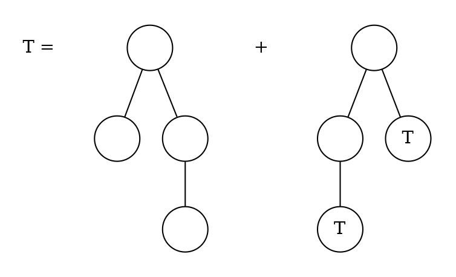

#### 51) A $t$-ary tree is a plane rooted tree such that every node has either $t$ or $0$ successors. A node with $t$ successors is called internal node.

* How many leaves does a $t$-ary tree with $n$ internal nodes have?
    We can count the number of nodes in our tree by counting all nodes with a parent and the nodes without a parent, the latter simply being the root. Each internal node has to have $t$ children, thus we have:
    $$
    t \times n +1
    $$
    nodes in total, meaning we have:
    $$
    (t n + 1) - n = t (n-1) + 1
    $$
    leaves, by removing the internal nodes from the total nodes.

* Moreover, let $a_n$ be the number of $t$-ary trees with $n$ internal nodes and $A(z)$ the generating function of this sequence. Find a functional equation for $A(z)$!
    We can construct a $t$-ary tree with $n$ internal nodes by taking $t$ $t$-ary trees which have $n-1$ internal nodes all together and attaching them to a root node.

\begin{gather*}
a_n = \sum_{n_1, \dots, n_t} a_{n_1} \times \dots \times a_{n_t},
\end{gather*}

where $(n_1, \dots, n_t)$ are all possible combinations such that $n_1 + \dots n_t = n-1$

We define $a_0=1$ since there exists exactly one $t-ary$ tree with no internal nodes, namely the one consisting of only the root.
Then, since $A(z) = \sum_{n \geq 0} a_n z^n$, by definition of generating functions.

Furthermore, we know

\begin{gather*}
(A(z))^t = (\sum_{n \geq 0} a_{n+1}z^n)^t = \sum_{n \geq 0} c_n z^n,
\end{gather*}

where

\begin{gather*}
c_n = \sum_{n_1 + \dots + n_t = n} a_{n_1} \times \dots \times a_{n_t}
\end{gather*}

which can be observed from the definition of the cauchy product.

We observe that $c_n=a_{n+1}$, hence

\begin{gather*}
(A(z))^t = \sum_{n \geq 0} a_{n+1}z^n
\end{gather*}

and

\begin{gather*}
\sum_{n \geq 1} a_n z^{n-1} = \sum_{n \geq 1} a_n z^{n-1} + a_0 - a_0 = \frac{1}{z} \sum_{n \geq 0} a_n z^n - a_0
\end{gather*}

Thus, our functional equation for $A(z)$ is defined by:

\begin{gather*}
(A(z))^t = \frac{A(z)-a_0}{z} \Leftrightarrow (A(z))^t \times z + 1 = A(z)
\end{gather*}

#### 52) Compute the number $t_n$ of plane rooted trees with $n$ nodes which can be described by the equation:

Then $t_4 = 1$ and $t_n = \sum_{i+j=n-2} t_i \times t_j$, for $n \geq 4$.

We observe that

\begin{gather*}
t_{n+2} = \sum_{i+j=n} t_i \times t_j = c_n, \quad n > 2
\end{gather*}

where, since,

\begin{gather*}
(A(z))^2 = \sum_{n > 2} t_{n+2} z^n= A(z) \times A(z) = \sum_{n \geq 0} t_n z^n \times \sum_{n \geq 0} t_n z^n = \sum_{n \geq 0} (\sum_{l=0}^{n} t_l \times t_{n-l})z^n =
\end{gather*}

\begin{gather*}
= \sum_{n \geq 0} (\sum_{i+j=n} t_i \times t_j)z^n = \sum_{n > 2} t_{n+2} z^n =
\end{gather*}

\begin{gather*}
(\sum_{n > 2} t_{n+2} z^n) + t_4 z^2 - t_4 z^2 = (\sum_{n \geq 2} t_{n+2} z^n) - z^2 =
\end{gather*}

\begin{gather*}
= z^{1/2} \sum_{n \geq 2} t_{n+2} z^{n+2}) - z^2 =
\end{gather*}

since for $n = 0,1,2,3$, $t_n = 0$

\begin{gather*}
= z^{1/2} \sum_{n \geq 0} t_{n} z^{n}) - z^2
\end{gather*}

Then, we have $(A(z))^2 = z^2 A(z) - z^2$, we solve the quadratic equation:

\begin{gather*}
A(z) = \frac{1}{2z^2} \pm \sqrt{\frac{1}{4z^4} - z^2}
\end{gather*}

refactor to get the same enumerator:

\begin{gather*}
A(z) = \frac{1-\sqrt{1- 4z^6}}{2z^2}
\end{gather*}

where the negative square root denotes a common generating function, thus we substitute

\begin{gather*}
A(z) = \frac{1}{2z^2} \sum_{n \geq 1} \binom{\frac{1}{2}}{n} (-4^n) z^{6n} =
\end{gather*}

we know the $0$th series number is $1$:

\begin{gather*}
\sum_{n \geq 1} -\frac{1}{2} \binom{1/2}{n} (-4^n) z^{6n -2}
\end{gather*}

we can then define $t_n$

\begin{equation}
  t_n =
    \begin{cases}
      - \binom{\frac{1}{2}}{k} (-4^k) \frac{1}{2} & \text{if } n = 6k-2 \text{ for } k \in \mathbb{N}\\
      0 & \text{otherwise}
    \end{cases}
\end{equation}

#### 53) Compute the number $t_n$ of plane rooted trees with $n$ nodes.

Since we are dealing with plane-rooted trees, left-right order matters, these trees can be described by the root combined with a sequence of subtrees:

\begin{gather*}
P = \{\circ \} \times seq(P)
\end{gather*}

We apply the relevant generating functions:

\begin{gather*}
P(z) = \frac{z}{1- P(z)}
\end{gather*}

we multiply by the denominator

\begin{gather*}
P(z) - (P(z))^2 = z
\end{gather*}

and solve the quadratic equation, taking the positive result as $z_0=0$

\begin{gather*}
P(z) = \frac{1-\sqrt{1-4z}}{2}
\end{gather*}

when comparing this to binary trees, only factor $1/z$ is missing for binary trees, thus we can state that $1/zP(z)$ is equivalent to the generating function for the Catalan numbers.

The number of plane-rooted trees with $n$ nodes can thus be defined by coefficient extraction of the Catalan numbers:

\begin{gather*}
[z^n]P(z) = [z^{n-1}] C(z) = \frac{1}{n} \binom{2(n-1)}{n-1} \quad \text{, for } n\geq 1
\end{gather*}

since

\begin{gather*}
C_n = \frac{1}{n+1} \binom{2n}{n}
\end{gather*}

#### 54) Consider the following context-free grammar: $S \rightarrow aSb|\epsilon$. This defines a formal language $\mathcal{L}$ which consists of all words $w$ over the alphabet $\Sigma = \{a,b\}$ such that either (a) $w$ starts with $a$ followed by a word from $\mathcal{L}$, then a $b$ follows, which is itself followed by another word of $\mathcal{L}$, or (b) $w$ is the empty word. Compute the number of words in $\mathcal{L}$ that consist of $n$ letters. Do this by finding a combinatorial structure that specifies $\mathcal{L}$ and analysing the generating function of that structure.

```graphviz
graph graphname {
splines=false
a[label="",shape=point]
b[label="",shape=point]
c[label="",shape=point]
d[label="",shape=point, style=invis]
e[label="",shape=point, style=invis]
f[label="",shape=point, style=invis]
g[label="",shape=point, style=invis]

		a -- b[label="a"];
		a -- c[label="b"];
        c--d[shape=none];
        c--e[shape=none];
        b--g[shape=none];
        b--f[shape=none];

}
```

where the words of length $0$ have one possibility and there exist no words of odd length, since exerytime we write $a$, we write a $b$.

We can easily show that the language represented by this grammar can be translated to $D_1$, where $D_1$ is the Dyck language over one set of parentheses, we simply translate $a \rightarrow ($ and $b \rightarrow )$. Since we know that $C_n$ is the number of Dyck words of length $2n$, where $C_n$ is the $n$th catalan number, we can define the number of words in $\mathcal{L}$ with $n$ letters by:

\begin{gather*}
[z^{n}] D_z = \frac{1}{\frac{n}{2} +1} \binom{n}{\frac{n}{2}}
\end{gather*}

for even $n \geq0$
and by $0$ otherwise.

#### 55) Consider a regular $(n+2)$-gon $A$, say, with the vertices $0,1, \dots, n+1$. A triangulation is a decomposition of $A$ into $n$ triangles such that the $3$ vertices of each triangle are vertices of $A$ as well. Show that the set $\mathcal{T}$ of triangulations of regular polygons can be described as a combinatorial construction satisfying

\begin{gather*}
\mathcal{T} = \{\epsilon\} \cup \mathcal{T} \times \Delta \times \mathcal{T}
\end{gather*}

**where $\Delta$ denotes a single triangle and $\epsilon$ denotes the empty triangulation (consisting of no triangle and corresponding to the case $n=0$).**

Order matters here, since we have labelled vertices.
We have $0$ triangulations for $n=0$, since we then only have 2 vertices.

\begin{gather*}\{\epsilon\}\end{gather*}

Otherwise, we can split our $(n+2)$-gon into a triangle and the remaining shapes to be triangulated, hence:

\begin{gather*}
\mathcal{T} \times \Delta \times \mathcal{T}
\end{gather*}

**What is the number of triangulations of $A$?**
From the combinatorial construction, we directly get:

\begin{gather*}
T(z) = 1 + T(z) \times z \times T(z) \Leftrightarrow
\end{gather*}

\begin{gather*}
\Leftrightarrow T(z) = 1 + zT(z)^2 \Leftrightarrow
\end{gather*}

we solve the quadratic equation for $a=z, b = -1, c = 1$:

\begin{gather*}
T(z)= \frac{1- \sqrt{1-4z}}{2z}
\end{gather*}

where we chose the negative solution, since for $n=0$ the number is 0.

This is the closed form of the Catalan numbers.
Therefore, the number of triangulations of $A$ is computed by:

\begin{gather*}
[z^n]\sum_{n \geq 0} \frac{1}{n+1} \binom{2n}{n}
\end{gather*}

which is

\begin{gather*}
 \frac{1}{n+1} \binom{2n}{n}
\end{gather*}

#### 56) Use exponential generating functions to determine the number $a_n$ of ordered choices of $n$ balls such that there are $2$ or $4$ red balls, an even number of green balls and an arbitrary number of blue balls.
* $2$ or $4$ red balls: $(\frac{z^2}{2!} + \frac{z^4}{4!})$
* even number of green balls: $\frac{1}{2}(e^z + e^{-z})$
* arbitrary number of blue balls: $e^z$

We therefore get:

\begin{gather*}
(\frac{z^2}{2!} + \frac{z^4}{4!}) \times \frac{1}{2}(e^z + e^{-z}) \times e^z =
\end{gather*}

\begin{gather*}
= (\frac{z^2}{2!} + \frac{z^4}{4!}) \times (\frac{e^{2z}}{2} + \frac{e^{0}}{2})=
\end{gather*}

\begin{gather*}
= \frac{1}{2} \frac{z^2}{2} + \frac{1}{2} \frac{z^4}{4!} + \frac{e^{2z}}{2} \frac{z^2}{2} + \frac{e^{2z}} {2}\frac{z^4}{4!} =
\end{gather*}

\begin{gather*}
\frac{1}{2} \frac{z^2}{2} + \frac{1}{2} \frac{z^4}{4!} + \frac{1}{4} z ^2 \sum_{n \geq 0} 2^n \frac{z^{n}}{n!} +
\frac{1}{48} z ^4 \sum_{n \geq 0} 2^n \frac{z^{n}}{n!} =
\end{gather*}

\begin{gather*}
\frac{1}{2} \frac{z^2}{2} + \frac{1}{2} \frac{z^4}{4!} + \sum_{n \geq 0} \frac{1}{4}  2^n \frac{z^{n}}{n!} +
\sum_{n \geq 0} \frac{1}{48}  2^{n} \frac{z^{n}}{n!} =
\end{gather*}

\begin{gather*}
\frac{1}{2} \frac{z^2}{2} + \frac{1}{2} \frac{z^4}{4!} + \sum_{n \geq 2} \frac{1}{4}  2^{n-2} \frac{z^{n}}{(n-2)!} +
\sum_{n \geq 4} \frac{1}{48} 2^{n-4} \frac{z^{n}}{(n-4)!} =
\end{gather*}

\begin{gather*}
\frac{1}{2} \frac{z^2}{2} + \frac{1}{2} \frac{z^4}{4!} + \sum_{n \geq 2} \frac{1}{16} n (n-1) 2^n \frac{z^n}{(n-2)!} +
\sum_{n \geq 4} \frac{1}{768} n (n-1)(n-2) (n-3) 2^n \frac{z^n}{n!} =
\end{gather*}

\begin{gather*}
\frac{z^2}{2} + 3 \frac{z^3}{3!} + 13 \frac{z^4}{4!} + \sum_{n \geq 5} \frac{1}{16} n (n-1) 2^n \frac{z^n}{n!} +
\sum_{n \geq 5} \frac{1}{768} n (n-1) (n-2) (n-3) 2^n \frac{z^n}{n!} =
\end{gather*}

\begin{gather*}
\frac{z^2}{2} + 3 \frac{z^3}{3!} + 13 \frac{z^4}{4!} + \sum_{n \geq 5} (\frac{1}{16} + \frac{(n-2)(n-3)}{768}) n (n-1) 2^n \frac{z^n}{n!} =
\end{gather*}

\begin{gather*}
\frac{z^2}{2} + 3 \frac{z^3}{3!} + 13 \frac{z^4}{4!} + \sum_{n \geq 5} \frac{1}{768} (48 + n^2 - 5n + 6) n (n-1) 2^n \frac{z^n}{n!} =
\end{gather*}

\begin{gather*}
\frac{z^2}{2} + 3 \frac{z^3}{3!} + 13 \frac{z^4}{4!} + \sum_{n \geq 5} \frac{1}{768} (n^2 - 5n + 54) n (n-1) 2^n \frac{z^n}{n!} =
\end{gather*}

We therefore get the following numbers for $a_n$:

\begin{gather*}
a_n = \begin{cases}
1  &\textit{, if } n = 2 \\
3  &\textit{, if } n = 3 \\
13  &\textit{, if } n = 4 \\
\frac{1}{768} (n^2 - 5n + 54) n (n-1) 2^n  &\textit{, if } n \geq 5
\end{cases}
\end{gather*}

#### 57) Determine all solutions of the recurrence relation:

\begin{gather*}
a_n - 2 n a_{n-1} + n (n-1) a_{n-2} = 2n \times n! \textit{, } n \geq 2 \textit{, } a_0 = a_1 = 1.
\end{gather*}

*Hint: Use exponential generating functions.*

\begin{gather*}
\sum_{ n \geq 2} a_n \frac{z^n}{n!}  - 2 \sum_{ n \geq 2} n a_{n-1} \frac{z^n}{n!} + \sum_{ n \geq 2} n (n-1) a_{n-2} \frac{z^n}{n!} = 2 \sum_{ n \geq 2} n  n! \frac{z^n}{n!}
\end{gather*}

\begin{gather*}
(\sum_{ n \geq 0} a_n \frac{z^n}{n!}) - a_0 - za_1  - 2z (\sum_{ n \geq 0} n a_{n} \frac{z^n}{n!}) - a_0 + z^2 (\sum_{ n \geq 0} a_{n} \frac{z^n}{n!}) = 2 ((\sum_{ n \geq 2} n z^n ) - z)
\end{gather*}

we input the respective generating functions:
$$
\hat{A} - a_0 - za_1  - 2z \hat{A} - a_0 + z^2 \hat{A} = 2 \left( \frac{z}{(1-z)^2}  - z \right)
\end{gather*}

\begin{gather*}
\hat{A} - 1 - z  - 2z \hat{A}  + 2z + z^2 \hat{A} = \frac{2z}{(1-z)^2}  - 2z
\end{gather*}

\begin{gather*}
\hat{A} (1-2z+z^2) + 3z - 1 = \frac{2z}{(1-z)^2}
\end{gather*}

\begin{gather*}
\hat{A} (1-z)^2 + 3z - 1 = \frac{2z}{(1-z)^2}
\end{gather*}

\begin{gather*}
\hat{A} (1-z)^4 + 3z(1-z)^2 - (1-z)^2 = 2z
\end{gather*}

\begin{gather*}
\hat{A} (1-z)^4 + 3z - 6z^2 + 3z^3 - 1 + 2z -z^2 = 2z
\end{gather*}

\begin{gather*}
\hat{A} (1-z)^4 = -3z^3 + 7z^2 -3z + 1 =
\end{gather*}

\begin{gather*}
\hat{A} = \frac{(1-z)^3}{(1-z)^4} + \frac{4z^2 - 2z^3}{(1-z)^4} =
\end{gather*}

\begin{gather*}
\hat{A} = \sum_{n \geq 0} z^n + 4z^2 \sum_{n \geq 0} \binom{-4}{n} z^n- 2z^3 \sum_{n \geq 0} \binom{-4}{n} z^n =
\end{gather*}

\begin{gather*}
\hat{A} = \sum_{n \geq 0} z^n - 2 \sum_{n \geq 3} \binom{-4}{n-3} z^n + 4 \sum_{n \geq 2} \binom{-4}{n-2} z^n =
\end{gather*}

\begin{gather*}
\hat{A} = 1 + z + z^2 \sum_{n \geq 3} z^n - \sum_{n \geq 3} 2\binom{-4}{n-3} z^n + 4z^2 \sum_{n \geq 3} \binom{-4}{n-2} z^n =
\end{gather*}

\begin{gather*}
\hat{A} = 1 + z + 5z^2 +  \sum_{n \geq 3} (1 -  (2\binom{-4}{n-3}) + (4 \binom{-4}{n-2})) z^n
\end{gather*}

Therefore:

\begin{gather*}
a_n = \begin{cases}
1  &\textit{, if } n = 0 \\
1  &\textit{, if } n = 1 \\
5  &\textit{, if } n = 2 \\
1 -  (2\binom{-4}{n-3}) + (4 \binom{-4}{n-2})  &\textit{, if } n \geq 3
\end{cases}
\end{gather*}

#### 58) An involution is a permutation $\pi$ such that $\pi \circ \pi = id_M$, where $M = \{1,2, \dots, n\}$. Let $\mathcal{I}$ be the set of involutions. Determine the exponential generating function $I(z)$ of $\mathcal{I}$.

The possible structures of permutations which satisfy the condition $\pi \circ \pi = id_M$, are either 1-cycles, where $\pi(i) = i$ or 2-cycles where $\pi(i) = j$ for some $j \neq i$ and $\pi(j) = i$.

Therefore, $\mathbb{I}$ can be defined as a combinatorial structure:

\begin{gather*}
\mathcal{I} = set(1cycle(\{\circ\}) + 2cycle(\{\circ\}))
\end{gather*}

Hence, $I$ can be computed by:

\begin{gather*}
exp\left(log(\frac{1}{1-z}) + \frac{1}{2} log(\frac{1}{1-z})^2\right) =
\end{gather*}

\begin{gather*}
exp\left(log(\frac{1}{1-z}) + log(((\frac{1}{1-z})^2)^{\frac{1}{2}})\right) = e^z + e^{z^2 \frac{1}{2}} = e^{z + \frac{z^2}{2}}
\end{gather*}

#### 59) Let $\mathcal{T}$ be the class of rooted and labelled trees, i.e. the $n$ vertices of a tree of size $n$ are labelled with the labels $1,2, \dots, n$. Use the theory of combinatorial constructions to determine a functional equation for the exponential generating function of $\mathcal{T}$.

**Finally, apply the following theorem to prove that the number of trees in $\mathcal{T}$ which have $n$ vertices is equal to $n^{n-1}. (You are not asked to prove the theorem.)**

*Theorem: Let $\Phi(w) = \sum_{n \geq 0} \phi_0 \neq 0$ with $\phi_0 \neq 0$. If $z = w/\Phi(w)$, then $[z^n]w = \frac{1}{n} [w^{n-1}] \Phi(w)^n$*

#### 60) Show the following formula for Stirling numbers of the second kind:

\begin{gather*}
\sum_{n \geq 0} \sum_{k = 0}^{n} S_{n,k} \frac{z^n}{n!} u^k = e^{u(e^x -1)}
\end{gather*}

We start with the left hand side:

\begin{gather*}
\sum_{n,k} S_{n,k} \frac{z^n}{n!} u^k
\end{gather*}
