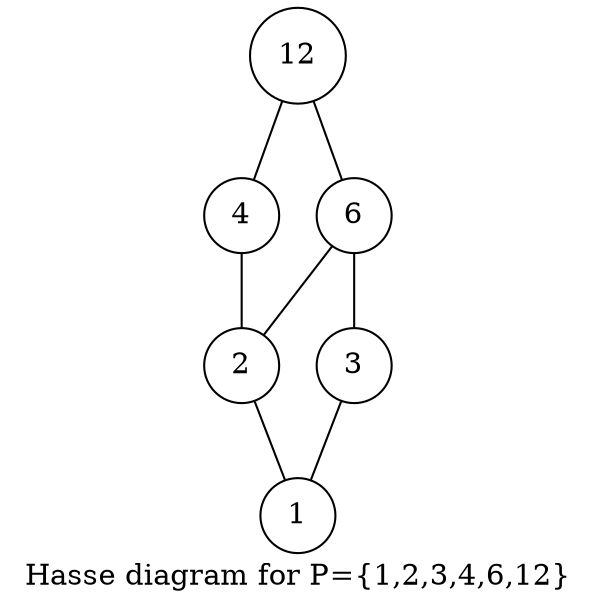
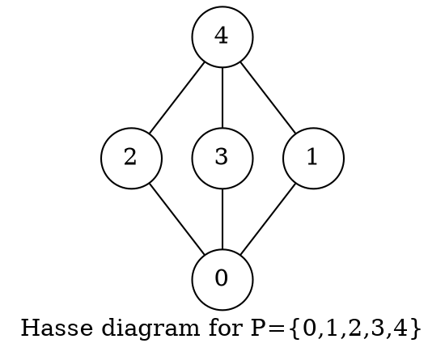
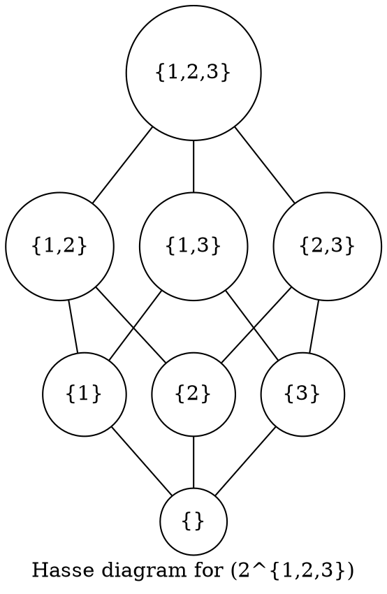

#### 61) Let $P$ be the set of all divisors of $12$. Determine the Möbius function of $(P,|)$ using the definition of the Möbius function and compare your result with the one from the last example in the lecture.

The Möbius function is defined as follows:

\begin{gather*}
\forall x,y \in P: \quad \sum_{z \in [x,y]} \varphi(z,y) =
    \begin{cases}
    &1 \textit{, if } x=y \\
    &0 \textit{, if } x \neq y
    \end{cases}
\end{gather*}

By definition $\varphi(12,12) = 1$ and

\begin{gather*}
\varphi(6,12) + \varphi(12,12) = 0
\end{gather*}

meaning $\varphi(6,12) = -1$. Thus, by

\begin{gather*}
\varphi(3,12) + \varphi(6,12) + \varphi(12,12) = 0
\end{gather*}

we derive $\varphi(3,12) = 0$.
And by

\begin{gather*}
\varphi(4,12) +  \varphi(12,12) = 0
\end{gather*}

we get that $\varphi(4,12) = -1$.
Now we have:

\begin{gather*}
\varphi(2,12) +  \varphi(4,12) + \varphi(6,12) +  \varphi(12,12) ) = 0
\end{gather*}

from which we can derive $\varphi(2,12) = 1$
Therefore, we know by:

\begin{gather*}
 \varphi(1,12) +  \varphi(2,12) + \varphi(3,12) +  \varphi(4,12) +  \varphi(6,12) +  \varphi(12,12) = 0
\end{gather*}

that $\varphi(1,12) = 0$.
The last example from the lecture states:

\begin{gather*}
\varphi(1,n) = \varphi(n)= \varphi_{\geq}(0,e_1) \cdots \varphi_{geq}(0,e_r)
\end{gather*}

where $n = p_1^{e_1} \cdots p_r^{e_r}$ (prime factorisation of $n$).

\begin{gather*}
\varphi(n)=
\begin{cases}
    1 &\text{, if } n=1\\
    (-1)^r &\text{, if } n=p_1 \cdots p_r\\
    0 &\text{, if $n$ is not square free}.
\end{cases}
\end{gather*}

Since $1 \cdot 2 \cdot 3 \cdot 4 \cdot 6 \cdot 12$ is not square free $\varphi(12)=0$, which coincides with our findings.

#### 62) Let $(P,|)$ be the poset defined by $P =\{0,1,2,3,4\} and $0 \geq 1 \geq 4$, $0 \geq 2 \geq 4$, $0 \geq 3 \geq 4$. Compute all values $\varphi(x,y)$ for $x,y \in P$.

We know:

\begin{gather*}
\varphi(4,4) = \varphi(3,3) = \varphi(2,2) = \varphi(1,1) = \varphi(0,0) = 1
\end{gather*}

and

\begin{gather*}
\varphi(0,1) = \varphi(0,3) = \varphi(0,2) = \varphi(1,4) = \varphi(2,4) = \varphi(3,4) = -1
\end{gather*}

and by the calculated values and

\begin{gather*}
\varphi(0,4) + \varphi(1,4) + \varphi(2,4) + \varphi(3,4) + \varphi(4,4) = 0
\end{gather*}

we derive $\varphi(0,4) = 2$.

#### 63) Let $(P_1, \leq_1)$ and $(P_2, \leq_2)$ be two locally finite posets with $0$-element and $(P,\leq)$ be defined by $P = P_1 \times P_2$ and for $(a,x),(b,y) \in P$:

\begin{gather*}
(a,x) \leq (b,x) \Leftrightarrow a \leq_1 b \land x \leq_2 y.
\end{gather*}

Show that $(P,\leq)$ is a locally finite poset with $0$-element.

A poset has to satisfy *reflexivity*, *asymmetry* and *transitivity*. We first show that $P$ is a poset.

* Reflexivity ($\forall (a,x) \in P: (a,x) \leq (a,x)$)
    By $P_1,P_2$ being posets and thus reflexive, we know for each $(a,x) \in P$ that $a \leq_1 a$ and $x \leq_2 x$, thus by definition of $P$, $(a,x) \leq (a,x)$.
* Antisymmetry ($\forall (a,x),(b,y): (a,x) \leq (b,y) \land (b,y) \leq (a,x) \implies (a,x) = (b,y)$)
    We take arbitrary $(a,x), (b,y)$ such that $(a,x) \leq (b,y)$ and $(b,y) \leq (a,x)$.
    Then $a \leq_1 b$ and $b \leq_1 a$ by definition of $P$, thus $a = b$ by $P_1$ being a poset.
    And $x \leq_2 y$ and $y \leq_2 x$ by definition of $P$, thus $x = y$ by $P_2$ being a poset.
    Therefore, $(a,x) = (b,y)$ by $a = b$ and $x = y$.
* Transitivity:
    \begin{gather*}
    \forall (a,x), (b,y), (c,z): (a,x) \leq (b,y) \land (b,y) \leq (c,z) \implies (a,x) \leq (c,z)
    \end{gather*}
    We take arbitrary $(a,x), (b,y), (c,z)$ such that $(a,x) \leq (b,y)$ and $(b,y) \leq (c,z)$.
    Then $a \leq_1 b$ and $b \leq_1 c$ by definition of $P$, thus $a \leq_1 c$ by $P_1$ being a poset.
    And  $x \leq_2 y$ and $y \leq_2 z$ by definition of $P$, thus $x \leq_2 z$ by $P_2$ being a poset.
    It follows, that $(a,x) \leq (c,z)$ by definition of $P$.
* $(P,\leq)$ has a $0$-element
    By $P_1, P_2$ having $0$-elements, there exist $a \in P_1$ and $x \in P_2$ such that $\forall b \in P_1: a \leq_1 b$ and $\forall y \in P_2: x \leq_2 y$,
    thus we know $(a,x)$ is the $0$-element of $P$, since $\forall (b,y) \in P: (a,x) \leq (b,y)$ by the above and definition of $P$.
* $(P,\leq)$ is locally finite
    Since $P_1,P_2$ are locally finite, we know:
    $\forall a,b \in P_1: |[a,b]| < \infty$ and $\forall x,y \in P_2: |[x,y]| < \infty$
    Therefore, for any $a,b \in P_1$ and $x,y \in P_2$, $|[a,b]| = k$ for some finite $k$ and $|[x,y]| = d$ for some finite $d$.
    Inspecting the intervall $[(a,x),(b,y)]$ of $P$, by the above $|[(a,x),(b,y)]| = k \cdot d$, where $k,d$ are respectively finite, thus $k \cdot d$ is finite.

#### 64) We use the notations from exercise 63. Let the Möbius functions of $P,P_1,P_2$ be denoted by $\varphi_P, \varphi_{P_1}, \varphi_{P_2}$, respectively. Prove that forall $(a,x) (b,y) \in P$ we have $\varphi_P((a,x),(b,y)) = \varphi_{P_1} \cdot \varphi_{P_2}(x,y)$.

For $\varphi_P((a,x),(b,y))$ is has to hold that:

\begin{gather*}
\sum_{(c,z) \in [(a,x),(b,y)]}
\varphi_{P((c,z),(b,y))} = \begin{cases}
1 &\text{ ,if $a=b$ and $x=y$}\\
0 &\text{ ,if $a \neq b$ or $x \neq y$}
\end{cases}
\end{gather*}

The first condition holds, since:

$\varphi_{P_1}(a,b) = 1$, when $a=b$ and $varphi_{P_2}(x,y) = 1$ when $x = y$ thus $\varphi_P((a,x),(b,y)) = 1 \cdot 1 = 1$, if $a=b$ and $x = y$.

We show, the second condition holds:

\begin{gather*}
\sum_{(c,z) \in [(a,x),(b,y)]} \varphi_P((c,z),(b,y)) = \sum_{(c,z) \in [(a,x),(b,y)]} \varphi_{P_1}(c,b) \cdot \varphi_{P_2}(z,y) =
\end{gather*}

we split the sum

\begin{gather*}
\sum_{(c) \in [a,b]} \sum_{(z) \in [x,y]} \varphi_{P_1}(c,b) \cdot \varphi_{P_2}(z,y)
\end{gather*}

we extract the constant factor $\varphi_{P_1}(c,b)$

\begin{gather*}
\sum_{(c) \in [a,b]} \varphi_{P_1}(c,b) \cdot \sum_{(z) \in [x,y]} \varphi_{P_2}(z,y)
\end{gather*}

Now either $x \neq y$ or $a \neq b$, w.l.o.g. we say $x = y$

\begin{gather*}
\sum_{(c) \in [a,b]} \varphi_{P_1}(c,b) \cdot 0 = 0
\end{gather*}

#### 65) Draw the Hasse diagram of $(2^{1,2,3}, \supseteq)$ and redo the proof of the principle of inclusion and exclusion for the special case of three sets $A_1, A_2, A_3 \subseteq M$. Carry out every step in detail.

#### 66) Let $p,q,r$ be three distinct prime numbers and $m = pqr$. How many of the numbers $1,2, \dots, m$ are relatively prime to $m$? (Two numbers $x$ and $y$ are called relatively prime if their greatest common divisor is $1$.)

\begin{gather*}
m - ((\frac{m}{p} + \frac{m}{q} + \frac{m}{r}) - (\frac{m}{pq} + \frac{m}{pr} + \frac{m}{qr}) + \frac{m}{pqr}) =
\end{gather*}

since, $m = pqr$

\begin{gather*}
= m - (\frac{pqr}{p} + \frac{pqr}{q} + \frac{pqr}{r} - \frac{pqr}{pq} - \frac{pqr}{pr} - \frac{pqr}{qr} + \frac{pqr}{pqr}) =
\end{gather*}

we cancel the respective factors in each term

\begin{gather*}
= m - qr - pr - pq + r + q + p - 1
\end{gather*}

#### 67) Prove: If $gcd(a,b) = 1$ then $gcd(a+b,a-b)$ is either $1$ or $2$.

Let $d = gcd(a+b,a-b)$,
then by $\dagger$, $d | (a+b)+(a-b)$, thus $d|2a$,
and $d | (a+b)-(a-b)$, thus $d | 2b$.

And since $d|2a$ and $d |2b$, $d|gcd(2a,2b)$, by definition of the $gcd$,
and by $gcd(a,b) = 1$, $d$ can only either be $1$ or $2$.

*Lemma $\dagger$:*
    Let $z = gcd(x,y)$, then $\exists m,n$, such that $x=zm$ and $y=zn$.
    Then $x+y = zm + zn = z(m+n)$, thus $z|(x+y)$ for arbitrary $x,y$, where $z = gcd(x,y)$
    and $x-y = zm - zn = z(m-n)$, thus $z|(x-y)$ for arbitrary $x,y$ such that $z=gcd(x,y)$.

#### 68) Let $n = \prod_{p \in \mathbb{P}} p^{v_p (n)}$ be a positive integer such that for all $p \in \mathbb{P}$ we have $v_p(n) \leq 1$. Moreover, a prime $p$ divides $n$ if and only if $p-1$ divides $n$ too ($\dagger$). Compute $n$.

We know that forall positive integers, $1 | n$, thus by $\dagger$ $2 | n$, therefore also $3|n$. Since $2$ and $3$ divide $n$, $6 | n$, hence by $\dagger$, $7 |n$.
Then, $n = 2 \cdot 3 \cdot 7 = 42$.

#### 69) Use the Euclidian algorithm to find two integers such that:

\begin{gather*}
2863a + 1057b = 42
\end{gather*}

We first compute the division chain:

\begin{gather*}
\begin{align}
2863 &= 1057 \cdot 2 + 749 \\
1057 &= 749 \cdot 1 + 308 \\
749 &=308 \cdot 2 + 133 \\
308 &= 133 \cdot 2 + 42 \\
133 &= 42 \cdot 3 + 7 \\
42 &= 7 \cdot 6 + 0
\end{align}
\end{gather*}

We then find the linear combination for $2863$ and $1057$:

\begin{gather*}
\begin{align}
42 &= 308 - (133 \cdot 2) \\
42 &= 308 - ((749 - 308 \cdot 2) \cdot 2) = 308 \cdot 5 - 749 \cdot 2\\
42 &= (1057 - 749 \cdot 1) \cdot 5 - 749 \cdot 2 = 1057 \cdot 5 - 749 \cdot 7
42 &= 1057 \cdot 5 - (2863 - 1057 \cdot 2) \cdot 7 = 1057 \cdot 19 - 2863 \cdot 7
\end{align}
\end{gather*}

Thus we have found $a = -7$ and $b = 19$ which satisfy the equation.

#### 70) Use the Euclidian algorithm to find all the greatest common divisors of $x^3 + 5x^2 + 7x + 3$ and $x^3 + x^2 - 5x +3$ in $\mathbb{Q}[x]$.

\begin{gather*}
\begin{align}
x^3 + 5x^2 + 7x + 3 = 1 \cdot (x^3 + x^2 - 5x + 3) + (4x^2 + 12x)
x^3 + x^2 - 5x + 3 = (4x^2 + 12x) \cdot (1/4 x - 1/2) + (x+3)
4x^2 + 12x = (x+3) \cdot (4x) + 0
\end{align}
\end{gather*}

Thus, forall $x \in \mathbb{Q}^x: a \cdot x + 3 \cdot a$ is a gcd of $x^3 + 5x^2 + 7x + 3$ and $x^3 + x^2 - 5x +3$.
